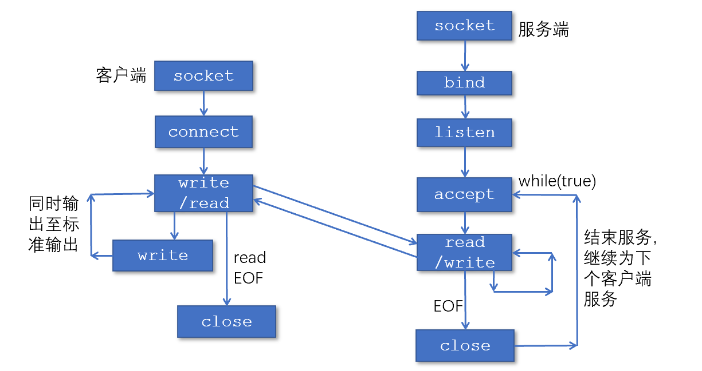
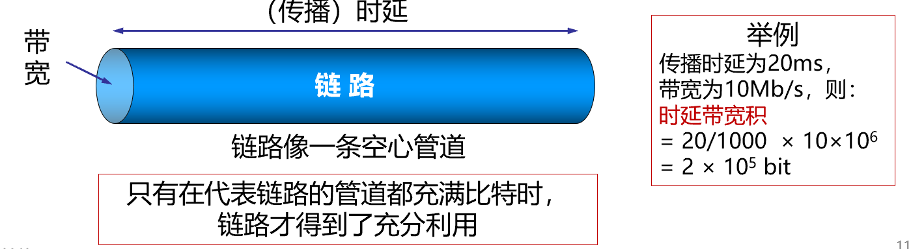

# 计算机网络

> 据说是纯背的文科课？（改革前

* 作业 7 次，每次 2 分（14%）
* 实验 6 次，每次 4 分（24%）- 奇数周实验课讲解，双数周周末前提交
* 大作业（12%）
* 期末（50%）

> 推荐会议和期刊（计算机网络方向）
>
> SIGCOMM
> MobiCom
> INFOCOM
> NSDI

## Overview

网络基本功能

* 网络提供的最基本服务 - 信息传递
* 不同的网络用所提供的服务区分
* 服务用功能、延迟、带宽、丢失率等等区分

------

网络分类

* 个域网PAN(Personal Area Network) - 一般半径 10 米以内，如蓝牙耳机
* 局域网LAN(Local Area Network) - 如企业网络
* 城域网MAN(Metropolitan) - 覆盖一整个城市
* 广域网WAN(Wide Area Network) - 覆盖很大地理区域

互联网（Internet）与互连网（internet）

* 都是指网络的网络，Internet 是一个具体实例，internet 是泛指
* 互联网特指遵循 TCP/IP 标准

-----

互联网的层级结构

> ISP - 网络服务提供商

* Tier-1 ISP - 如中国电信、中国联通，全球最高级别，互不结算
* Tier-2 ISP - 教育网、中国移动等，往往需要向更高级别 ISP 交流量费

<!-- 这里放张树状图 -->

------

互联网的构成

* 网络边缘 - 各类主机构成的端系统（如 PC、智能手环）
* 网络核心 - 连接网络的路由器等等
* 接入网 - 将主机连接到边缘路由器上
    * 边缘路由器 - 端系统去往任何其他远程端系统经过的第一台路由器
    * 有线网 - 光纤到户 FTTH（Fiber to the home）（还有更慢的 DSL 和同轴电缆等等
    * 无线网 - 无线局域网（WLAN）和广域蜂窝接入网（连基站）

物理介质

* 传输单元：位（bit）

> 存储常用字节Byte，K/M/G 层级为 2^10 进制
>
> 传输常用比特bit，K/M/G 层级为 10^3 进制
>
> 1B = 8b

* 引导型介质和非引导型
* 光纤介质 - 玻璃纤维携带光脉冲，每个脉冲一位

<!-- 睡着了 11：10 - 11：30 -->

----

存储转发

多种交换方式

* 电路交换
* 报文交换
* 分组交换

------

协议 - 为数据交换设计的规则

* 三要素 - 语法、语义、时序

协议分层结构

* 层次栈
* 对等实体 - 不同机器上构成……
* 接口 - 相邻层级怎么服务

> 发送端：层层封装；接收端：层层解封装

* 面向连接 - 请求连接、接受相应……一来一回
* 无连接 - 丢出去不管

----

OSI 参考模型（7 层，现实中不用

TCP/IP 参考模型

* 链路层（Link Layer）
* 互联网层（Internet Layer）
* 
* 

-----

## 套接字编程

> 如何创建一个网络应用

进程如何标识自己

* IP 地址标识主机
* 端口号标识具体进程

### 因特网应用编程接口：socket API

套接字地址

创建

描述符

关键字

> 基于 UDP 的套接字回音

> 基于 TCP - 面向连接
>
> A 向监听进程 B 发出请求连接，B 产生一个进程 C，接受连接信息

--------

各种端口

* 80 - http 网页服务
* 21 - 文件传输端口
* 数字小的是常用端口
* 数字大的可以在网络开发时自定义

------------

## 1.5 计算机网络度量单位

> 同层 - peer
>
> 相同标准 - 协议

* 比特率 b/s = bps
* 带宽 - “最高数据率” bit/s
* 包转发率(PPS, Packet Per Second) 包/秒
    * 线速转发 - 满负载的情况下能到达的最高速度

> 大包和小包，哪个更容易实现线速？

时延/延迟(delay 或 latency)

* 指数据（一个报文或分组）从网络（或链路）的一端传送到另一端所需的时间
* 传输时延(transmission delay)：数据从结点进入到传输媒体所需要的时间，传输时延又称为发送时延
* 传播时延(propagation delay)：电磁波在信道中需要传播一定距离而花费的时间
* 处理时延(processing delay)：主机或路由器在收到分组时，为处理分组（例如分析首部、提取数据、差错检验或查找路由）所花费的时间
* 排队时延(queueing delay)：分组在路由器输入输出队列中排队等待处理所经历的时延
    * 路由器是存储转发，需要先排队进到路由器的缓冲区
* 总的时延等于上面四个加起来

另一个角度 - 往返时延(RTT, Round-Trip Time)

* 从发送方发送数据开始，到发送方收到来自接收方的确认，经历的总时间
* 可用于判断网络的通断性、测试网络时延、计算数据包丢失率等

时延带宽积

* 时延带宽积 = 传播时延 * 带宽，即按比特计数的链路长度
* 

-----

## 1.6 网络安全与威胁

* 病毒（Virus）
    * 需要某种形式的用户交互来不断传播的恶意软件
    * 如含可执行代码的email附件（打开后会给通信录所有再次用户发送）
* 蠕虫（Worm）
    * 一种无须用户明显交互即可运行和传播的独立程序
    * 通过不断扫描网络中存在漏洞的计算机，进行传播

拒绝服务攻击(Denial-of-Service (DoS) attack)

* 攻击者通过制造大量虚假流量占用资源，使合法流量无法使用资源(服务、带宽)
* 利用僵尸主机
* DDoS - 分布式拒绝服务攻击

> 密码泄露 - 拖库、洗库、撞库

------------------

### 数据可靠性

数据包嗅探（packet sniffing） 

* 广播传输（共享式以太网、无线网） 
* 混杂网络接口读取/记录所有数据包 

IP欺骗（IP spoofing）

* 攻击者产生的IP数据包为伪造的源IP地址，以便冒充其他系统或发件人的身份

