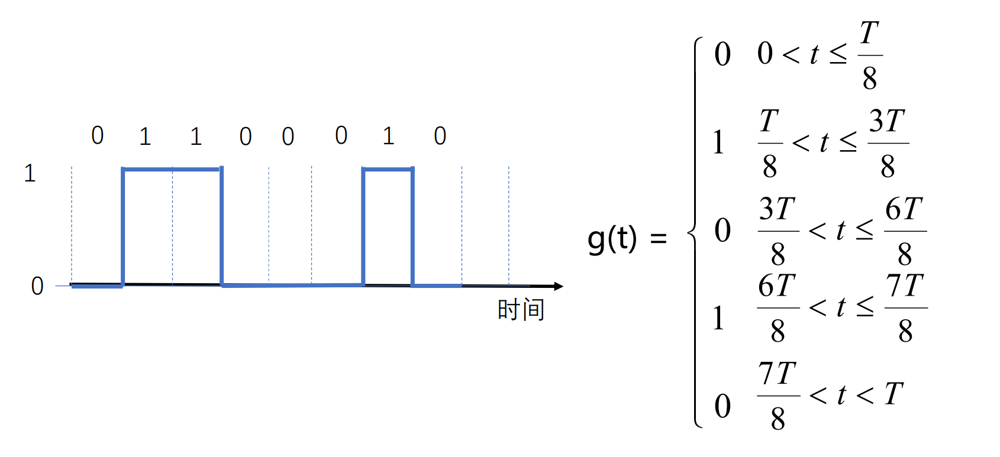

# 第二章 物理层

## 2.1 物理层基本概念

物理层功能

* 位置 - 网络体系结构的最底层
* 功能 - 传输数据比特流

物理层设备

* 数据终端设备(DTE) - 数据处理和转发，源点和终点
* 数据电路终结设备(DCE) - 信号变换和编码，面向传输
* DTE 和 DCE 之间的接口 - 物理层的协议

物理层协议

* 机械特性 - 接线器的形状和尺寸等
* 电气特性 - 电路特性、负载要求……发送信号的电平
* 功能特性 - 描述接口执行的功能，定义接线器每一引脚的作用
* 过程特性 - 之名对于不同功能的各种可能事件出现的顺序
* 常用标准
    * 点对点通信(EIA RS-232-C 标准，EIA RS-449 标准等)
    * 广播通信线路 - 一条公共通信线路连接多个结点(802.3……)

--------------

## 2.2 数据通信基础

> 干扰后，方波难以辨识

* 数据通信研究信号在通信信道上传输时的数学表示及其所受到的限制
* 傅里叶分析 - 将周期函数分解成若干项正弦和余弦函数的和

以二进制编码 ０１１０００１０ 为例，进行傅里叶分析

$$
a_n = [cos(\pi n/4) - cos(3\pi n/4) + cos(6 \pi n/4) - cos(7 \pi n/4)]
$$
$$
bn= [sin(3\pi n/4) - sin(\pi n/4) + sin(7 \pi n/4) - sin(6\pi n/4)]
$$
$$
c = 3/8
$$

* 波形叠加地越多，越接近方波

> 欧拉公式算傅里叶系数 - 复平面上向量的叠加

----------

* 频谱（spectrum）是一个信号所包含的频率的范围
* 信号的绝对带宽等于频谱的宽度
* 许多信号的带宽是无限的，然而信号的主要能量集中在相对窄的频带内，这个频带被称为有效带宽，或带宽（bandwidth）
* 信号的信息承载能力与带宽有直接关系，带宽越宽，信息承载能力越强
* 信号在信道上传输时，对不同傅立叶分量的衰减不同，引起输出失真
* 信道有截止频率 fc，0 ~ fc 的振幅衰减较弱，fc 以上的振幅衰减厉害，这主要由信道的物理特性决定，0 ~ fc 是信道的有限带宽

波特率（baud）和比特率（bit）的关系

* 波特率：每秒钟信号变化的次数，也称调制速率
* 比特率：每秒钟传送的二进制位数
* 波特率与比特率的关系取决于信号值与比特位的关系

> 例：每个信号值可表示3位，则比特率是波特率的3倍；每个信号值可表示1位，则比特率和波特率相同

* 有限的带宽限制数据传输速率

----------

奈魁斯特定理

* 最大数据传输率 = $2Hlog_2V (bps)$
* 任意信号通过一个带宽为 Ｈ 的低通滤波器，则每秒采样 2H 次就能完整地重现该信号，信号电平分为 V 级（带宽单位为 Hz）

香农定理

* 信噪比 - 信号（S）与噪声（N）功率之比 10log10S/N，单位：分贝
* 带宽为 H 赫兹，信噪比为 S/N 的任意信道的最大数据传输率为：Hlog2(1 + S/N) (bps) 
* 此式是利用信息论得出的，具有普遍意义
* 与信号电平级数、采样速度无关
* 此式仅是上限，难以达到

信息量

* 根据香农理论，一条消息包含信息的多少称为信息量
* 一条消息所荷载的信息量等于它所表示的事件发生的概率p的倒数的对数

-------

传输方式

---------

数据编码技术

* 不归零编码
* 曼彻斯特编码 - 有时钟
* 差分曼彻斯特编码

-------

频带传输

