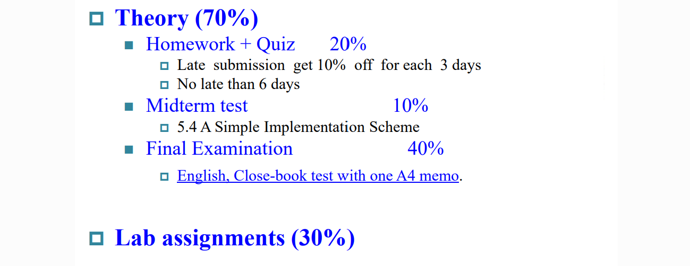

# 计算机组成与设计
* 助教：秦佳俊、郭家豪
* 成绩构成
  {width=600px}

------
## Chapter 1: Introduction
### 0. 历史
* 第一台可编程电子计算机：ENIAC
  * 10进制
  * 通过开关编程
  * 无存储部分
* 冯·诺伊曼的计算机设计理论——五个基本部分
  {width=400px}
  * 得到EDSAC——有存储部分的计算机

**几代的计算机**：
* 1~4代：真空管->晶体管->集成电路->大规模集成电路
* 第5代：
* 
  * RISC：精简指令集计算机——CPU处理简单
    * RISC-5
    * MIPS
  * CISC：复杂指令集计算机——指令条数少
  * 80x86

### 1. 介绍
* 发展进展——摩尔定律
* 应用
  * 手机
  * 万维网
  * ......
### 2. Eight Great Ideas
* 摩尔定律
* 抽象化
  
* Make common case fast
* ......
* 层次存储——又大又快
* 可靠性——备份

### 4. 硬件系统
* 显示
* 主板
* CPU里：
  * DataPath
  * Control
  * cache memory ——SRAM静态存储，造价高
* Memory
* Network

### 6. Performence
* **Response time**：完成一个task需要的时间
* *Throughput*：单位时间完成的任务数
* “X is n time faster than Y”： Y 所用时间是 X 的 n 倍
* CPU time = 时钟周期数 $\times$ 一个周期长度
* 将一个指令分成几个部分，每个部分一个周期(CPI = Cycle per Instruction)
* 则 
$$
CPU\ time = 指令数 \times CPI \times 一个周期长度 
$$ 
$$
= \frac{指令数 \times CPI}{时钟频率}
$$

### 7. 不可能的性能提升
* Power Wall：提升性能耗能巨大，温度高
* Memory Wall：二层缓冲区L2 cache变大、表现变差；CPU比内存快得多
* ILP Wall：难以并行处理

### 8. Multiprocessors
* 硬件上的并行：多核
* Amdahl's Law:
  $$
  T_{improved}=\frac{T_{affected}}{improvement \ t \ factor}+T_{unaffected}
  $$
  * >make common cases fast
* MIPS as a Performance Metric
  * millions of instructions per second
  * 不能精确反映CPU性能
  * 因为指令所占周期数不同

### *设计原则
1. （处理器）跟着摩尔定律
2. 逐层抽象化
3. make common cases fast
4. 多核
> assignment:1-1, 1-2, 1-4, 1-6, 1-7, 1-14

------
## Chapter 3: Arithmetic for Computer
### 3.1 Introduction
* 读、写内存：
  * lw, sw: load word, 读取32位长度的内存
  * ld, sd: load double word, 64位
  * lb, sb: load byte, 一个字节
  * 根据起始地址读取不同长度的内容
* ALU相关：
  * slt x1 x2,x3: set if less than, x1=(x2<x3)
* 分支跳转指令：
  * beq, bne, jal: 有条件/无条件跳转

### 3.2 Possible representation
* 2's Biased notation
  * $= 2's complement + 2^n$
  * 最小：$-2^n$，表示为000000000000···
  * 最大：$2^n$，11111111111····
  * 便于比较大小（相当于无符号数）

### 3.3 Arithmetic
* Overflow：溢出判断
  * $V = C_n \oplus C_{n-1}$
  * 符号位是否进位、最高数值位是否进位
### 3.4 Multiplication
由移位和加法组成
  * 乘数是1：移位、加上
  * 乘数是0：add 0
  {width=200px}
  $4\times 4$ =>8位加法器

  {width=500px}

* 大且慢：$64\times64$=>128位加法器用64次

改进：
{width=600px}
* 不移被乘数，右移基（低位不参与后续运算）
* 加法器位数减半

进一步：将乘数放在基中
{width=600px}
> 乘法不能用补码

* 有符号数的乘法
  * 将符号保存
  * 转换为绝对值
  * 同号为正，异号为负

> Booth's Algorithm ？

{width=600px}
 {width=600px}
* 默认$C_{-1}$=0
 {width=600px}

另一种方法：
用多个ALU并行实现

### 3.5 Divide
除法实现基本思想：
1. 将被除数每次左移，减掉除数
2. 如果结果大于等于0，则有效，在商上加一个1
3. 否则无效，将除数加回去，在商上加一个0
4. 需要迭代65次（64位）
   {width=200px}
   {width=600px}

具体实现：

  除数放在高位，被除数放在低位，被除数减除数的结果放在被除数的高位，每次右移除数
  {width=600px}

改进：可以节省空间。

将被除数左移，移出来的位置放商，高位减剩下来的是余数，会多移一位。因此最后要把高位右移一位
{width=600px}

* 符号约定：余数和被除数符号一致
* 软件检查除数是否为0（处理器不管）

### 3.6 Float
{width=600px}
* Bias: single——127, double——1023
* 1是隐含的（科学计数法）

例：$15=1111=1.111\times2^3$
float: 0 10000010 111000...
(Exponet = 3+127 = 130)

{width=600px}
大约相当于6位十进制小数精度
{width=600px}
* Exponent=00...0——隐含的首位是0
  
  * 0 00...0 00...0 = 
  {width=600px}

  -----

**如何进行运算**：
* 加法
  1. Alignment（对齐）
  2. The proper digits have to be added（小的往大的靠）
  3. Addition of significands
  4. Normalization of the result（归一化）
  5. Rounding（舍入，可能需要重新归一化）

{width=600px}

* 乘法：
{width=400px}

* 指数相加，还要减去127（bias）
{width=400px}

Accurate Arithmeticd
* 为提升精度，最多加三位(guard, round, sticky)
  * guard位和round：在运算过程中多保留两位
  * sticky位：在结果位的右边如有不为0的bit，则为1
    * 可以分辨0.500000...0和0.500000...1

round方式可选