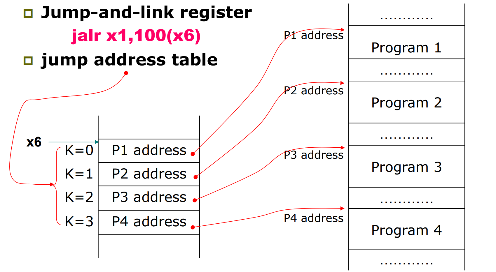

# Chapter 2
------
## 2.1 Introduction

计算机的语言：指令和指令集

设计目标：最大化表现、最小化消耗、减少设计时间

我们选择的指令集：RISC-V

指令集决定：

* 指令怎样在内部存储
* 有多少 operand
* 指令集中的指令怎样执行
* 操作数的类型和大小

--------------
## 2.2 Operations of the Computer Hardware

每条指令一个运算，三个变量（a = b + c）

设计原理：简单源自规整，让所有运算都保持三个变量

将复杂的高级指令转换为只有三个操作数的汇编指令：


```c title="c"
f = ( g + h ) – ( i + j );
```

```asm title="RISC-V"
add t0, g, h // temporary variable t0 contains g + h
add t1, i, j // temporary variable t1 contains i + j
sub f, t0, t1 // f gets t0 – t1
```

------------

## 2.3 Operands of the Computer Hardware

Register Operands（比 Memory 访问快）

* RISC-V 中 32 个 64 位（doubleword）寄存器
* 设计原理2：越少越快，不超过 32 个寄存器


Memory Operands

* 可以存储更多的数据以及成片的数据（数组等）
* 用 ld(load doubleword) 读取到寄存器、sd(save doubleword) 存储来自寄存器
* Memory is byte addressed：Each address identifies an 8-bit byte
* RISC-V 是小端，且不需要字对齐


* Memory 需要更多条指令

```c title="c"
g = h + A[8] ; // A is an array of 100 doublewords
( Assume: g ---- x20 h ---- x21 base address of A ---- x22 )
```

```asm title="RISC-V"
ld x9, 64(x22) // temporary reg x9 gets A[8]
add x20, x21, x9 // g = h + A[8]
```

```c title="c"
g = h + A[i] ; // A is an array of 100 doublewords
( Assume: g, h, i -- x1, x2, x4 base address of A -- x3 )
```


```asm title="RISC-V"
add x5, x4, x4 # temp reg x5 = 2 * i
add x5, x5, x5 # temp reg x5 = 4 * i
add x5, x5, x5 # temp reg x5 = 8 * i
add x5, x5, x3 # x5 = address of A[i] (8 * i + x3)
ld $x6, 0(x5) # temp reg x6 = A[i]
add x1, x2, x6 # g = h + A[i]
```

Constant

获取方法:

1. 提前存储在内存中，用 load 指令获得
2. 放在指令中（小的数用的多，避免 load，make common case fast）


-----

## 2.4 signed and unsigned numbers
2's 补码那些东西

## 2.5 Representing Instruncrions in the computer

设计原则 4：好的设计需要好的折衷，尽管有的指令不需要 32 bits，我们还是令其全为 32 bits

指令格式：


* I 型指令：注意 imm 是 2's 表示，需要符号扩展到相应位数


* 高级指令->汇编指令->机器码

入侵更改程序

------
## 2.6 Logical Operations
移位、与、或、异或、非


* useful and：保留某些位，将其他位设为 0
* or：保留某些位，将其他位设为 1

-----
## 2.7 Instruction for making decision

分支跳转

```c title="c"
if ( i = = j ) f = g + h ; else f = g – h; 
```
( Assume: f ~ j ---- x19 ~ x23 )
```asm title="RISC-V"
bne x22, x23, ELSE // go to ELSE if i != j
add x19, x20, x21 // f = g + h ( skipped if i not equals j )
beq x0, x0, EXIT
ELSE: sub x19, x20, x21 // f = g - h ( skipped if i equals j )
EXIT:
```


循环

```c title="c"
while ( save[i] = = k )
    i += 1 ;
```

( Assume: i and k---- x22 and x24 base of save ---- x25 )

```asm title="RISC-V"
Loop:   slli x10, x22, 3 // Temp reg x10 = i * 8
        add x10, x10, x25 // x10 = address of save[i]
        ld x9, 0(x10) // x9 gets save[i]
        bne x9, x24, Exit // go to Exit if save[i] != k
        addi x22, x22, 1 // i += 1
        beq x0, x0, Loop // go to Loop
Exit:
```

其他的条件跳转（有符号数的比较）：

* `blt rs1, rs2, L1`

    如果rs1<rs2，跳转到Lable L1处

* `bge rs1, rs2, L1`

    如果rs1>=rs2，跳转到Lable L1处


也可以用 slt 指令进行跳转

* `slt x2, x3, x4`

    set on less than——如果x3<x4，将x2设为1（2's 有符号数的比较）


```c title="C"
if (a < b), goto Less
```

```asm title="use blt"
blt x6, x7, Less
```

```asm title="use slt"
        slt x5, x6, x7 # x5 = 1 if x6 < x7 ( a < b) 
        bne x5, x0, Less # go to Less if x5 != 0 (that is, if a < b)
        …… 
Less:
```

> slt 也被用来产生 '1'


无符号数比较的指令：bltu, bgeu


* `bgeu x20, x11, Outbound`


Case/Switch 语句

* 转换成汇编代码后，分支语句在memory中像数组一样连续存储
* 根据偏移量访问（jump address table）



```c title="c"
switch ( k ) {
case 0 : f = i + j ; break ; /* k = 0 */
case 1 : f = g + h ; break ; /* k = 1 */
case 2 : f = g - h ; break ; /* k = 2 */
case 3 : f = i - j ; break ; /* k = 3 */
}
```

```asm title="RISC-V"
        lt x25, x0, Exit // test if k < 0 
        bge x25, x5, Exit // if k >= 4, go to Exit
        slli x7, x25, 3 // temp reg x7 = 8 * k
        add x7, x7, x6 // x7 = address of JumpTable[k]
        ld x7, 0(x7) // x7 gets JumpTable[k]
        jalr x1, 0(x7) // jump entrance
Exit:
```


> Basic blocks: 一段没有跳转的连续指令，可以被编译器优化

------
## 2.8 Supporting Procedures in Conputer Hardware
过程调用（函数）

step：

1. Place Parameters in a place where the procedure can access them （in registers x10~x17）
2. Transfer control to the procedure
3. Acquire the storage resources needed for the procedure
4. Perform the desired task
5. Place the result value in a place where the calling program can access it 
6. Return control to the point of origin (address in x1)


`jal x1, Lable` - 跳转到 Lable，PC + 4 存到 x1

`jalr x0, 0(x1)` - jumps to 0 + address in x1

需要用更多的寄存器

* 过程调用中使用的寄存器：
    * x10~x17：传递参数和返回结果的8个寄存器
    * x1：记录return地址的寄存器

* stack 是存储数据的理想地方
* Stack grow from higher address to lower address
  * Push: sp= sp-8
  * Pop: sp = sp+8


**Leaf procedure**：不会调用别的过程的过程

* 把要用的寄存器存到栈中，用完后再ld回来

```c title="C"
long long int leaf_example (
long long int g, long long int h,
long long int i, long long int j) {
long long int f;
    f = (g + h) - (i + j);
    return f;
}
```

* Arguments g, …, j in x10, …, x13, f in x20
* temporaries x5, x6
* Need to save x5, x6, x20 on stack

```asm title="leaf_example:"
leaf_example:
    addi sp,sp,-24
    sd x5,16(sp)
    sd x6,8(sp)
    sd x20,0(sp)// Save x5, x6, x20 on stack
    add x5,x10,x11// x5 = g + h
    add x6,x12,x1// x6 = i + j
    sub x20,x5,x6// f = x5 – x6
    addi x10,x20,0// copy f to return register
    ld x20,0(sp)
    ld x6,8(sp)
    ld x5,16(sp)// Resore x5, x6, x20 from stack
    addi sp,sp,24
    jalr x0,0(x1)// Return to caller
```
**Register Usage**

* x5-x7，x28-x31：temporary register（随便用）
* x8-x9，x18-x27：saved register（需要压栈）


**Non-leaf procedure**

* return的地址会改变
* 因此需要把返回地址 x1 压栈
* 以及存储结果的寄存器也要压栈

> 递归求阶乘为例

```c title="C"
long long fact ( long long n ) 
{
    if ( n < 1 ) return ( 1 ) ;
    else return ( n * fact ( n - 1 ) ) ;
}
```

argument n is in x10, and results in x10

```asm
fact:   addi sp, sp, 16 // adjust stack for 2 items
        sd x1, 8(sp) // save the return address
        sd x10, 0(sp) // save the argument n
        addi x5, x10, -1 // x5 = n - 1
        bge x5, x0, L1 // if n >= 1, go to L1(else)
        addi x10, x0, 1 // return 1 if n <1
        addi sp, sp, 16 // Recover sp (Why not recover x1and x10 ?)
        jalr x0, 0(x1) // return to caller

L1: addi x10, x10, -1 // n >= 1: argument gets ( n - 1 )
    jal x1, fact // call fact with ( n - 1 )
    add x6, x10, x0
    ld x10, 0(sp) // restore argument n
    ld x1, 8(sp) // restore the return address
    addi sp, sp, 16 // adjust stack pointer to pop 2 items
    mul x10, x10, x6 // return n*fact ( n - 1 )
    jalr x0, 0(x1) // return to the caller
```

> 递归的坏处：消耗大量资源保护寄存器的值、需要大量内存空间（压栈），loop可以解决（特别是尾递归）


总结（是否需要保留）


* Procedure frame and frame pointer ( x8 or fp ) - 保存 C 中的自动变量
* Global pointer ( x3 or gp ) - 保存 C 中的静态变量


------
## 2.9 communication with people
字符的表示方法:

  * ascii码（128个字符）
  * unicode（16-bit/32-bit）


load和store指令

* Load byte/halfword/word: Sign extend to 64 bits in rd
    * lb rd, offset(rs1)
    * lh rd, offset(rs1)
    * lw rd, offset(rs1)
* Load byte/halfword/word unsigned: Zero extend to 64 bits in rd
    * lbu rd, offset(rs1)...
* Store byte/halfword/word: Store rightmost 8/16/32 bit
    * sb rs2, offset(rs1)
    * sh rs2, offset(rs1)
    * sw rs2, offset(rs1)

字符串的表示方法

* Place the length of the string in the first position(JAVA)
* An accompanying variable has the length
* A character in the last position to mark the end of a string(C)

> 拷贝字符串的例子

```c
void strcpy ( char x[ ] , char y[ ] )
{
    size_t i ;
    i = 0 ;
    while ( ( x[ i ] = y[ i ] ) != ‘\ 0’ ) /* copy and test byte */
        i += 1 ;
    }
```

( Assume: i -- x19， x’s base --x10, y’s base ----x11)
```asm
strcpy: addi sp, sp, -8 // adjust stack for 1 doubleword
        sd x19, 0(sp) // save x19
        add x19, x0, x0 // i = 0
L1:     add x5, x19, x11 // address of y[ i ] in x5
        lbu x6, 0(x5) // x6 = y [ i ]
        add x7, x19, x10 // address of x[ i ] in x7
        sb x6, 0(x7) // x[ i ] = y[ i ]
        beq x6, x0, L2 // if y[ i ] == 0, go to L2 
        addi x19, x19, 1 // i = i + 1
        jal x0, L1 // go to L1 
L2:     ld x19, 0(sp) // restore x19
        addi sp, sp, 8 // pop 1 doubleword off stack
        jalr x0, 0(x1) // return
```

优化：叶子程序先使用不需要 save 的 temp 寄存器，再使用必须 save 的


------

## 2.10 Addressing for Wide Immediate and Addresses
`lui rd, constant` - U型指令（前20位是立即数，接下来5位是目的寄存器，最后是操作符）

将立即数存在目的寄存器中，后面补零

<div>  <center>  `lui x19, 976 ` 
</div>


如果我们想要 `li  b0000 0000 0011 1101 0000 1001 0000 0000`

必须分两步：`lui 0000 0000 0011 1101 0000` `addi 1001 0000 0000`（寄存器略）

寄存器的高32位会进行符号扩充

-----
**Branch Addressing**

`bne x10, x11, 2000` - SB型指令（2000 - 跳转偏移量）


* 立即数末尾补零（相当于乘二）

跳转范围：$\pm 2^{12}$个byte，即$\pm 4$k个字节

------
**Jump Addressing**

无条件跳转

`jal x0, 2000` - j型指令（只有这一条）


跳转范围$\pm 1$M字节

* For long jumps, eg, to 32-bit absolute address
    * lui: load address[31:12] to temp register
    * jalr: add address[11:0] and jump to target


```asm title="一次跳转不了"
beq x10, x0, L1

// 转换成
    bne x10, x0, L2
    jal x0, L1
L2
```


**寻址Summary**


## 2.11 Parallelism and Instructions: Synchronization
在load和save时，可能有并行的程序导致地址不可用，操作失败，因此加入判断

* Load reserved: `lr.d rd,(rs1)`
    * 把 rs1 地址里的值存在 rd 中
    * 保持地址存放的东西不变
* Store conditional: `sc.d rd,(rs1),rs2`
    * 把 rs2 的值存在 rs1 中的地址里
    * 成功时（location 没变）返回0
    * 失败时返回非零值

> Example 1: atomic swap(to test/set lock variable)

```asm
again:  lr.d x10,(x20)
        sc.d x11,(x20),x23 // X11 = status
        bne x11,x0,again // branch if store failed
        addi x23,x10,0 // X23 = loaded value
```


> Example 2: lock
```asm
        addi x12,x0,1 // copy locked value
again:  lr.d x10,(x20) // read lock
        bne x10,x0,again // check if it is 0 yet
        sc.d x11,(x20),x12 // attempt to store
        bne x11,x0,again // branch if fails
```

Unlock: `sd x0,0(x20) // free lock`

> 其他指令

* `aulpc`

M: integer multiply, divide, remainder

* A: atomic memory operations
* F: single-precision floating point
* D: double-precision floating point
* C: compressed instructions

## 2.12 Translating and Starting a Program


object file 和 executable file

* 静态链接：将库文件整个copy，不实时更新

* 动态链接（Dynamic Linking）

* Lazy Linkage: 

* Java application


------
## 2.13 C Example

调用子函数：将需要保持的寄存器存起来

* 存到栈中
* 存到另一寄存器——效率更高


约定：

* 父函数保证：子函数能随便使用temporary registers (x5-x7, x28-x31)，返回给父函数的时候，x5-x7, x28-x31的值可以被改变。
*  子函数保证：返回给父函数的时候，saved registers(x18-x27) 保持父函数调用子函数前的值。

------
编译器的优化效果


> 效果与算法有关
>
> 算法很重要


> 上节课：b、j、u型指令
>
> Leaf - temperor register
>
> Father - saved register

访问数组的两个方式

* 索引 - `array[i]`
* 指针 - `*p = array[0]`，通过`*p`访问


* 数组大时，后者好（前者需要 i 乘 size）
* 大小为 0 时，会无限循环（需要判断）

实际上在编译器的优化下无区别

------

## 2.14 Real Stuff: MIPS & x86

MIPS 和 Risc-5 的相似点：

* 指令 32 位
* 32 个目的寄存器，32个浮点寄存器
* 内存只能用 load/save 访问

不同点：

* 分支跳转不同 MIPS 只用 slt、sltu，再用 beq、bne


上图 MIPS 中，Rs2 是目的寄存器（ld 存数据到 Rs2 中，st 把 Rs2 中的数据存到内存中）


------

X86：多年改进得到，兼容

> 以 386 为例

* 每条指令有两个操作符,可以在一条指令读取、计算、存回
* 多种寻址模式
* 指令有长有短

