# Chapter 4

## Introduction

影响 CPU 表现的因素：

* Instruction count: ISA 和 编译器决定
* CPI 和时钟周期长度: 硬件决定

我们需要实现两种版本 CPU：单周期和流水线

指令的大类：

* Memory reference: ld, sd
* Arithmetic/logical: add, sub, and, or, slt
* Control transfer: beq，jal

所有指令都有的两步：内存取指，译码读寄存器

CPU 中的重要模块：ALU、Memery（指令只读，数据可读写）、Regfile、立即数产生器

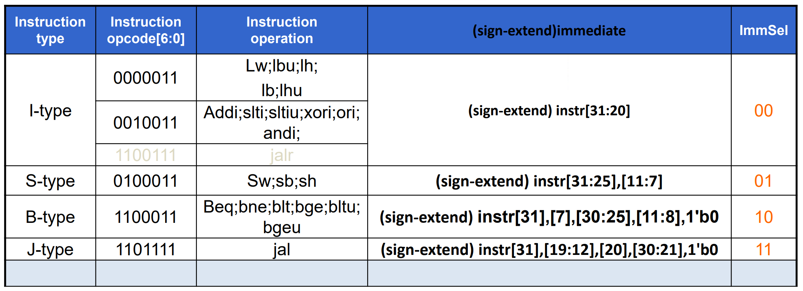

组成的 CPU 大致如下：

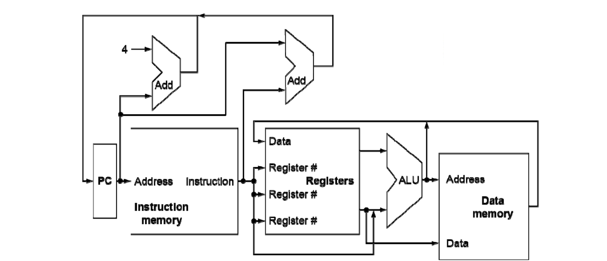

多路信号的地方都需要多路选择器

多路选择器需要控制信号

都加入完善后得到下面的 CPU


------


## Building a datapath

Datapath：Elements that process data and addresses in the CPU

* RISC-V 指令集：
    


寄存器和内存：

* 32 个寄存器，x0 恒等于 0
* $2^{61}$ memory words，一个 word 4 个 byte（可以访问 Mem[0]、Mem[8] ··· Mem[18446744073709551608]）

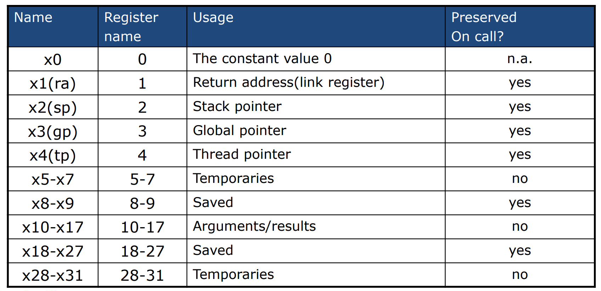


执行指令的步骤：

1.  Fetch
2.  Instruction decoding & Read Operand
3.   Executive Control
4.    Memory access
5.    Write results to register
6.    Modify PC (branch)


完整的数据通路（注意 imm 出去后的 shift left 1 是因为 B 型指令不存立即数的最后一位，以便获得更大的跳转范围）


------


## Control Unit

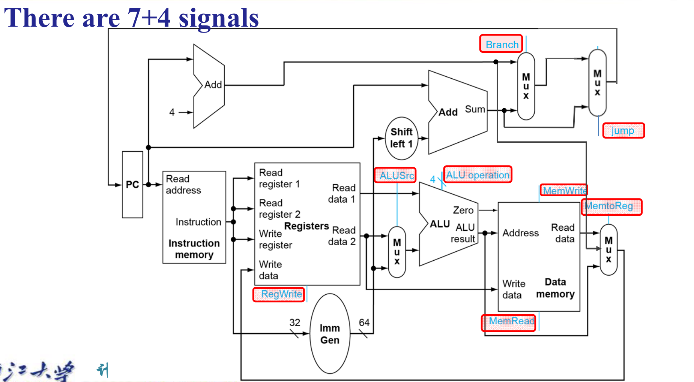

需要参照的指令部分（蓝色）


可以多层解码生成 ALU 控制信号（这样在开始时可以只传 ins[6:0]）


此时的 Decoder：


或者一层用case语句test


> Performence（cycle time）取决于最慢的指令，一些部件在某些指令没有用到
>
> 提升：流水线

-----

## Exception


* CPU 内部的中断信号（同步）—— Exception
* CPU 外部（异步）—— Interuption

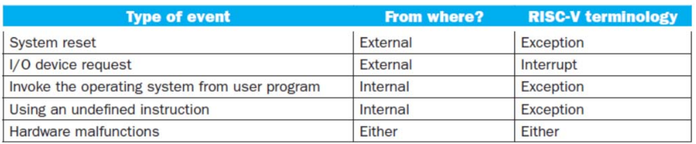

处理中断信号：

1. 保存 CPU 状态
      1. 保存被打断的信号的 PC，In RISC-V 保存在 Supervisor Exception Program Counter（mEPC）
      2. 保存问题的说明，In RISC-V 保存在 Supervisor Exception Cause Register (mCAUSE)
2. 处理异常：跳转到 mtvec 寄存器提供的地址解决问题
      1. 读取 mCAUSE，并转至相关处理程序
      2. 确定需要进行的操作
      3. 可行的话处理完毕后回归
      4. 不行的话终止程序，报告 SEPC、SCAUSE

3. 回到正常流程（In RISC-V 机器模式，使用MRET退出指令，返回到SEPC存储的pc地址开始执行）


根据以上流程，我们需要：

* Transfer control to exception handler & return from exception
* Control status registers
* CSR instructions

> RISC-V 的权限模式（机器模式权限最高且必须提供）
>
> 在机器模式（M 模式）下运行的代码通常本质上是可信的，因为它对机器实现具有低级访问权限。
>
> M 模式可用于管理 RISC-V 上的安全执行环境。
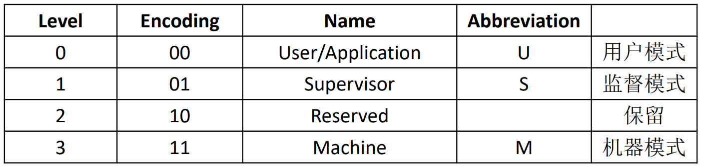

实现多个权限 mode 更加安全

**Control and Status Registers (CSRs)**

* additional set of registers，可以被 CSR 指令访问（某些模式）
* CSR 指令分为： atomically read-modify-write CSR 和所有其他特权指令

指令格式：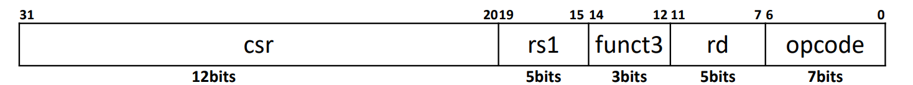

* 12 位可访问 4096 个 CSRs
* 前两位：读写模式选择
* 接下来两位：模式（机器模式、用户模式等）

* 中断中使用的 MSRs：
  

    * mstatus(0x300)

        Machine STATUS register：主要用于保证当前特权模式下中断处理程序的原子性。
        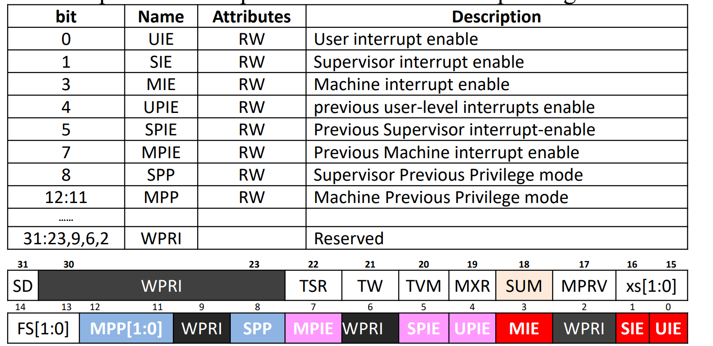
    * mie/mip(0x304/344)

        Machine Interrupt Enable register: 控制能否响应中断

        * MEIE、SEIE and UEIE enable external interrupt
        * MSIE、SSIE & USIE enable software interrupts
        * MTIE、STIE and UTIE enable timer interrupts

        Machine interrupt-pending register
        

    * mtvec

        Machine Trap-Vector Base-Address Register：包含 vector base address 和 vector mode
        

        BASE 字段中的值必须始终在 4 字节边界上对齐，并且 MODE 设置可能会对 BASE 字段中的值施加额外的对齐约束。

        
    * mepc
  
        Machine Exception Program Counter: 记录回来的地址（最后两位为 0，因为地址是 4 的倍数）
        
        
        
        Exception：mepc = PC

        Interruption： mepc = PC + 4

    * mcause

        第一位是 1 - 中断，0 - 异常
        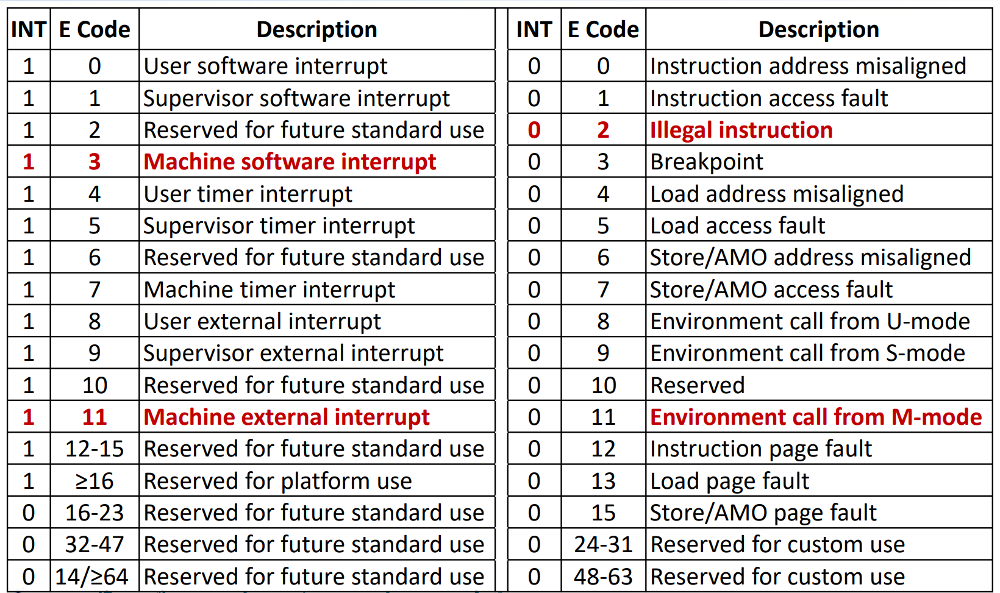


## 流水线

> 不是提升一条指令的速度，而是增加部件利用率，提升 Throughput
>
> 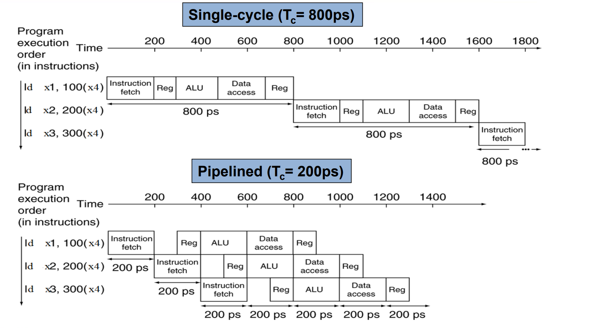

每个阶段之间加一个缓冲器，记录所需的所有信息

* **Data** need to be used in the next stages.
* **Control signals** need to be used in the next stages
* **Debug info** when used in duration of desig

由于缓冲器 latch 有 cost、需要 area，因此不是阶段越多越好

* Machine cycle > latch latency + clock skew

> 时钟偏斜是指在同一时钟信号下，不同部件或电路的响应时间不同，导致它们在同一时刻接收到的时钟信号不完全同时


------

影响流水线性能的因素：

* Latency - 每条指令的执行时间反而延长（latch 的准备时间
* Imbalance - 不同阶段时间不同，需要取最长的阶段
* Overhead - 寄存器延迟和时钟偏斜导致的开销增加
* Hazard
* 填充流水线和清空流水线的时间


### Hazard——冒险

* Structure hazard: 竞争硬件资源
    * 将指令和 data memory 分开
    * 备份硬件
    * 前半个时钟周期写 reg，后半个读
    * 不管（概率小）

> 浮点数乘法器需要多个周期，可能需要一直等待，可以分成多个部件分阶段执行

* Data hazard: 需要等待前一条指令执行完
    * 前递
* Control hazard: contrl action 依赖于前一条指令（比如跳转时
    * 分支预测
    * 在 ID 阶段增加硬件，提前跳转

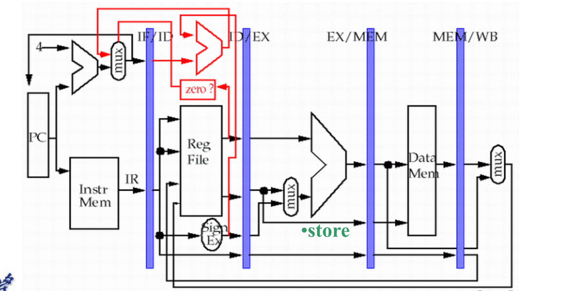

> 上面的所有问题都可以用两个 stall 解决
>
> add extra hardware to detect stall situations

有时候不处理冒险，因为会造成额外开销、本身出现少，可以降低 Latency


```asm
// x19 在连续两条指令中使用
add x19, x0, x1
sub x2, x19, x3
```

解决方法一：停顿两个周期（效率低）

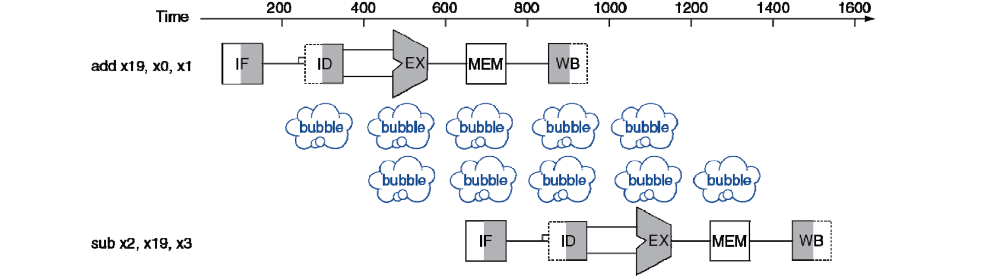

解决方法二：前递


但一些时候不能直接前递，必须 bubble


forwarding 条件判断：

* 当前指令 rs1 == 上一指令 rd?
* 上一指令 RegWrite == 1?
* rd != 0

数据通路：


如果多个 buffer 里都有当前指令的 rs1/rs2，优先最新的 buffer

```verilog
if (MEM/WB.RegWrite and (MEM/WB.RegisterRd ≠ 0)
    and not (EX/MEM.RegWrite and (EX/MEM.RegisterRd ≠ 0)
        and (EX/MEM.RegisterRd = ID/EX.RegisterRs1))
    and (MEM/WB.RegisterRd = ID/EX.RegisterRs1))
    orwardA = 01

if (MEM/WB.RegWrite and (MEM/WB.RegisterRd ≠ 0)
    and not (EX/MEM.RegWrite and (EX/MEM.RegisterRd ≠ 0)
        and (EX/MEM.RegisterRd = ID/EX.RegisterRs2))
    and (MEM/WB.RegisterRd = ID/EX.RegisterRs2))
    ForwardB = 01
```

* Control Hazard: Control 信号的产生依赖前一条指令

> Example: branch 指令


k 阶流水线CPU执行 n 条指令所需的时钟周期数 = n + k − 1

* n 是填充流水线所需的时钟周期数，
* (k−1) 是所有指令进入流水线后，最后一条指令完成所需的额外时钟周期数


### 衡量 performence

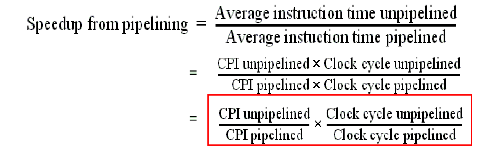


> The ideal CPI on a pipelined processor is almost always 1

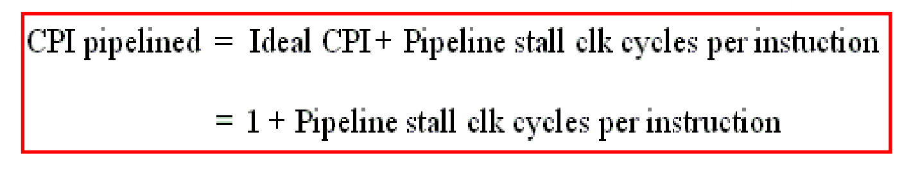