# Memory

## 5.1 Introduction
程序的两个常见性质：

* temporal locality (locality in time): 一个 item 被访问，可能很快就被再次访问
* spatial locality (locality in space): 一个 item 被访问，可能很快访问它旁边（address）的 item

现在的关注点：upper & lower 两个层级

* block: minimum unit of data (block) for transfers 
* hit: data requested is in the upper level
    * hit time: The time to access the upper level of the memory hierarchy, which includes the time needed to determine whether the access is a hit or a miss.
* miss: data requested is not in the upper level
    * miss penalty: The time to replace a block in the upper level with the corresponding block from the lower level, plus the time to deliver this block to the processor.

怎么利用 locality:

* Memory hierarchy
* Store everything on disk
* Copy recently accessed (and nearby) items from disk to smaller DRAM memory - Main memory
* Copy more recently accessed (and nearby) items from DRAM to smaller SRAM memory - Cache memory attached to CPU

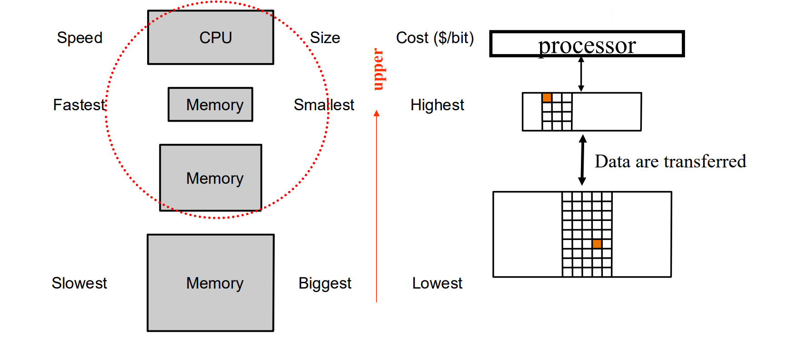

越接近 CPU 的存储层级，越快、越小、越昂贵

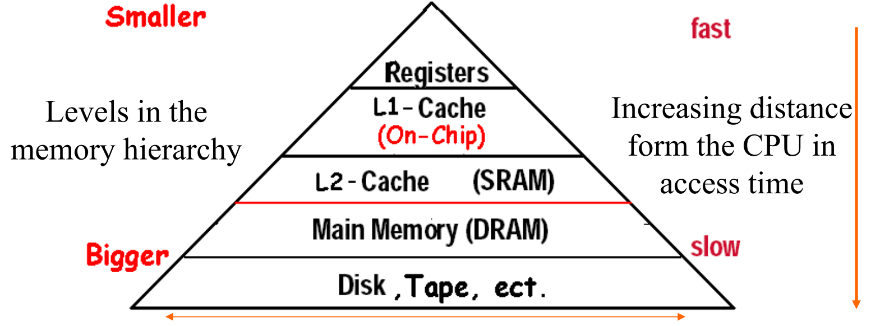

---------------
## 5.2 Memory Technology
* SRAM - 门电路组成
* DRAM - 电容池组成，读取一整行数据
    * DDR - 在上升沿和下降沿都能读写
    * QDR - DDR 的输入输出端分开
* Flash Storage - 非易失性的半导体存储（NOR、NAND...）
* **Disk** - 非易失性的旋转磁性存储

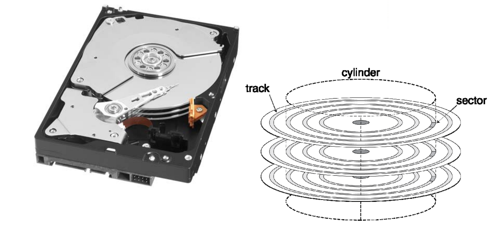

每个 sector 包含：

* Sector ID
* Data
* Error correcting code (ECC)
* Synchronization fields and gaps

访问一个 sector 需要：

1. 等待前面一次的访问
2. seek - 移动磁头到目标磁道（最耗时）
3. 等待磁盘旋转到正确位置
4. 数据传输
5. Controller overhead - 磁盘控制器处理读写操作请求的时间，包括命令解析、数据缓存等。（开销相对较小）

> Disk Access Example: 512B sector, 15,000rpm, 4ms average seek time, 100MB/s transfer rate, 0.2ms controller overhead, idle disk
>
> 注：15,000rpm 表示它的旋转速度是每分钟15000转

Average read time 

= 4ms 平均寻道时间 + (60/15000) * 1/2ms 平均旋转时间 + 512/100*2^10ms 传输时间 + 0.2ms controller overhead

= 6.205 ms

提升磁盘性能：locality -> smaller seek time; cache - 预先拿到 sector，避免 seek 和等待旋转。

------------
## 5.3 The basics of Cache

怎么把磁盘里的 block 放在 cache 里

方法一：Direct Mapped Cache

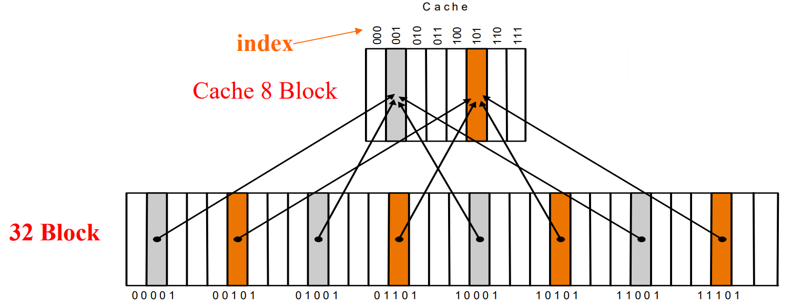

后缀相同的块放在 cache 的同一个 block 里

* block address:
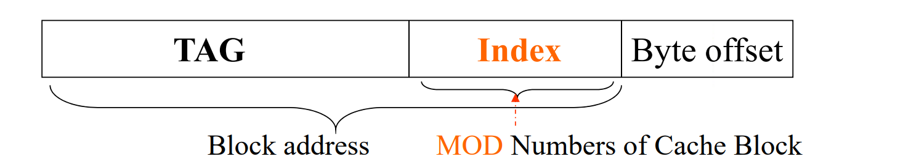
    * 对于内存地址而言，其后block offset个字节的数据会构成一个和cache做数据交换的块，即cache块的大小

下面的图中，tag 是内存地址的前两位，index 是后三位

当后三位相同时，发生置换

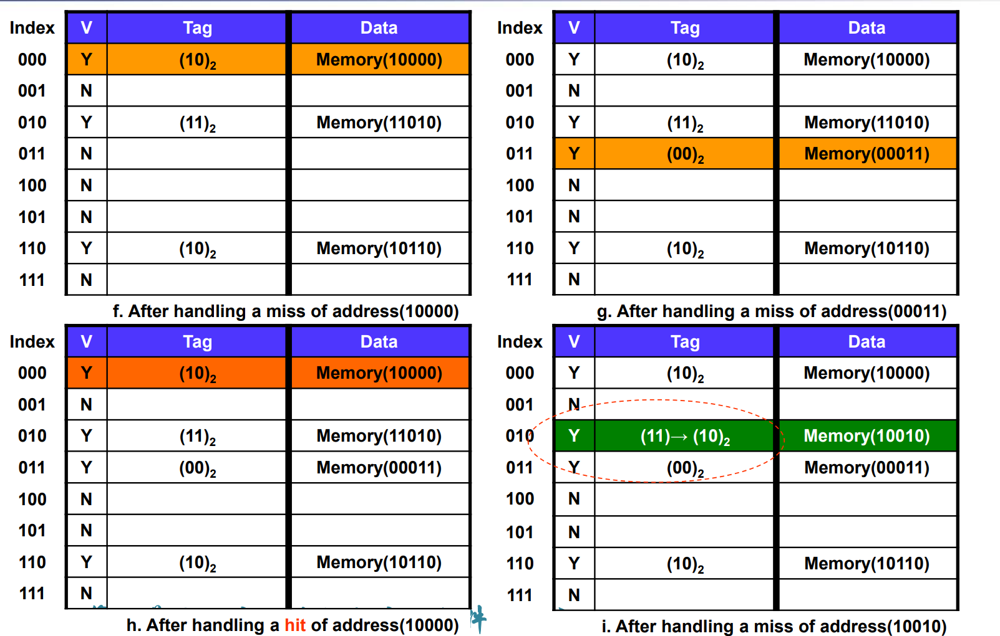

* 优点：映射简单，访问快速
* 缺点：替换频繁，命中率低

> Example: How many total bits are required for a direct-mapped cache 16KB of data and 4-word blocks, assuming a 64-bit address?

* 16KB data = 4K words = $2^12$ words = $2^10$ blocks

* 索引位数（每个 block 需要一个索引值）= 10

* 表示偏移的位数（一个 block 中，每个字节需要一个偏移值）= 4

* 标签位数 = 总地址位数 - 索引位数 - 偏移位数 = 64 - 10 - 4 = 50 位

每个缓存块需要存储：

* 数据（128 位）
* 标签（50 位）
* 有效位（1 位）

每个块的总位数 = 数据位 + 标签位 + 有效位 = 128 + 50 + 1 = 179 位

所有块的总位数 = 块数 * 每块的位数 = 1024 块 * 179 位/块 = 183,296 位

--------------

方法二：全相联 - 主存的任意一块可以映射到 cache 的任意一块

* 优点：cache 利用率高，命中率高
* 缺点：速度低，每次都要遍历全部 cache

方法三：组相联 - 主存和 cache 按同样大小分成组，同组之间全相联，组间直接映射

* 优点：前两种方法的优点
* 缺点：实现复杂

size 和 performence

* 一般来说 cache 越大缺失率越低
* 相同 cache 大小，大 block 会增加竞争和污染
* 写回时需要消耗很多，抵消了低缺失率的好处

----------

**如何处理 miss 和 hit**

* read hit
* read miss (instruction or data) - Stall the CPU, fetch block from memory, deliver to cache, restart CPU read
* write hit - write back (替换块时才写回) or write through (立即写回)
* write miss - write allocate (读取块) or write around (直接写到 memory)

优缺点和解决方法

* write back - cache 和 memory 数据不一致
* write through - 耗时
* Solution: write buffer, 把要写的数据放里面，cpu 继续运行，当 write buffer 满了才 stall

多种 orgnization：

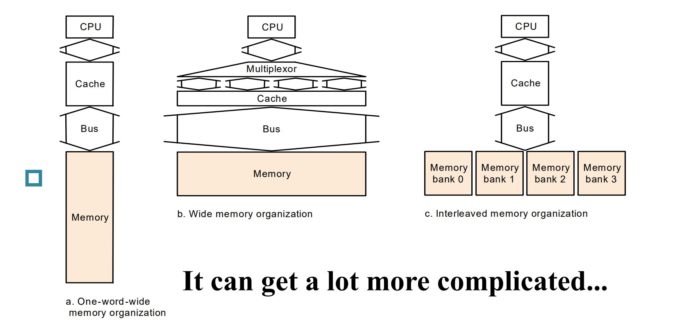

## 5.4 Measuring and improving cache performance

> Average Memory Access time = hit time + miss time 
> 
> = hit rate × Cache time + miss rate × memory tim

We use **CPU time** to measure cache performance.

* CPU time = (CPU execution clock cycles + Memory-stall clock cycles) × Clock cycle time = I × CPI × Clock cycle time
* Memory-stall clock cycles = Read-stall cycles + Write-stall cycles
* 通常情况下 Read-stall cycles 和 Write 相同，Memory-stall clock cycles = access memory 的指令比率 × Miss rate × Miss penalty

> 如果加快时钟频率为原来的两倍，miss penalty 的时钟数也要变为两倍

**Average Access Time** (AMAT)

* AMAT = Hit time + Miss rate × Miss penalt
* 多级存储情况下 - AMAT = L1 访问时间 + L1 未命中率 × (L2 访问时间 + L2 未命中率 × 主存访问时间)

> 总结：CPU 提升越大，miss rate 和 cache 性能影响越大

---------

Replacement Policy

* 一路组相联 - direct-mapped
* 一组组相联 - fully-associative
* 组相联实现需要的额外的门 - 下面的四路需要 4 comparators and a 4-to-1 multiplexor

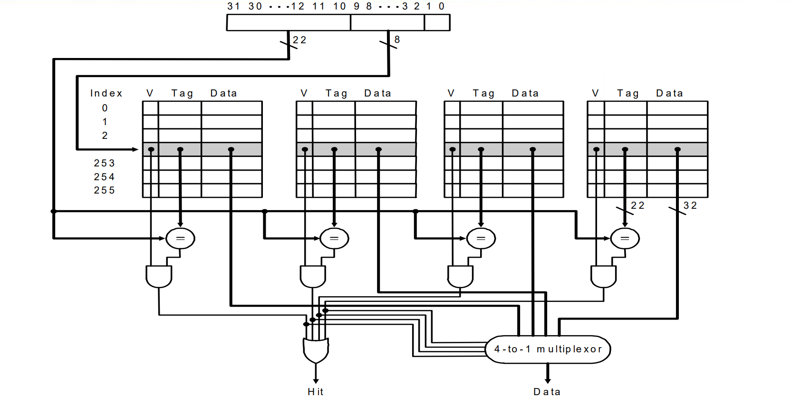

* LRU: 替换掉最不常用的
* Random
* 性能差不多

-----------

Multilevel Caches

> 多级缓存 - 减少缺失的数据量

* primary cache(DRAM) - 与 CPU 在同一个芯片里，访问速度快，容量小
* 在一级缓存上放一个二级缓存(SRAM、组相联、容量大)
* 缺失率在二级缓存大大降低

性能改善：(计算 CPI 比较)

> primary cache, 2% miss, miss penalty 5 ns
>
> secondary cache, 0.5% miss, miss penalty 100 ns
>
> clock 5GHz, CPI without stall 1.0

* 每个 clock = 1/5 = 0.2 ns
* 只有一级 cache - CPI = 1.0 + 2% * 100/0.2 = 11
* 两级 - CPI = 1.0 + 2% * 5/0.2 + 0.5% * 100/0.2 = 4.0
* 后者速度是前者的 2.8 倍

--------

Advanced CPU

* 乱序处理器可以在 cache miss 时继续执行指令，与该缓存未命中相关的存储操作会留在加载/存储单元，受 miss 的 load/store 影响的指令在 reservation stations 等待，独立的指令继续执行 
* miss 的影响取决于具体的程序，很难分析（系统仿真工具）

------

Software Optimization via Blocking

* 目标：在块被替换之前最大程度利用它

<!-- 感觉这块不重要 -->

> 排序算法

> 矩阵乘法（分块思想）DGEMM

----------

## 5.5 Dependable Memory Hierarchy

* Reliability: mean time to failure (MTTF)
* Service interruption: mean time to repair (MTTR)
* Mean time between failures - MTBF = MTTF + MTTR
* Availability = MTTF / (MTTF + MTTR)
* improve Availability - 减少 fault 的发生（增加 MTTF）或提升修复工具（缩短 MTTR）

The Hamming SEC Code

* Hamming distance - 两个部分在相同位置上不同 bit 的数量
* 最小汉明距离 = 2 - 可以检验错误
    * 奇偶校验码就是（序列出错后一定有一位不同，加上校验位一定至少两位不同）
* 最小距离 = 3 - 提供单比特错误纠正，双比特错误检测

编码 SEC：

* 最左边的 bit 是 1，给每个 bit 编码 1、2、3 ...
* 校验位的位置通常选为 2 的幂次位置（即 1, 2, 4, 8, ...）。其余位置用于放置数据位。
* 对应的奇偶校验码根据下图标记的位数生成

解码 SEC：

<!-- 这里感觉不重要，没仔细看 -->

* 重新计算校验位 H
* 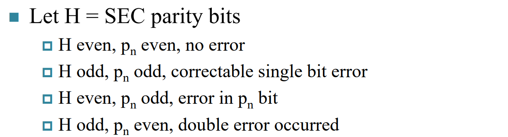

SEC/DED Code - Add an additional parity bit for the whole word (pn), Make Hamming distance = 4

* 用 8 位保护 64 位

----------- 

## 5.6 Virtual Machines

> 主机模拟不同的操作系统 & machine source

* 改善对多个客操作系统的隔离
* 避免安全性和可靠性问题
* 有助于资源共享
* 但是对性能有影响（现代高性能计算机可行

Virtual Machine Monitor（虚拟机管理程序）

* 将虚拟资源映射到物理资源 - 内存、I/O设备、CPU
* 客体代码在本机的用户模式下运行 - 在执行特权指令和访问受保护资源时 trap 到 VMM
* 客体操作系统可以与主机操作系统不同
* VMM 处理实际的I/O设备 - 为客体仿真通用的虚拟I/O设备

--------

以 timer interrupt 为例

* 主机 - 操作系统挂起当前程序，处理中断，决定下一个程序
* VM - VMM 挂起当前 VM，处理中断，决定下一个 VM
* VMM 怎么发起 timer interrupt：emulates a virtual timer, emulates interrupt for VM when physical timer interrupt occurs

指令集支持

* 权限指令只能在 system mode 执行，如果在 user mode 唤起，则 trap
* physical resources 只能被权限指令访问（页表、中断、I/O 寄存器等
* 指令集为虚拟化革新过

---------

## 5.7 Virtual Memory

> 相当于把主存作为磁盘的 cache，由硬件和操作系统共同维护

多个程序共享内存

* 避免冲突，给每个程序一个虚拟内存空间

* 虚拟内存 -> 物理内存(by CPU & OS)

    * VM "block" is called a page
    * VM translation "miss" is called a page fault

---------

### Addrss Translation

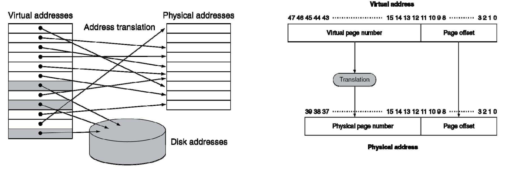

page fault

* 虚拟内存不在 memory，而在 disk
* miss penalty 很大，因此每页需要很大 (4KB)
* 降低 page fault 很重要 (LRU)
* 可以在软件处理这个过程
* write through expensive, use write back

**page table**

* 表记录了虚拟页号（Virtual Page Number, VPN）和物理页号（Physical Page Number, PPN）之间的映射关系，将虚页号转化为实页号
* 数据结构是以虚拟页号为 index 的 array
* PTE（Page Table Entry，页表项）是页表中的一个条目，它存储虚拟页号对应的物理页号，还包含了一些控制和状态信息 (如 dirty bit & valid bit)
    * If page is present in memory - PTE stores the physical page number, Plus other status bits (referenced, dirty, …)
    * If page is not present - PTE can refer to location in swap space on disk
    * 全相联

* 如何映射到磁盘
    * When the OS creates a process, it usually creates the space on disk for all the pages of a process
    * page fault -> OS be given control through exception mechanism
    * OS find page in disk
    * bring the page to main memory

计算 page table 的大小

> Virtual address is 48 bits
>
> page size is 4KB
> 
> Entry size is 8 Bytes

因为 page size is 4KB，所以在 Virtual address 中，有 $log_24K$ = 12 位是 page offset bit

因此虚拟页号占 48 - 12 = 36 bits，需要 $2^{36}$ 个 PTE

Size of page table = $2^{36}\times 8$(Entry size/byte) = 512 GB

--------

LRU 策略如何实现

* 每访问一次 page，置 PTE 的 LRU 位为 1
* Periodically cleared to 0 by OS
* A page with reference bit = 0 has not been used recently

### Making Address Translation Fast--TLB

> 用页表访问页需要额外访问一次存储里的页表，才能访问到内存里的页

注意到页表的访问 has good locality

* 给页表一个 fast cache (within CPU)
* called TLB（Translation Lookaside Buffer，翻译后备缓冲器）
* 一般来说，里面有 16 - 512 个 PTE，0.5 - 1 cycle for hit, 10 - 100 cycle for miss, 0.01 - 1% miss rate
* miss 可以用硬件或软件处理

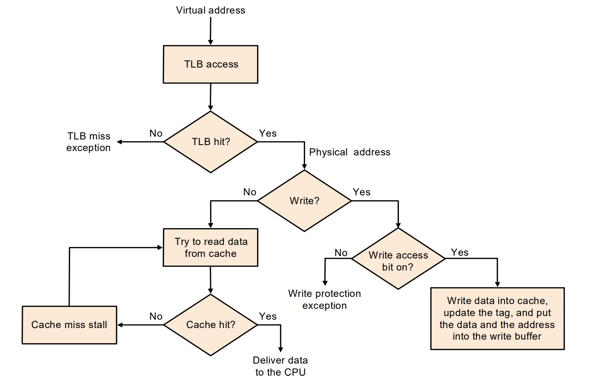

* 必须保证虚拟地址没有别名

### Memory Protection

## The Memory Hierarchy

Block Identification

* Tag
    * Every block has an address tag that stores the main memory address of the data stored in the block
    * When checking the cache, the processor will compare the requested memory address to the cache tag -- if the two are equal, then there is a cache hit and the data is present in the cache

Strategy of block Replacement

* Random
* LRU
* FIFO

Write Strategy

* 写 cache 的时候同时写内存 - write-through cache（替换简单，可能需要 write buffer）
* 不写内存 - write-back cache（在替换 block 时写回）
* write stall
* write miss

Sources of Misses

> 3C 模型

* Compulsory misses (aka cold start misses) - 第一次访问一个 block
* Capacity misses - cache 满了，替换掉的 block 需要再次访问
* Confilct misses (aka collision misses) - 非全相联时 ...

Cache Controller FSM

