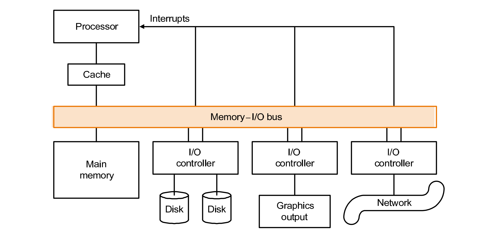
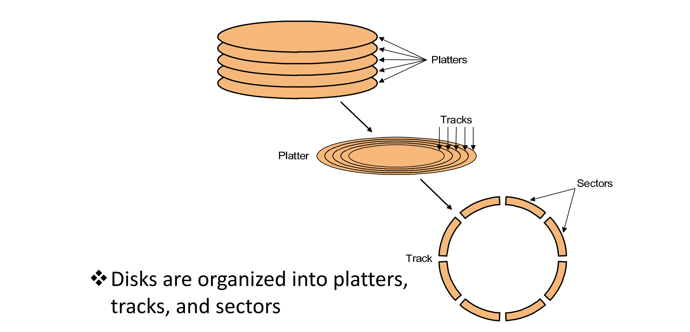
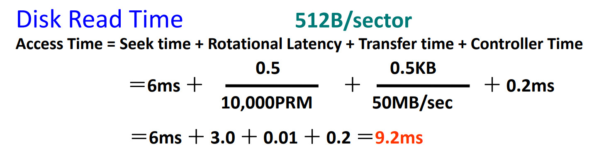
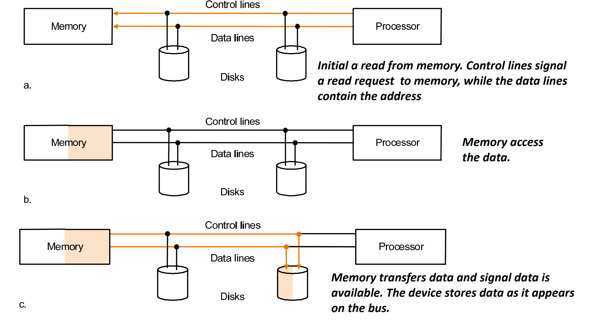
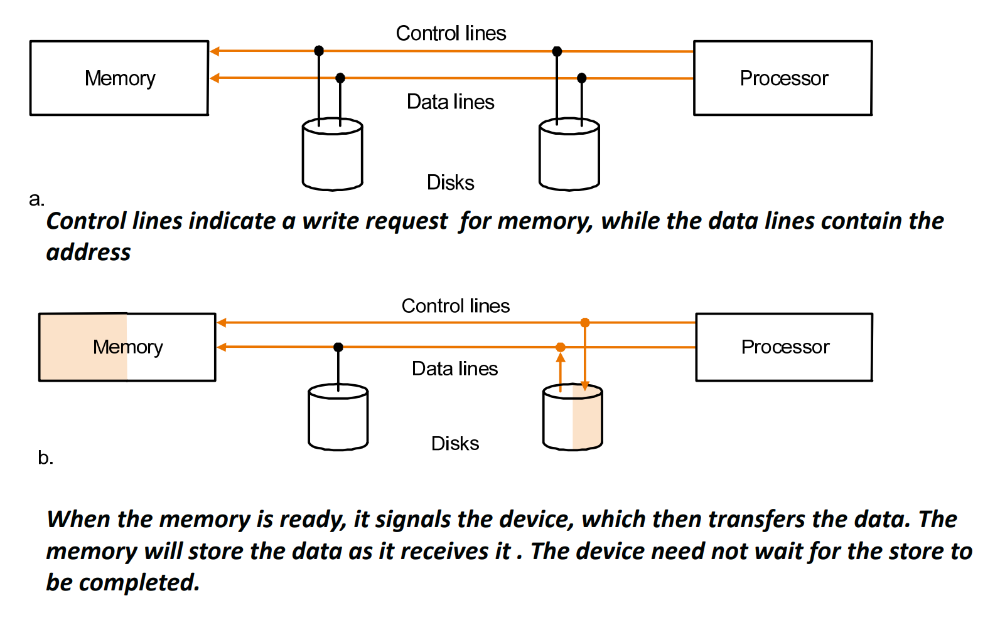
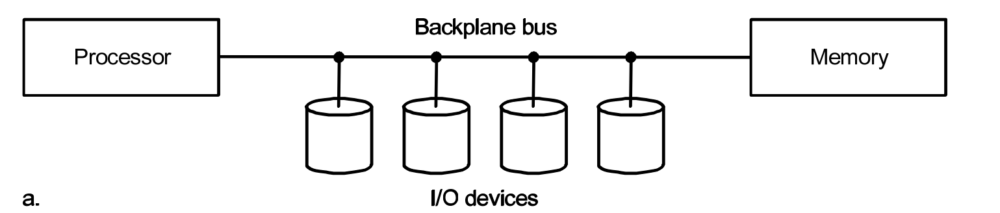
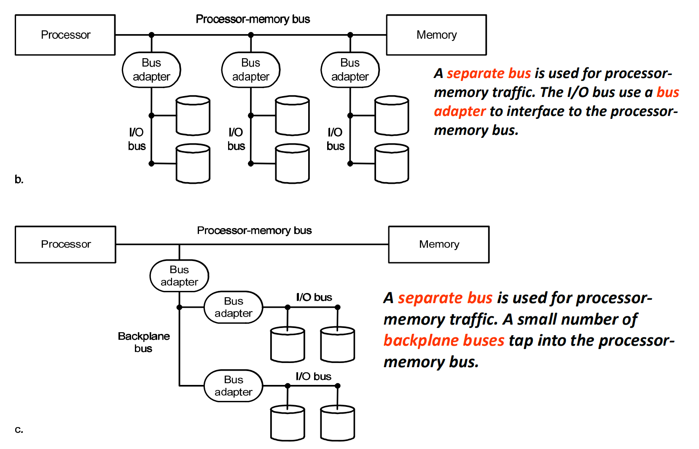

# I/O

## 6.1 Introduction

* 输入输出设计需要考虑可扩展性，可恢复性，表现...
* 评价表现很困难（很多种情况
* Performance depends on: 设备之间的连接、存储层级、操作系统

> 典型的 I/O 设计

三个特征：

* Behavior - input (read once), output (write only, cannot read) ,or storage (can be reread and usually rewritten)
* Partner - human or machine (input or get output data)
* Data rate - I/O 设备和主内存传递数据的速率峰值

衡量表现

* throughput
    * 带宽（I/O bandwidth）- 单位时间内可以传输的最大数据量
    * 单位时间可以进行多少次 I/O 操作
* 等待时间

-------------
## 6.2 Disk Storage and Dependability

* 两种主要的磁盘
    * floppy disks
    * hard disks - 更大、密度更高、速率更高、多个盘片（Platter）

> 计算从磁盘拿数据的时间

## Dependability
* MTTF - mean time to failure（平均无故障时间）
* MTTR - 平均修复时间
* MTBF - 平均故障间隔时间

* **Availability** - 可用性

    $$
    Availability = \frac{MTTF}{MTTF+MTTR}
    $$

Three way to improve MTTF - Fault avoidance、Fault tolerance、Fault forecasting

Array Reliability

* Reliability of N disks = Reliability of 1 Disk ÷ N

* Redundant Arrays of (Inexpensive) Disks (RAID, 同数据库)
    * RAID0 - 正常无冗余，数据**条带化**，大磁盘分为小磁盘，可以改善性能（多个读写磁头）
    * RAID1 - 将数据复制一份存在另一组磁盘里（镜像）
    * RAID2 - 算校验码（现在不用
    * RAID3 - 按位交叉，所有的磁盘按位算校验码（需要同时读所有盘）
    * RAID4 - 按块交叉（不能同时写不同盘）
    * RAID5 - 块交叉，将冗余信息放在不同的盘上，这样可以同时写入
    * RAID6 - P+Q，每行、每列都算一个校验位

## Buses and Other Connections between Processors Memory, and I/O Devices

bus 包含两种 line - control line（表明信息类型）data line

bus 事务：发送地址/接收或发送信息

bus 操作：input/output

* 总线类型
    * 处理器-内存总线
    * 背板总线
    * I/O 总线

    

    * 分离总线
     

* 握手协议

6.3 Networks (Skim)
6.4 Buses and Other Connections between
Processors Memory, and I/O Devices
6.5 Interfacing I/O Devices to the Memory,
Processor, and Operating System
6.6 I/O Performance Measures: 
Examples from Disk and File Systems
6.7 Designing an I/O system
6.8 Real Stuff: A Typical Desktop I/O System

