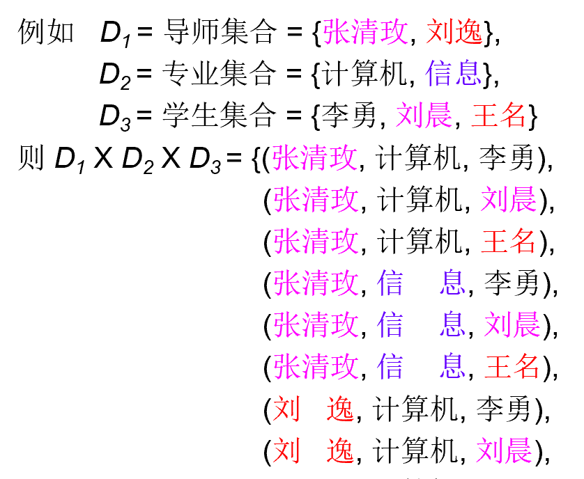
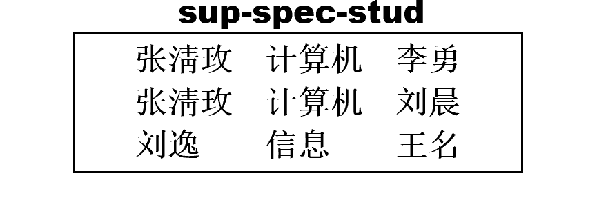
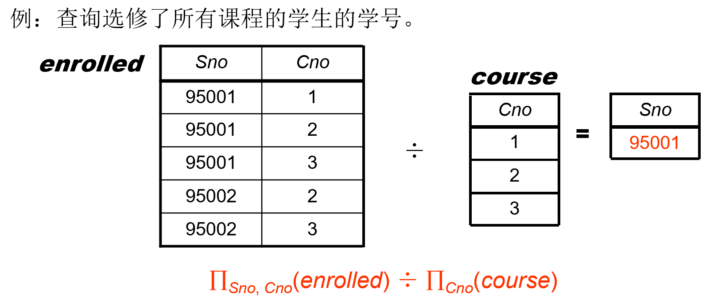

# 数据库系统
* Database Management System（DBMS）
* 成绩构成：
 
 考试可带A4纸
* 教材：Database System Concepts (7th Edition)
  * 1, 2, 3, 4, 5, 6, 7, 
    12, 13, 14, 15, 16, 17, 18, 19


## Lecture 1: Introduction
### Purpose
* 数据库：长期存储在计算机内、有组织的、可共享的数据集合
* 数据库系统（DBMS）：数据库 + 可对其进行操作的程序
* DBMS的特征
  * **数据访问**高效、稳定、可扩展
  * 缩短应用的开发时间
  * 数据独立性（physical和logical）
  * 数据完整性和安全性
  * 并发访问和鲁棒性（易恢复

* DBMS VS File-Processing System 
  * 文件处理系统由传统的操作系统 （OS） 支持。
### View
* 如果想要隐藏
  * 新建一个表：空间、**同步问题**
  * 同一张表上用不同的视图
#### Database Langueage
* Data Definition Language (DDL) 
* Data Manipulation Language (DML) 
* Data Control Language (DCL) 
* SQL = DDL+ DML+DCL 
#### Transaction Management
* 并发访问带来问题
* 数据库保证原子性、一致性、隔离性、持久性

#### Database Architecture 
* Storage Manager 
* Query Processor：描述性语句转化成操作 
* Overall System Structure 
* Application Architecture 

## Lecture 2: Relational Model 
#### Structure of Relational Databases 
基本结构：笛卡尔积
    {width=400px}
  * 可用二维表表示
  * 反映特定意义的子集就是**关系**，例如：
  {width=300px}
* 导师——属性（attribute）
  * 属性值——原子性（不可分割）
  * 所有可取的值——域
<!-- Relation schema 待补充 -->

Key
* 可以唯一确定关系中另一个属性的值的**属性**
  * 例如知道学号可以确定学生，学号是key
<!-- 类型 -->
* Foreign Key（外键）
  * 在当前表不能唯一确定，但在另一张表可以
    * 专业号不能确定学生，但在另一张{专业号，专业}的表里可以确定专业
#### Fundamental Relational-Algebra Operations 
6个基本操作：收到1-2个表，返回一个**表**
* Select      选择 （横向切割）
  * 符号：$\sigma_{branch-name=‘Perryridge’ }(account) $
  * ?: Note that, the selection conditions need to aim at the attribute values of the same tuple, when we conduct section operation. 
  
* Project     投影 （纵向切割——注意相同的集合元素要合并）
* Union       并 
 * set difference      差（集合差）
* Cartesian product      笛卡儿积 
* Rename      改名（重命名） 


> Example Queries 5: Find the names of all customers who have a loan at the Perryridge branch. 

方法1：customer-name(branch-name=‘Perryridge’ 
(borrower.loan-number = loan.loan-number(borrower x loan))) 
方法2：customer-name(borrower.loan-number = loan.loan-number 
(borrower x (branch-name=‘Perryridge’ (loan)))) 
* 需要乘的东西更少，节省开销

> Example Queries 7: Find the largest account balance (i.e., **self-comparison**). 

* 改名的用处

#### Additional Relational-Algebra Operations 
Four basic operators

* Set intersection      交 
  可以用差来表示：A ∩ B = A - (A - B)
* Natural join            自然连接 
  多个表的操作经常用到

  由笛卡尔积和选择组成
  * Notion: $\gamma \bowtie s$  

* Division                  除  
  笛卡尔积的逆运算
  {width=450px}
<!-- 详细解释？ -->
  * Notion: $ r \div s$
  > 用基本操作推导
* Assignment            赋值 
  $<-$

Summary:
* Union, set difference, Set intersection 为双目、**等元**运算 
* Cartesian product, Natural join, Division 为双目运算 
* Project, select 为单目运算

* 优先级：单目>多目，乘除>加减

#### Extended Relational-Algebra Operations 
Generalized Projection: 广义投影
* 可以用代数运算产生一个新属性

Aggregate Functions: 聚合函数
* Aggregation function takes a collection of values and returns a single value as a result. 
avg: average value 
min: minimum value 
max: maximum value 
sum: sum of values 
count: number of values 

式子前面加属性A：根据属性A分组，返回一个关系
> E.g., 求平均存款余额 
               $g_{avg(balance)}(account) $

#### Modification of the Database 

数据库更改操作: Deletion,  Insertion,  Updating 
All these operations are expressed using the **assignment** operator. 

<!-- Deletion? -->

------
## Lecture 3: SQL
Structured Query Language——结构化查询语言
与国际标准不同——没人要
与国际标准相同——易替代

#### Data Definition Language 
```sql
CREATE TABLE branch
              (branch_name    char(15) not null, 
                branch_city   varchar(30), 
                assets        numeric(8,2),
                primary key (branch_name)) 

```
Domain Types:
* char(n): Fixed length character string, with user-specified length. 
* varchar(n): Variable length character strings, with user-specified maximum length n. 
* int: Integer (a finite subset of the integers that is machine-dependent). 
* smallint: Small integer (a machine-dependent subset of the integer domain type). 
* numeric(p, d): Fixed point number, with user-specified precision of p digits, with d digits to the right of decimal point. 
* real, double precision: Floating point and double-precision floating point numbers, with machine-dependent precision. 

DROP TABLE r：将数据和表都删掉

Basic Structure 
Set Operations 
Aggregate Functions 
Null Values 
Nested Subqueries 
Views 
Derived Relations 
Modification of the Database 
Joined Relations 


file:///E:/book/DB/Database_System_Concepts.pdf