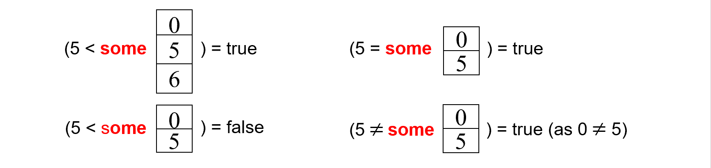

# 数据库系统 - sql语言
Structured Query Language——结构化查询语言
与国际标准不同——没人要
与国际标准相同——易替代

## Data Definition Language 
-----
```sql
CREATE TABLE branch
              (branch_name    char(15) not null, 
                branch_city   varchar(30), 
                assets        numeric(8,2),
                primary key (branch_name)) 

```
Domain Types:

* char(n): Fixed length character string, with user-specified length. 
* varchar(n): Variable length character strings, with user-specified maximum length n. 
* int: Integer (a finite subset of the integers that is machine-dependent). 
* smallint: Small integer (a machine-dependent subset of the integer domain type). 
* numeric(p, d): Fixed point number, with user-specified precision of p digits, with d digits to the right of decimal point. 
* real, double precision: Floating point and double-precision floating point numbers, with machine-dependent precision. 

DROP TABLE r：将数据和表都删掉


## Basic Structure
------
> 操作的示例数据库
>
> `loan(loan-number, branch-name, amount)`
> 
> `borrower(customer-name, loan-number) `


The select clause
```sql
Select branch_name, balance from account  where balance >= 500 

SELECT distinct branch_name FROM loan -- distinct: remove duplicates
SELECT all branch_name FROM loan -- all: allow duplicates, default 

SELECT loan_number  
FROM loan 
WHERE amount BETWEEN 90000 AND 100000 -- amount >=90000 && amount <=100000

```

The where clause 

The from clause 


The rename operation 
```sql
SELECT customer_name, T.loan_number, S.amount 
FROM borrower as T, loan as S -- as: rename
WHERE T.loan_number = S.loan_number 
-- 改名起到简化作用
```
rename 更关键的作用——复制一张表，起比较作用
```sql
--Find the names of all branches that have greater assets 
--than some branch located in city Brooklyn.

SELECT distinct T.branch_name
FROM branch as T, branch as S
WHERE T.assets > S.assets and S.branch_city = ‘Brooklyn’ 
```


String operations 

* 通配符
    
    * % --- matches any substring (likes * in the file system). 
    * _ --- matches any character (like ? in the file system). 

```sql
--Find the names of all customers 
--whose name includes the substring “泽”. 

SELECT customer_name
FROM customer
WHERE customer_name LIKE ‘%泽%’ 


--Match the name “Main%” 

LIKE ‘Main\%’ escape  ‘\’
```


Ordering the display of tuples 
```sql
-- List in alphabetic order the names of all 
-- customers having a loan in Perryridge branch. 

SELECT distinct customer_name
FROM borrower A, loan B 
WHERE A.loan_number = B.loan_number and 
branch_name = ‘Perryridge’ 
order by customer_name 
```


Duplicates 


## Set Operations
------
UNION, INTERSECT, and EXCEPT 分别是并、交、差集

* 使用集合运算符时，自动去重

* 如果不想去重 - UNION ALL, INTERSECT ALL, and EXCEPT ALL.

```sql title='set op example'
-- Find all customers who have a loan or an account or both. 
(SELECT customer_name FROM depositor) 
UNION 
(SELECT customer_name FROM borrower) 

-- Find all customers who have both a loan and an account. 
(SELECT customer_name FROM depositor) 
INTERSECT 
(SELECT customer_name FROM borrower) 
```

## Aggregate Functions
------
> 聚合函数
<!--分隔  -->

> `account(account-number, branch-name, balance) `
> 
> `depositor(customer-name, account-number) `

```sql
-- Find the number of depositors for each branch. 

-- 无distinct: 账户数
SELECT branch_name, count(customer_name) tot_num 
FROM depositor, account 
WHERE depositor.account_number=account.account_number 
GROUP BY branch_name 

-- 有distinct: 客户数（同一个人可能有多个账户）
SELECT branch_name, count(distinct customer_name) as tot_num 
FROM depositor D, account A	
WHERE D.account_number = A.account_number 
GROUP BY branch_name 
```

Having Clause
```sql
SELECT A.branch_name, avg(balance) 
FROM account A, branch B 
WHERE A.branch_name = B.branch_name and 
        branch_city =‘Brooklyn’ 
GROUP BY A.branch_name 
HAVING avg(balance) > 1200 
-- Having & where
-- 表象：having后有聚合函数，对聚合函数的结果进行操作
-- 实际：执行顺序不同
```

Summury
```sql
-- The format of SELECT statement: 

SELECT <[DISTINCT] c1, c2, …> 
FROM <r1, …> 
[WHERE <condition>] 
[GROUP BY <c1, c2, …> [HAVING <cond2>]] 
[ORDER BY <c1 [DESC] [, c2 [DESC|ASC], …]>] 
```


**执行顺序**:

From → where → group (aggregate) → having → select → distinct → order by


## Null Values
-----
当前不知道的值


## Nested Subqueries 
-----
> 嵌套查询


some: 表中某些值的值
```sql
--Find all branches that have greater assets 
--than some branch located in Brooklyn. 
SELECT distinct branch_name 
FROM branch 
WHERE assets >  some -- 如果不加：asset>表，无意义
            (SELECT assets 
            FROM branch 
            WHERE branch_city = ‘Brooklyn’) 
```


all: 表中所有的值

* (!=all)=not in
* (=all)!=in——必须是集合的相等  


------
除法的实际写法（“所有”）

* not exists —— 差集结果是否为空，为空说明除得尽
```sql
SELECT distinct S.customer_name 
FROM depositor as S 
WHERE not exists ( 
                    (SELECT branch_name 
                    FROM branch 
                    WHERE branch_city = ‘Brooklyn’) 
                    EXCEPT 
                    (SELECT distinct R.branch_name 
                    FROM depositor as T, account as R 
                    WHERE T.account_number = R.account_number 
                    and S.customer_name = T.customer_name)) 
```


## Views
------
> 也是一张表，隐藏了一些信息

```sql
  CREAT view all_customer as 
         ((SELECT branch_name, customer_name 
          FROM depositor, account 
          WHERE depositor.account_number = account.account_number) 
       union
          (SELECT branch_name, customer_name 
          FROM borrower, loan 
          WHERE borrower.loan_number = loan.loan_number)) 
```

## Derived Relations 
-------
```sql
Query 1:  SELECT branch_name, avg_bal 
                 FROM (SELECT branch_name, avg(balance) 
                     FROM account 
                     GROUP BY branch_name) -- 先建立一个本地视图
                     as result (branch_name, avg_bal) 
                 WHERE avg_bal > 500 

Query 2:  SELECT branch_name, avg(balance) 
                 FROM account 
                 GROUP BY branch_name 
                 HAVING avg(balance) > 500 

```
With Clause

* The WITH clause allows views to be defined locally for a query, rather than globally. 
```sql
      WITH max_balance(value) as 
                SELECT max(balance) 
                FROM account 
      SELECT account_number 
      FROM account, max_balance 
      WHERE account.balance = max_balance.value 
```
* 更复杂的一个例子
```sql
--Find all branches where the total account deposit is greater 
--than the average of the total account deposits at all branches.
     WITH branch_total(branch_name, a_bra_total) as 
        SELECT branch_name, sum(balance) 
        FROM account 
        GROUP BY branch_name 
     WITH total_avg(value) as 
        SELECT avg(a_bra_total) 
        FROM branch_total 
     SELECT branch_name, a_bra_total 
     FROM branch_total A, total_avg B 
     WHERE A.a_bra_total >= B.value 
```
离开这条语句，local view不存在


Modification of the Database 

Joined Relations 
