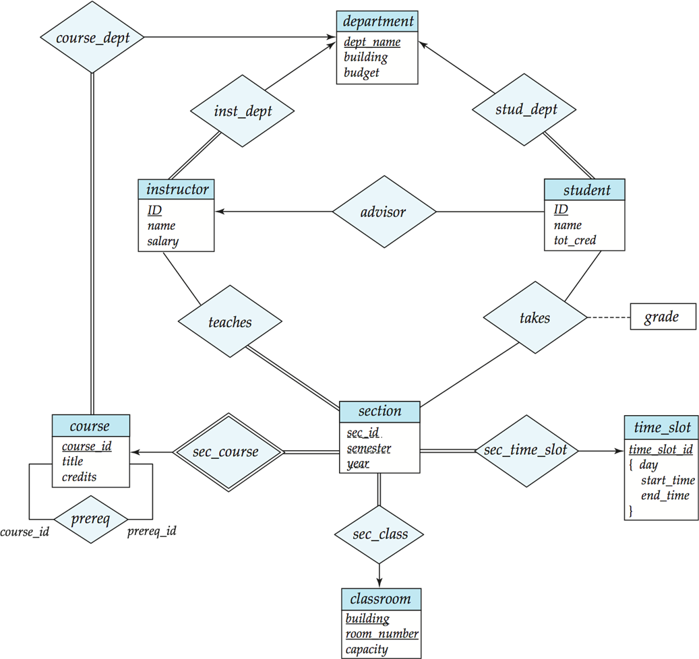

# Entity-Relationship Model —— Database System

## E-R Diagram

* 属性表示（普通属性、符合属性、多值属性、派生属性）

    法一：
<!-- 两张图 -->
    法二：

* 一对一/多对多关系表示
  * 箭头指向的是“一”
  * 没有箭头的是“多”

    alternative notion: 
  * 0..* 
  * 1..1

* 多元关系转换为二元关系

## Weak Entity Sets

弱实体：没有 Primary key

* 跟别的实体产生关系后才能唯一决定自己
* 每个属性下面都画虚线

<!-- 课程的例子 -->

<!-- 借款账户还款的例子 -->

**总结：E-R**

## Extended

* 箭头分开：两个实体可能有重合
* 箭头合并：没有重合关系

完全性约束：

* 两条线：完全泛化（分为多个个正交的子集，合并后是全集）
* 单线：部分泛化（可以存在不属于下面子集，但属于全集的元素）

<!-- 一个例子 -->

**Summary of Symbols**

## Design of an E-R Database Schema

> 将 E-R 图转换为表

* A strong entity set  => to a table with the same attributes
* 复合属性变成多个 attribute - name => first-name and last-name
* 多值属性变成两张表 - employee(emp-id, ename, sex, age, dependent-names) => employee(emp-id, ename, sex, age), employee-dependent-names(emp-id, dependent-name)
* 弱实体的联系的表是多余的
* 弱实体 + identifying strong entity set 的主键变成一张表
* 多对多之间的关系 - 双方的 key + 关系属性变成一张表
* 多对一 - 在上一条的基础上，把关系的表合并到多这一端（如 account-banker 关系，合并到 account 表中）
* 如果多的一方的 participation is partial，一些属性可能为空
* 一对一关系 - 合并到任意一边
