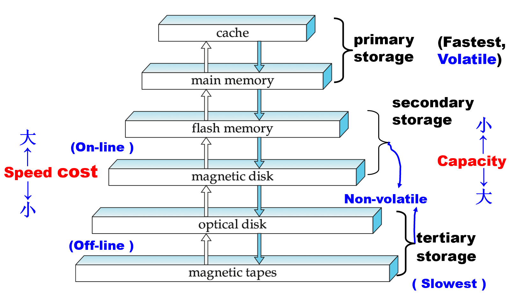

## Storage and File Structure
### Overview of Physical Storage Media

### Physical Storage Media

重要属性：

* 读写速度
* 花费
* 可靠性

DB 的效率和可靠性与合理的存储层次有关。

**多层次存储**：

> vollatile: 易失

Storage media 分类

* Primary storage: Fastest media but volatile (cache, main memory). 
* Secondary storage (辅助存储器，联机存储器): next level in hierarchy, non-volatile, moderately fast access time 
    * Also called on-line storage 
    * E.g., flash memory, magnetic disks 
* Tertiary storage (三级存储器，脱机存储器): lowest level in hierarchy, non-volatile, slow access time 
    * also called off-line storage 
    * E.g., magnetic tape, optical storage 

以可靠性分类：

* 断电易失存储器 - DDR2、SDR 等
* 断电不易失存储 - Includes secondary and tertiary storage, as well as batter-backed up main-memory. 

以速度分类 - 即多层次存储的每一层

### Magnetic Disks

* 数据传输请求到传输开始的时间 = Seek time(寻道时间) +  Rotational latency(旋转等待时间) 
    * Seek time: 到达正确的轨道所需的时间
    * Rotational latency time: it takes for the sector to be accessed to appear under the head. 
    
    * CPU 速度变快，而拿到数据的速度提升不明显

* Data-transfer rate

### RAID Levels

* Level 1: 将数据备份一份
* Level 5: 五块硬盘，轮流作为其他数据的异或结果，有效存储空间为四块。损坏一块可以用其他块恢复

数据库一般用 RAID 1，RAID 5 用于数据量特别大的情况

### Storage Access

* 包（block）是读取的基本单元
* Buffer - 主存里存放从硬盘拿取的块的部分

Buffer-Replacement(缓冲区不够，需要将原有的 block 替换)的两种策略：

* LRU(Least Recently Used，最近最少使用策略): 把最少访问的部分覆盖
    * 不适合的情况：多表的自然连接，在 for 循环中，最少使用的表反而最可能下一个被访问
* MRU(Most Recently Used，最近常用使用策略)

Pinned block (被钉住的块): Memory block that is not allowed to be written back to disk. (如当前块正在被使用时) 

* 行存：需要经常改动时最好使用
* 列存：比较关注一个属性时好用

* OLTP
* OATP

## Indexing and Hashing

> 怎么把 records 存放在文件里
> 
> Heap – record can be placed anywhere in the file where there is space
> 
> Sequential – store records in sequential order, based on the value of the search key of each record
>
> 在多表聚簇文件组织中，可以将几种不同关系的记录存储在同一个文件中（最小化 I/O）
>
> B+-tree file organization
>
> Hashing – a hash function computed on search key

### Basic Concepts

index（索引）

* 目的：加速找到想要的数据
* search key：用于查找记录的属性或属性集合
* 索引文件的数据结构：
    
    

不同情况的访问：

* 特定某一行
* Between

> 哈希不适合 between 的情况，顺序索引适合

* 额外开销：Access time、Insertion time、Deletion time、Space overhead
* 牺牲写性能，极大加快查找性能

* 顺序索引：search key 排列好
* 散列索引：search key 用 hash 方法查找

### Ordered Indices

稠密（Dense）索引：每条记录的 key 都存在索引文件里

稀疏（Sparse）索引：只存部分 key（通常在 Primary index 时使用）

* 当索引文件很大，稠密索引需要多次读入时，稀疏索引更有优势

> Primary index: in a sequentially ordered file, the index whose search key specifies the sequential order of the file.
> 
> Also called clustering index
> 
>
> The search key of a primary index is usually but not necessarily the primary key.
>
> Index-sequential file: ordered sequential file with a primary index.

二级索引 - an index whose search key specifies an order different from the sequential order of the file.  Also called non-clustering index.

* 多种属性作为查询条件时有用
* 二级索引记录指向一个桶，该桶包含指向所有具有该特定搜索键值的一级索引
    
    * 辅助索引不能使用稀疏索引，每条记录都必须有指针指向
* seek 耗时大，可能用索引比不用慢

### B+ Tree Index Files

> 解决溢出问题

> B 树

### Hash

### Write-optimized Indices

用树、删除标记和多层存储优化写操作

### Index Definition in SQL

