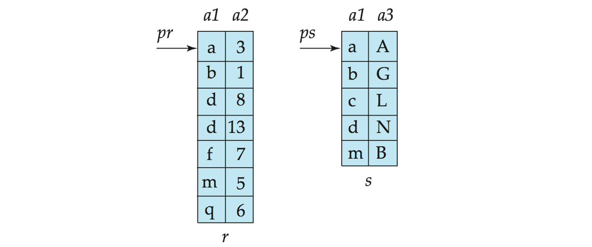

## Query Processing
### Overview

* 需要一个 evaluation plan 来判断具体选择什么查询方法


> 其中 merge join 最复杂，方法最多


### Selection Operation

1. Basic algorithms
2. Selections Using Indices and equality
3. Selections Involving Comparisons
4. Implementation of Complex Selections

    多个条件的组合

    * 查找 非 $\theta$：如果满足 非 $\theta$ 的多，则线性扫描，反之用索引


### Sorting

外部归并排序


复杂度分析：

* 忽略内存里排序的消耗
* 最后一次不写回，只输出


### Join Operation

> problem: 计算表 r 和 s 基于条件 theta 的自然连接

方法一：

```c
for each tuple tr in r do begin
	for each tuple ts  in s do begin
		test pair (tr,ts) to see if they satisfy the join condition theta
		if they do, add tr • ts to the result.
	end
end
```

* r  is called the outer relation and s the inner relation of the join
* 不需要任何索引且能用于任何自然连接
* expensive
* 复杂度分析

	最坏情况，内存最多容纳两个 block（r、s 各一个），需要 (nr * bs + br) block transfers, 加上 (nr + br) seeks
	
* If the smaller relation fits entirely in memory, use that as the inner relation.	
    * Reduces cost to (br  + bs) block transfers and 2 seeks
	
> nr、ns - r 和 s 的行数
>
> br、bs - r 和 s 的 block 数

------------

方法二：Block Nested-Loop Join（better）


```c
// 如果 block Br 和 Block Bs 都在内存里，把他们俩连接
for each block Br of r do begin
	for each block Bs of s do begin
		for each tuple tr in Br  do begin
			for each tuple ts in Bs do begin
				Check if (tr,ts) satisfy the join condition 
				if they do, add tr • ts to the result.
			end
		end
	end
end
```

* 复杂度分析
* worst case: (br * bs + br)  block transfers + (2 * br)  seeks
	* seek 数 - br 次找 r 的 blcok，br 次找 s 最开始的 block
* 当内存不只能放两个 block 时，假设最多能放 n 个，M - 2 个位置放 outer relation，一个位置放 inner，一个位置放结果
* 因此 Cost =   $$\lceil b_r  / (M-2)\rceil \times b_s + b_r block transfers + 2 \lceil b_r  / (M-2)\rceil seeks$$
* 如果 s 能一次性读出，则极大提升效率
    * Reduces cost to (br  + bs) block transfers and 2 seeks

-------------

方法三：Indexed Nested-Loop Join

* 遍历 r 的每一行
* 在 s 里查找 r 的相应属性
* 如果连接的属性有一个索引，能加快查找从而加快连接
    * 可以为了连接新创建一个

* Cost: $b_r (t_T + t_S) + n_r \times c$

-----------

方法四：Merge-Join（排序归并连接）

* 把连接的属性排好序
* 维护两个指针，指向未连接的该属性
	

> 因为排好序，所以指针不用往回走

* Cost (不包括排序) = $b_r + b_s  block transfers  + \lceil b_r / b_b\rceil + \lceil b_s / b_b\lceil  seeks$

-----------

方法五：Hash-Join (哈希连接)

* 对连接的属性运用同样的哈希函数，这样连接属性相同的值都有同一个哈希值
* 只有同一个哈希值的属性需要比较


算法描述


* 把 s 用哈希函数分成 n 个部分，每个部分需要一个 block - 因此哈希块的个数 = M-1
* 对 r 进行相同操作
* 对每个 i（即分成的每个块
    * 将分区 si 加载到内存中，并使用连接属性在其上建立一个内存中的哈希索引。该哈希索引使用的函数与之前的哈希函数不同
    * 从磁盘中逐个读取分区 ri 中的元组。对于每个元组 tr，使用内存中的哈希索引定位在 si 中的每个匹配元组 ts。输出它们属性的连接结果

> Relation s is called the build input and  r  is called the probe input.

* 选取哈希函数分成的部分数 n - $\lceil b_s / M\rceil*1.2$
* 如果 n 比 M 大，需要 Recursive partitioning 
    * use  M – 1 partitions 
    * 


-----------


## Query Optimization


### Equivaience Rules

* 自然连接顺序无关
* 选择与自然连接的顺序可交换（因此希望先选后连，减少消耗）
* 先让小表连接