## Concurrency Control 

### Lock-Based Protocols

> 可串行化计划是并发控制的基础
>
> 并发事务的调度（schedule）是可串行化的（serializable），如果它等效于某个顺序执行的事务调度

lock 的两种类型：

* S 锁 - 获取锁的事务只能读数据，一般允许其他事务获取相同数据的 S 锁（lock-X instruction）
* X 锁 - 获取锁的事务可以读写数据，不允许别的事务获取任何锁（lock-X instruction）

事务向并发控制管理器发出锁定请求，只有在请求获得批准后，事务才能继续进行。如果与其他锁冲突，则需要等待已经拿到锁的事务执行完毕。

* 锁协议 - A locking protocol is a set of rules followed by all transactions while requesting and releasing locks. Locking protocols restrict the set of possible schedules.
* Pitfalls
    
    * 死锁 - 当两个或多个事务相互等待对方持有的锁时，发生死锁。此时所有事务都不能进行
    * 饥饿 - 一个事务要求 X 锁，一系列事务要求 S 锁，这样就会一直等待下去

* Concurrency control manager 就是设计防止以上情况

> 死锁的一个例子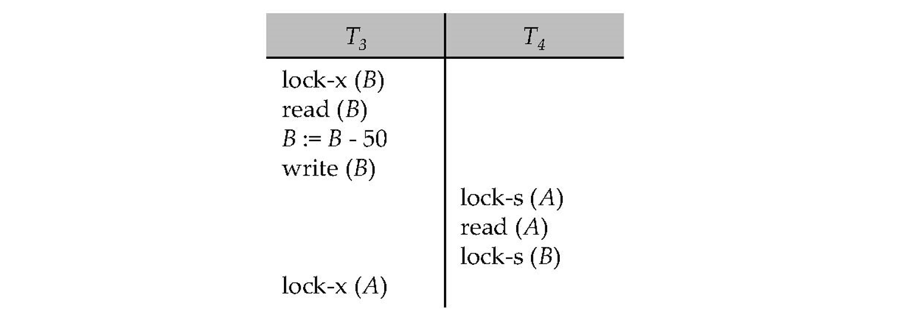


-------

两阶段锁协议（Two-Phase Locking Protocol, 2PL）：

* 生长阶段（Growing Phase）：事务可以获得锁但不能释放锁。
* 收缩阶段（Shrinking Phase）：事务可以释放锁但不能再获得新锁。

2PL保证了事务的序列化，即确保事务在并发执行时不会导致数据不一致。（如何序列化：可以证明事务可以按其锁定点的顺序（即事务获取其最终锁定的点）进行序列化）

* 不能防止死锁
* 如果一个事务已经获取了一些锁，但由于某种原因需要回滚，那么其他事务也可能因为无法获得所需的锁而被迫回滚，导致级联效应（可以用下面的版本避免）
* 更为严格的版本：所有锁都保持到事务提交或中止。在这个协议中，事务可以按照它们提交的顺序进行串行化。这意味着事务之间的并发执行是按照它们完成的顺序进行的，从而避免了任何可能导致数据不一致的并发问题。

因为不能防止死锁，可能会有该协议不能串行化的情况

解决方法：在没有额外信息的情况下，比如数据访问的顺序，两阶段锁定就成为实现冲突可串行化的必要条件。这意味着如果一个事务 Ti 不遵循两阶段锁定，那么我们可以找到另一个使用两阶段锁定的事务 Tj，并且 Ti 和 Tj 可以组成一个不冲突可串行化的调度。

-----------

lock manager 的实现

* can be a separate process to which transactions send lock and unlock requests
* replies to a lock request by sending a lock grant messages (or a message asking the transaction to roll back, in case of a deadlock).
* requesting transaction waits until its request is answered
* maintains a data-structure called a lock table to record granted locks and pending requests
* The lock table is usually implemented as an in-memory hash table indexed on the name of the data item being locked


锁表通常是一个数据结构，用于存储关于每个数据项的锁信息。常见的实现方式是使用哈希表或平衡树，具体包括以下几个关键字段：

* 数据项（Data Item）：需要加锁的数据资源的标识符。
* 锁模式（Lock Mode）：指示当前持有的锁类型（例如，共享锁S或排他锁X）。
* 持有锁的事务列表（List of Transactions Holding the Lock）：当前持有锁的事务的列表。
* 等待队列（Wait Queue）：等待获取锁的事务队列，按请求的顺序排列。

当有一个新请求时，将它放到等待队列的末尾，并判断它是否与已经授予的锁冲突。如果没有冲突，则锁被授予，并将事务添加到持有锁的事务列表中

收到解锁请求，则在事务列表中删去它，并检查该 Data Item 的等待队列，判断是否能授予锁

事务被终止时，所有请求被删除
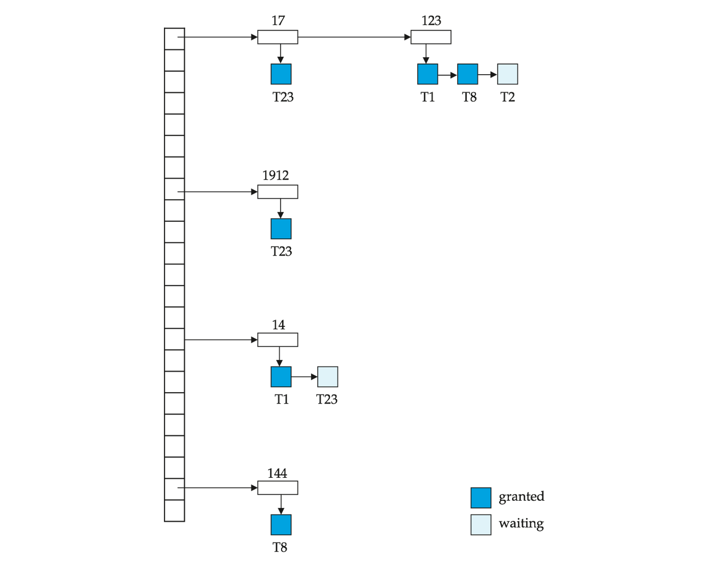

```c title="Automatic Acquisition of Locks "
// read(D)
if Ti has a lock on D then
    read(D) 
else begin 
    if necessary wait until no other  
    transaction has a lock-X on D then
            grant Ti a  lock-S on D;
            read(D)
end

// write(D)
if Ti has a  lock-X on D then 
    write(D)
else begin
    if necessary wait until no other trans. has any lock on D,
        if Ti has a lock-S on D then
            upgrade lock on D  to lock-X
        else
            grant Ti a lock-X on D
            write(D)
end;
```

--------------


Graph-Based Protocols

> an alternative to two-phase locking

考虑 data item 集合 $D = {d_1, d_2,..., d_h}$ 上的一个偏序关系

* If di -> dj  then any transaction accessing both di and dj must access di before accessing dj.
* Implies that the set D may now be viewed as a directed acyclic graph, called a **database graph**.

一个简单的图协议 - Tree Protocol

规则：

1. Only exclusive locks are allowed.
2. The first lock by Ti may be on any data item. Subsequently, a data Q can be locked by Ti only if the parent of Q is currently locked by Ti.
3. Data items may be unlocked at any time.
4. A data item that has been locked and unlocked by Ti  cannot subsequently be relocked by Ti .

> 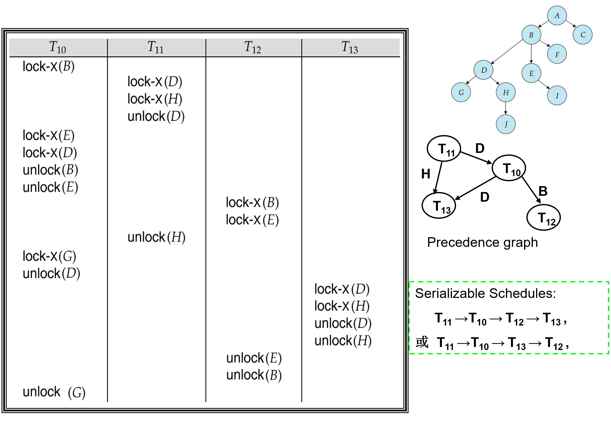

#### 优点

- 保证冲突可串行化和不发生死锁
- 解锁可能比 2pl 早 - 等待时间短，提升并发性

> 一个调度是冲突可串行化的，当且仅当它与某个串行调度冲突等价


#### 缺点

- 不能保证 recoverability or cascade freedom
- 可能需要额外的锁

### 结论


### Timestamp-Based Protocols


* 保证事务开始后，没有事务去读/写


### Multiple Granularity


Granularity of locking (level in tree where locking is done):

* Fine granularity (细粒度，lower in tree): high concurrency, high locking overhead
* Coarse granularity  (粗粒度，higher in tree): low locking overhead, low concurrency


从上往下加锁，从下往上解锁 - 增强并发性，减少加锁开销

### Deadlock Handling

避免死锁循环

* Wait-die
    * 锁被更年轻的拿到 - 等待
    * 锁被更老的拿到 - 自杀
* Wound-wait
    * 锁被更年轻的拿到 - 杀掉年轻的
    * 锁被老的拿到 - 等待

* 处理被杀掉的事务：重生，时间戳设为最早的


如果发现了死锁循环


## Recovery System

### Failure Classification

事务 failure

* Logical error: 事务因为内部条件无法完成（over flow、bad input、data not found）
* System error: 数据库系统必须终止一个事务（例如死锁时）

System crash: 断电、硬件软件损坏等

> assumption: 非易失性的存储不会因为 System crash 丢失（数据库系统有很多完整性检查防止磁盘数据损坏）

Disk failure: 磁头碰撞或类似的磁盘故障会破坏全部或部分磁盘存储

> assumption: disk drives use checksums to detect failures


--------

Recovery Algorithms (2 parts)

1. 平时记录发生 failure 时需要的恢复信息
2. 发生 failure 后怎么恢复数据库（atomicity, consistency and durability）


### Storage Structure

易失性、非易失性（前面的知识点）

stable storage - 一种能够在所有故障中幸存的神话般的存储形式，通过在不同的非易失性介质上维护多个副本来实现近似

* 制造副本时发生断电，可能导致数据不一致
* solution - 先写到第一个磁盘里，再写到第二个磁盘里，都完成后才发出完成信号
* 当副本数据不一致时的恢复方案
    * 比较磁盘上每个数据块的两个副本（expensive）
    * 在非易失性存储（非易失性RAM或磁盘的特殊区域）中记录进行中的磁盘写入操作。在恢复过程中使用这些信息找到可能不一致的数据块，只比较这些数据块的副本。该方法用于硬件RAID系统中。（better）
    * 如果检测到不一致块的任何一个副本有错误（校验和错误），则用另一个副本覆盖它。如果两个副本都没有错误，但内容不同，则用第一个副本覆盖第二个副本。


-----------

Physical blocks - 磁盘中的 block

Buffer blocks - 主存里的 block

Physical blocks 和 Buffer blocks 之间的块移动：
* input(B) 将物理块 B 转移到主存储器。
* output(B) 将缓冲块 B 转移到磁盘，并替换相应的物理块。

> 简化假设：每一个数据项占据一个块


每个事务 Ti 有其私有的 work-area，其中保存了它所访问和更新的所有数据项的本地副本。

> Ti 的数据项 X 的本地副本称为 xi

buffer block 和 work-area 之间的数据传输：
* read(X) 将数据项 X 的值赋给本地变量 xi。
* write(X) 将本地变量 xi 的值赋给缓冲块中的数据项 X。


> 事务必须在首次访问 X 之前执行 read(X)（后续读取可以使用本地副本）。write(X) 可以在事务提交之前的任何时候执行。

上述概念用图表示：

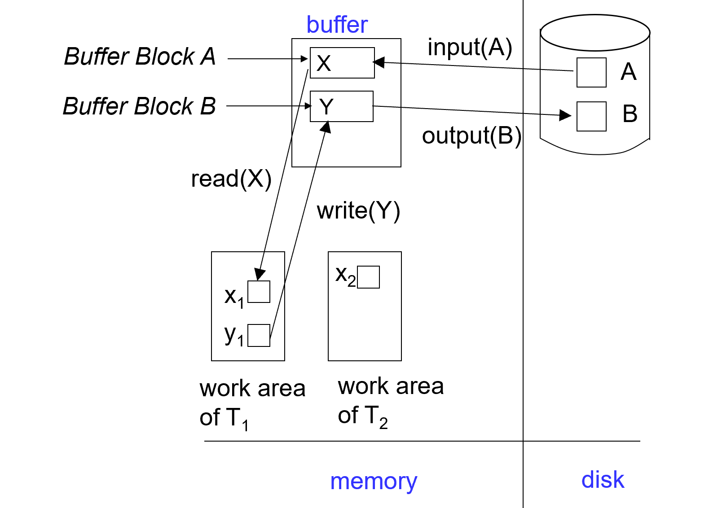

### Log-Based Recovery


> 为了确保即使在出现故障时也能保持原子性，我们首先将**描述修改的信息**（日志）输出到稳定存储，而不直接修改数据库本身
>
> log 是一系列 log record，用于记录数据库的更新活动，存储在 stable storage 中

日志记录的方法：

* `<Ti start>` - 事务 Ti 开始
* `<Ti X, V1, V2>` - 事务 Ti write(X)，将 X 的原始值 V1 改为 V2
* `<Ti commit>` - 事务 Ti 结束

``` title="log example"
<T1 start>
<T1, A, 100, 200>
<T2 start>
<T2, B, 300, 400>
<T3 start>
<T1, C, 500, 600>
<T1 commit>
<T3, C, 600, 700>
<T3, C, 700, 800>
<T3 commit>
<T2, C, 800, 900>
<T2, B, 400, 500>
```

--------------

两种使用日志的方法:

* Deferred（延迟） database modification - 将 write 操作放到 commit 后（不需要旧值 V1）
    * failure 后恢复 commit 了的事务
* Immediate database modification - 允许 write/output 操作在 commit 之前
    * 写入数据库项之前，必须**先写入更新日志记录**
    * 被 update 了的 block 输出到 stable storage 可以在事务提交之前或之后的任何时间进行
    * 块 output 的顺序可以与 write 的顺序不同

> assume that the log record is output directly to stable storage

<!--  -->
> Deferred database modification example
> 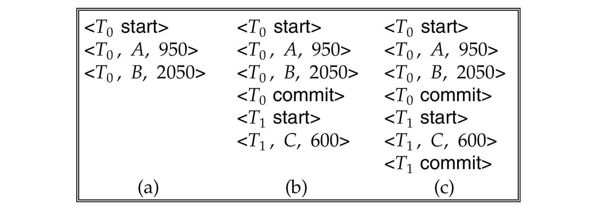
> a 情况：不 redo；b 情况：redo T0；c 情况：redo T0 & T1；


<!--  -->
> Immediate database modification example: 


---------------

Immediate database modification 怎么恢复：

1. 如果日志包含 `<Ti start>` 记录，但不包含 `<Ti commit`> 记录 - undo(Ti) 将 Ti 更新的所有数据项恢复到其旧值，从 Ti 的最后一条日志记录开始向后进行
2. 如果日志同时包含 `<Ti start>` 记录和 `<Ti commit>` 记录 - redo(Ti) 将 Ti 更新的所有数据项设置为新值，从 Ti 的第一条日志记录开始向前进行

> 两个操作都必须是幂等（idempotent）的（即，即使操作执行多次，其效果也与执行一次相同，因为 recovery 可能进行多次）

<!--  -->

> 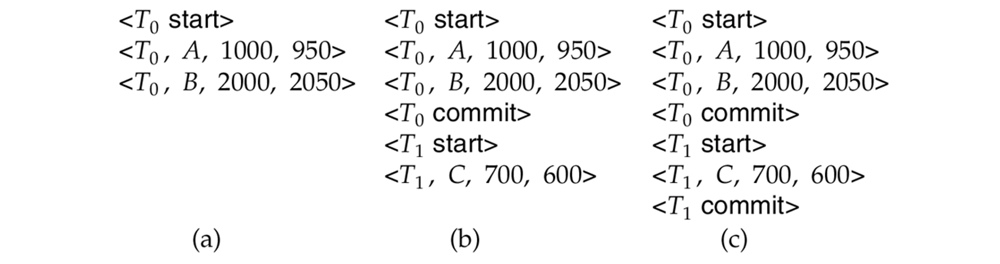
>
> a: undo (T0): B is restored to 2000 and A to 1000, and log records `<T0, B, 2000>`, `<T0, A, 1000>`, `<T0, abort>` are written out
> 
> b: redo (T0) and undo (T1): A and B are set to 950 and 2050 and C is restored to 700. Log records     `<T1, C, 700>`, `<T1, abort>` are written out.
> 
> c: redo (T0) and redo (T1): A and B are set to 950 and 2050 respectively. Then, C is set to 600 


------------

> 运行时间长后，重新执行或撤销日志中记录的所有事务可能非常慢

定期设一个 checkpoint 来简化恢复过程

* 将当前驻留在主存储器中的所有日志记录输出到稳定存储。
* 将所有修改过的缓冲区块输出到磁盘。
* 将日志记录 `<checkpoint L>` 写入稳定存储，其中 L 是检查点时所有活动事务的列表。
* 执行检查点时，所有更新操作将被暂停。

恢复过程：

* 从日志末尾向后扫描，找到最近的 `<checkpoint L>` 记录。只有在 L 中的事务或在检查点之后启动的事务需要重新执行或撤销（因为在检查点之前提交或中止的事务的所有更新已经输出到稳定存储）。
* 一些日志的较早部分可能需要用于撤销操作。继续向前扫描，直到找到 L 中每个事务 Ti 的 `<Ti start>` 记录。
* 在该记录之前的日志部分不需要用于恢复，可以随时删除。

> 
>
> T1 can be ignored, T2 and T3 redone, T4 undone


* commit 了的放在 redo-list
* 未 commit/abort 放在 undo-list


### Shadow Paging

> an alternative to log-based recovery, this scheme is useful if transactions execute serially 

idea: 在事务的整个生命周期内维护两个页表 - the current page table, and the shadow page table 

* 将影子页表存储在非易失性存储中，这样事务执行前的数据库状态可以被恢复。

> 影子页表在事务执行期间从不修改


* 一开始，两个页表是相同的。在事务执行期间，只有当前页表用于数据项访问。
* 每当某个页第一次被写入时，会将该页复制到一个新的页上。然后将当前页表指向该副本，更新在副本上进行。

> Example: 写入 page 4 后
>
> 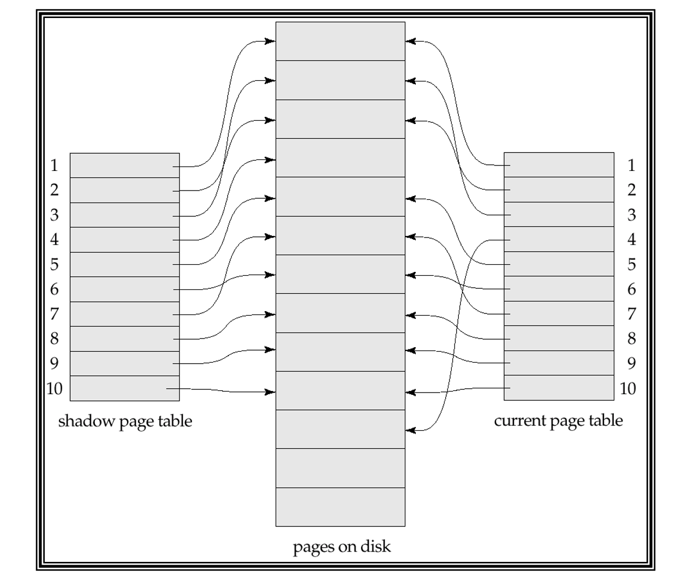

* 提交事务
    * 将主存储器中所有脏页写入磁盘
    * 把当前页表 output 到磁盘
    * 把当前页表设为新的影子页表，具体步骤：
        * 在磁盘上的固定（已知）位置保留指向影子页表的指针。
        * 为了将当前页表设为新的影子页表，只需更新指针，使其指向磁盘上的当前页表。

* 一旦指向影子页表的指针被写入，事务即提交完成。
* 崩溃后无需恢复——新事务可以立即开始，使用影子页表。
* 未被当前/影子页表指向的页面应被释放（垃圾回收）。

---------


影子分页相比基于日志的方案的优点：

* 无需写入日志记录的开销
* 恢复操作非常简单

缺点：

* 复制整个页表非常昂贵
    * 通过使用类似 B+ 树结构的页表可以减少这一成本
    * 无需复制整棵树，只需复制通向更新的叶节点的路径
* 即使有上述扩展，提交开销仍然很高
    * 需要刷新每个更新的页面和页表
* 数据会变得碎片化（相关页面在磁盘上被分开）
* 每次事务完成后，包含修改数据旧版本的数据库页面需要进行垃圾回收
* 很难扩展算法以允许并发事务运行


---------
### Recovery With Concurrent Transactions

> 修改基于日志的恢复方案，以允许多个事务并发执行
> 
> 所有事务共享一个磁盘缓冲区和一个日志文件。
> 
> 一个缓冲区块可以包含一个或多个事务更新的数据项。

* 我们假设使用严格的两阶段锁协议进行并发控制（即严格的2PL，X锁定保持到事务结束）。
* 日志记录按前述方式进行 - 不同事务的日志记录会在日志中交错出现。
* 改变检查点技术和恢复时采取的措施
    * `< checkpoint L >` - L 变成多个事务的列表，e.g. {T2, T4}
    * 假设检查点时没有更新进行

recover 的操作：

1. 初始化 undo-list（撤销列表）和 redo-list（重做列表）为空
2. 从日志的末尾开始向前扫描，直到找到第一个 `<checkpoint L>` 记录为止。同时，对于在向后扫描过程中找到的每条记录：
    1. 如果记录是 `<Ti commit>`，将 Ti 添加到 redo-list 中。
    2. 如果记录是 `<Ti start>`，并且 Ti 不在 redo-list 中，则将 Ti 添加到 undo-list 中。
    3. 如果记录是 `<Ti abort>`，将 Ti 添加到 undo-list 中。
    4. 对于 L 中的每个 Ti，如果 Ti 不在 redo-list 中，则将 Ti 添加到 undo-list 中。
3. 从 `<checkpoint L>` 开始向前扫描，直到遇到撤销列表（undo-list）中每个 Ti 的 `<Ti start>` 记录为止，扫描过程中对属于 undo 列表中事务的每条日志记录执行 undo 操作
4. 从 `<checkpoint L>` 开始向后扫描，对属于 redo 列表中事务的每条日志记录执行 redo 操作

> 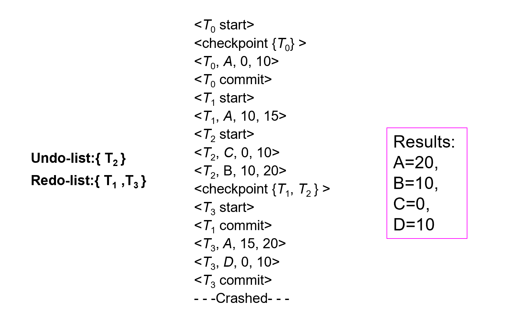


----------

### Buffer Management

> 通常，输出到稳定存储的单位是块，而日志记录通常比一个块小得多。因此，日志记录缓存在主存中，而不是直接输出到稳定存储


日志记录在以下情况下输出到稳定存储：

* 缓冲区中的日志记录块已满，
* 或者执行了 log force operation（如发生检查点时）。

Log force (强制日志) is performed to commit a transaction by forcing all its log records (including the commit record `<Ti  commit>` ) to stable storage.

这样可以一次写入多条日志（而不是每产生一条日志就写一次稳定存储）


------


如果日志记录被缓冲，则必须遵循以下4条规则：

* 日志记录按照它们创建的顺序输出到稳定存储。
* 事务 Ti 只有在 `<Ti commit>` 日志记录输出到稳定存储后才进入提交状态。
* 在 `<Ti commit>` 日志记录输出到稳定存储之前，所有与 Ti 相关的日志记录必须已输出到稳定存储。
* 日志应先于数据写到磁盘 - 此规则称为先写日志规则（write-ahead logging rule，WAL）。严格来说，WAL 只要求撤销信息被输出。

恢复算法支持非强制策略，即在事务提交时不需要将更新的块写入磁盘；恢复算法支持抢占策略，即包含未提交事务更新的块可以在事务提交之前写入磁盘。


> latch: 在写入数据项之前，事务获取包含该数据项的块的独占锁。写入完成后可以释放锁 - 这种持有时间短的锁称为 latches

将一个块输出到磁盘的步骤：

* 首先获取该块的独占 latch - 确保该块上没有正在进行的更新。
* 然后执行日志刷新。
* 接着将该块输出到磁盘。
* 最后释放该块的 latch

----------


buffer 的实现 - 内存的一个分区或者虚拟内存

* 内存分区方法的局限性：内存预先在数据库缓冲区和应用程序之间划分，限制了灵活性；需求可能会变化，尽管操作系统最了解如何在任何时候分配内存，但无法更改内存的分区。
* buffer 通常在虚拟内存上实现，但仍有局限性：
    * 当操作系统需要驱逐一个已修改的页面时，该页面被写入到磁盘上的 swap space。
    * 当数据库决定将缓冲页写入磁盘时，缓冲页可能位于 swap space 中，需要额外的 I/O（从 swap space 读到 buffer，再从 buffer 写入磁盘）
    * 这被称为双重分页问题。


> 理想情况下，当操作系统需要从缓冲区驱逐页面时，应将控制权传递给数据库，然后数据库应执行以下操作：
>
> 如果页面已修改，将页面输出到数据库而不是交换空间（确保首先输出日志记录）
> 
> 释放缓冲区中的页面，以便操作系统可以使用
>
> 这样可以避免双重分页问题，但通常的操作系统不支持此类功能。


--------
### Failure with Loss of Nonvolatile Storage

类似 checkpoint 的操作 - Periodically **dump**

* Output all log records currently residing in main memory onto stable storage.
* Output all buffer blocks onto the disk.
* Copy the contents of the database to stable storage.
* Output a record `<dump>` to log on stable storage

恢复：

* 从最近的备份（dump）中恢复数据库。
* 查阅日志，并重做在备份之后提交的所有事务。

可以扩展为允许事务在备份过程中保持活动状态；这称为 fuzzy dump or online dump。


--------------

### Advanced Recovery Techniques

* 支持高并发锁定技术，例如用于 B+ 树并发控制的技术

* B+ 树的插入和删除操作不能通过恢复旧值（physical undo）来撤销。
    * 因为一旦锁被释放，其他事务可能已经更新了 B+ 树（改变 B+ 树结构）
    * 插入（或删除）操作是通过执行删除（或插入）操作来撤销的（logical undo）

* 包含 undo operation to be executed 的日志 - Called logical undo logging, in contrast to physical undo logging. 
* 重做信息也应以物理方式记录（即，每次写入的新值）

> 逻辑重做非常复杂，因为磁盘上的数据库状态可能不是“operation consistent”的

------------

Operation logging:

```c
<Ti, Oj, operation-begin> 
// Oj is a unique identifier of the operation instance. 

// normal log records with physical redo and physical undo information 

<Ti, Oj, operation-end, U> 
// where U contains information needed to perform a logical undo information
```


* 如果在 Operation 完成之前发生 crash/rollback 
    * 未找到 operation-end 日志记录
    * 使用物理撤销信息 undo 操作

* 如果在操作完成之后发生 crash/rollback 
    * 找到 operation-end 日志记录
    * 使用 U 执行逻辑撤销，忽略操作的物理撤销信息。


* **redo 仍然用物理撤销信息**

----------

事务 Ti 的 Rollback：

向前扫描日志：

1. 如果找到日志记录 `<Ti, X, V1, V2>`，执行撤销并记录一个 redo-only log record 的特殊日志记录 `<Ti, X, V1>`。
2. 如果找到 `<Ti, Oj, operation-end, U>` 记录，使用撤销信息 U 逻辑回滚该操作。
      1. 在回滚期间执行的更新与正常操作执行期间一样记录日志。
      2. 在操作回滚结束时，不记录 operation-end 记录，而是生成一条记录 `<Ti, Oj, operation-abort>`。
      3. 跳过 Ti 的所有前面的日志记录，直到找到记录 `<Ti, Oj, operation-begin>`。
3. 如果找到仅重做记录，忽略它。
4. 如果找到 `<Ti, Oj, operation-abort>` 记录：跳过 Ti 的所有前面的日志记录，直到找到记录 `<Ti, Oj, operation-begin>`。
5. 当找到记录 `<Ti, start>` 时停止扫描。
6. 在日志中添加一条 `<Ti, abort>` 记录。

一些注意事项：

* 上述第 3 和第 4 种情况只有在数据库在回滚事务时崩溃时才会发生。
* 如第 4 种情况所示，跳过日志记录对于防止同一操作被多次回滚非常重要。

> 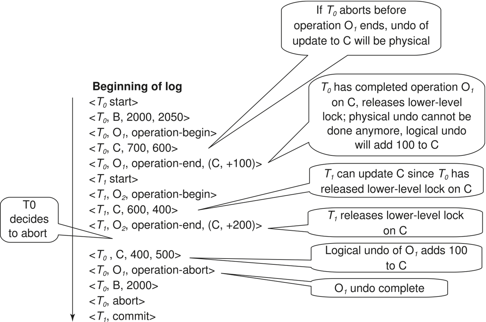

------------

recovering from system crash:

1. 从最后一个 `<checkpoint L>` 记录开始，向后扫描日志。
2. 通过物理重做所有事务的所有更新来 **Repeat history**
3. 在扫描期间按如下方式创建一个撤销列表（undo-list）：
      1. 初始时将撤销列表设置为 L。
      2. 每当找到 `<Ti start>` 时，将 Ti 添加到撤销列表中。
      3. 每当找到 `<Ti commit>` 或 `<Ti abort>` 时，从撤销列表中删除 Ti。

> 这将使数据库达到崩溃时的状态，已提交和未提交的事务都已重做。

对于 undo-list 里的事物，向前扫描执行 undo，当在撤销列表中的事务 Ti 找到 `<Ti start>` 记录时，写入 `<Ti abort>` 日志记录，当所有事务都找到 start 时停止。

> 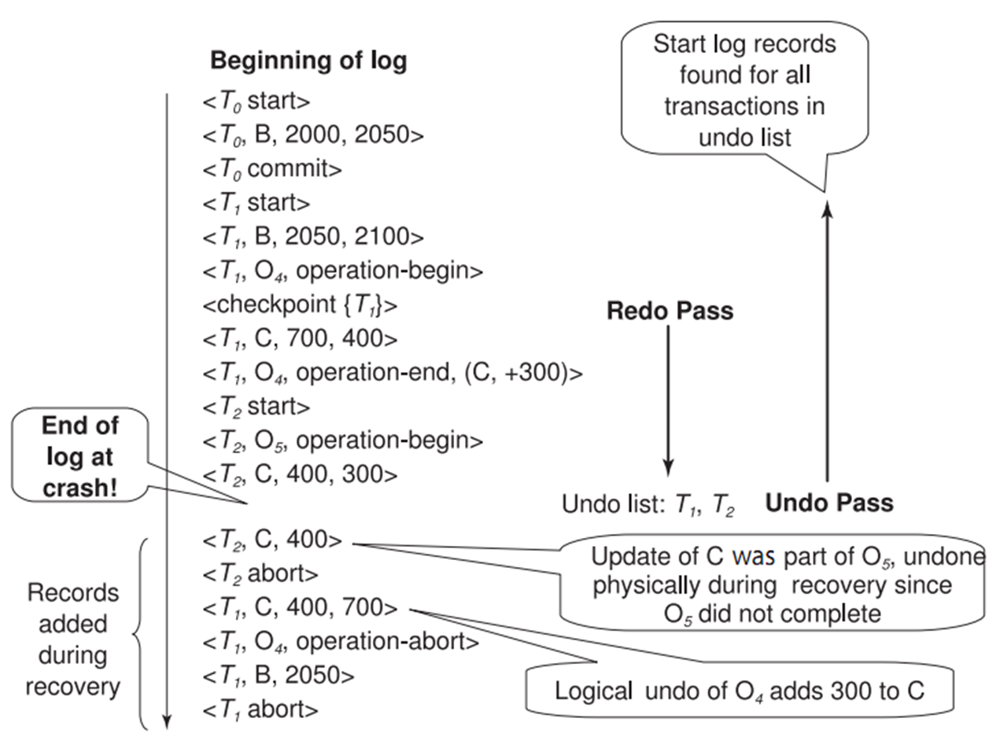

checkpoint 操作与之前相同

--------

Fuzzy checkpointing:

1. 暂时停止所有事务的更新。
2. 写入一个 `<checkpoint L>` 日志记录并将日志强制写入稳定存储。
3. 记录已修改缓冲区块的列表 M。
4. 允许事务继续进行其操作。
5. 将列表 M 中所有已修改的缓冲区块输出到磁盘。输出期间不应更新这些块。（遵循WAL）
6. 将一个指向检查点记录的指针存储在磁盘上的固定位置 **last_checkpoint**。

当使用模糊检查点进行恢复时，从 last_checkpoint 指向的检查点记录开始扫描。last_checkpoint 之前的日志记录的更新已经反映在磁盘上的数据库中，不需要重做。在执行检查点时系统崩溃的不完整检查点也能被安全处理（这时 last_checkpoint 指向前一个检查点）

-----------

### ARIES Recovery Algorithm

* Physiological redo - 物理页号找到页、操作可以 logical 表示
    * 比如删除一个记录，后面的记录需要填补到前面，可以只记录“删除”，而不是每个位置的数据变化
    * 页面原子性

ARIES 算法需要的数据结构：

* Log sequence number (LSN) - sequentially increasing
* Page LSN - the LSN of the last log record whose effects are reflected on the page
    * 写 page 到磁盘需要 S 锁
* Log records of several different types
    * 包含该事务的前一条日志的 LSN
    * compensation log record (CLR) - 只有 redo 信息的日志，用于 operation-abort log records，避免重复 undo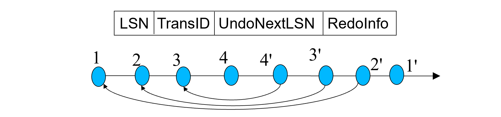
* Dirty page table


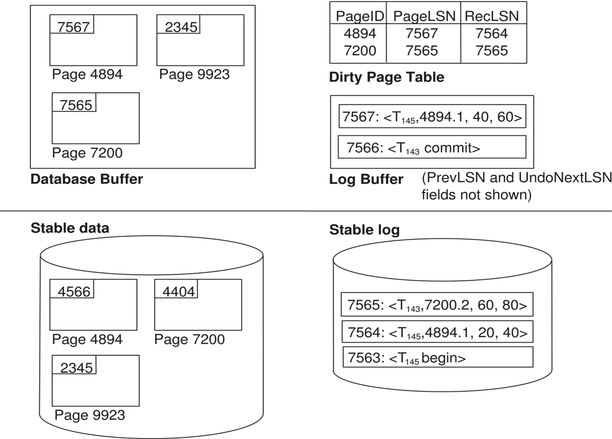

Checkpoint log record

* Checkpoint 卡顿：将数据写到硬盘上


支持部分恢复


ARIES Recovery Algorithm (3 passes)

* Analysis pass: 从 checkpoint 往后扫描
    * undo list - list of transactions in checkpoint log record + 新扫描的事务 - commit 了的事务 
    * 哪些 page dirty（包括 RecLSN）- minimize redo work
    * RedoLSN (dirty page 的最小 RecLSN) - where to start redo
    * 记录 undo list 里的事务最后的 LSN
* Redo pass: 从 RedoLSN 往后扫描，如果 LSN 的 page dirty 且是 RecLSN 才 redo
* Undo pass: 根据日志恢复一个事务（会跳过别的事务）
    * Generate a CLR containing the undo action performed.（下面的 n'）
    * Set UndoNextLSN of the CLR to the PrevLSN value of the update log record
    * pick largest of these LSNs to undo
     
    


