# Matlab


## 函数

* 多个输入输出的形式：`function [output1,output2,output3] = myFunc(input1,input2,input3`
* 命名以字母开头，文件名与函数名一致
* The first line of a function is referred to as the “H1 line” and is searchable by MATLAB using lookfor
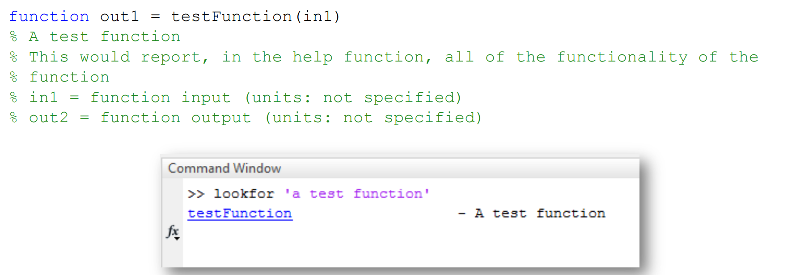
* 后面的连续的文本块可以作为帮助返回
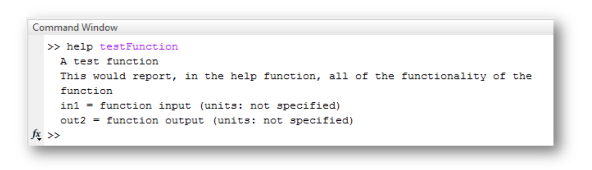
* Matlab finds functions by searching a set of directories specified in the path
* 调用结束后，函数的局部变量会销毁，脚本不会

* 匿名函数 - 表达式简单、经常使用
```
function_name = @ (arguments) expression 
FtoC = @ (F) 5*(F-32)./9 
cube = @ (x) x^3 
circle = @ (x,y) 16*x^2+9*y^2
```


Function Handles: 

> 有的函数以函数为参数
>
> `fzero()` - 找到函数零点 
>
> 两种接受参数的方法 - 句柄和函数名字符串


* 方法一：@function_name （匿名函数不需要@）
* 方法二：var = feval('function_name', arguments)


## 数组的应用

基本操作

* 初始化：x = [0.5, 1.5, 2, 3.2, 1.5, 0.4];
* 访问：x(3) - 既可以是左值也可以是右值（注意标号从一开始）
* 数组运算：a = [0 4 9 8 3 5] <= 4 —— 得到 [1 1 0 0 1 0] 每个元素进行小于等于判断，变量类型变为 logical （函数也可以这么做）
* 相同大小的数组可以进行加减运算 - 每个元素相加减
* 每个元素相乘除需要加一个 `.` (与矩阵运算区分)
    * `z = x.*y; % element-wise multiplication`
    * `z = x./y; % element-wise division`


数组生成的不同方式：

* `x = 1:15;` - x = [1,2,3,...,15]
* `x = 4:2:28;` - x = [4,6,8,...,28] (间隔为 2)
* `x = 1:2:6;` - x = [1,3,5]
* `x = linspace(1,5,10)`- 生成有 10 个 1-5 等间距的元素 [1, 1.5, 2, ... 5]
* `r = logspace(0, 3, 25)` - 生成一个 25 个元素的数组，从 $10^0$ 到 $10^{3}$，等对数间隔 


数组访问
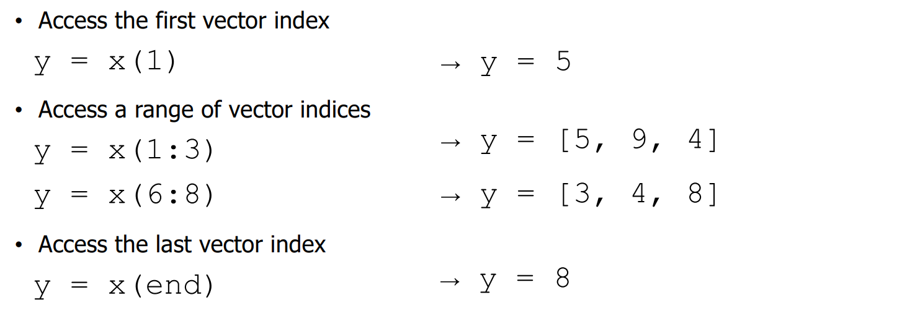

* 数组末尾添加元素：`x(end+1) = 8`
    * 多个元素：`(end+1:end+2) = [6, 9];`

* 删除某个元素：`x(1) = []` (多个元素同上)


## 分支和循环

```matlab title="循环"
for jj = 1:20
    disp(jj)
end
for jj = 1:3:19 % 设置间隔
    disp(jj)
end
for jj = [1 9 5] % 离散数组
    disp(jj)
end
```

向量计算和循环计算 

* 向量：`a.^2` 或 `a.*a` - 快一些，更推荐
* 循环：使用 `for jj = 1:length(a)`

逻辑运算

* 使用 & 进行数组的**逐元素逻辑与**运算。
* 使用 && 进行标量的短路逻辑与运算，通常用于控制流中的条件判断。

```matlab
x = [5 9 2 4 3];          % 定义一个“double”类型的向量 x
v = logical([1 0 1 0 1]); % 定义一个逻辑向量 v
xp = x(v);                % 返回 x 中对应于逻辑向量 v 为 true (1) 的索引处的元素
% xp = [5,2,3]
```
## 数据类型

* 整型（根据所占空间有范围）
    * uint8 - 8 bit unsigned int
    * int64 
* 浮点型（运算时容易失去精度）
    * double
    * single

指定类型：
```
x = uint16([1 3 4 5 89]);
x = single(0:0.1:100);
```

## 矩阵

线性方程组很容易解：
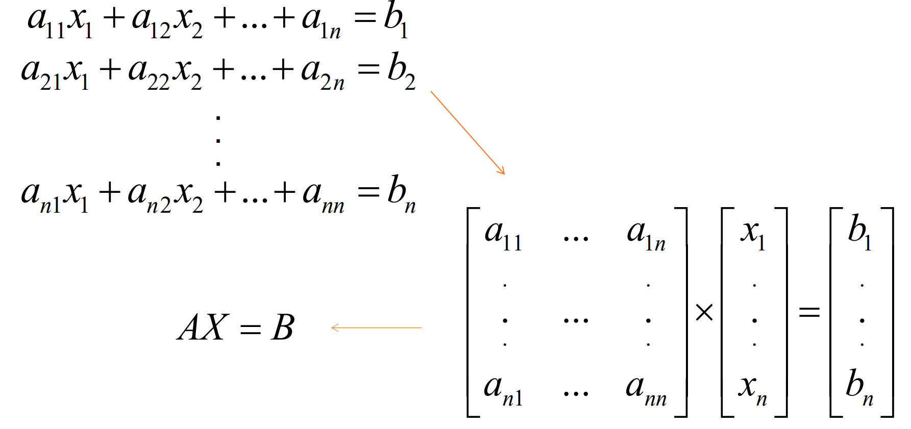

矩阵生成：

* `A = [1 2 3; 4 5 6];` - 第一行是 1，2，3 第二行是 4，5，6 的矩阵
* zero (生成全零矩阵) ones (全一矩阵) eyes (单位矩阵)

    `A = ones(2,5); A = zeros(2,3); A = eye(3);`

* `A'` - 转置
提取子序列：


$$
X = A^{-1}B
$$

```matlab
va(:) %all elements (相当于一维展开)
va(m:n) %elements m through n
A(:,n) %all elements in column n A(n,:) %all elements in row n 
A(:,m:n) %elements in columns m through n 
A(m:n,:) %elements in rows m through n 
A(m:n,p:q)
```

v 是一个数组，A 是一个矩阵


```matlab
A(end+1) = 5 %automatically adds one more element to the new line
A(:,2) = [] %deletes column 2 from A
```


矩阵加减

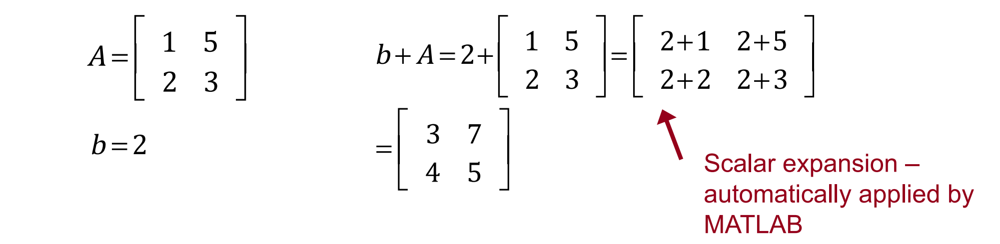
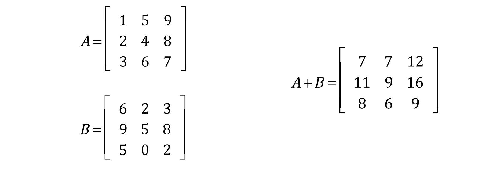


矩阵乘除

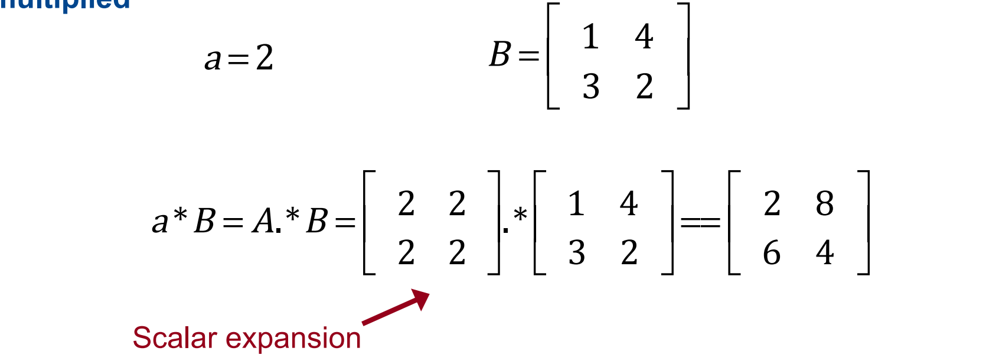
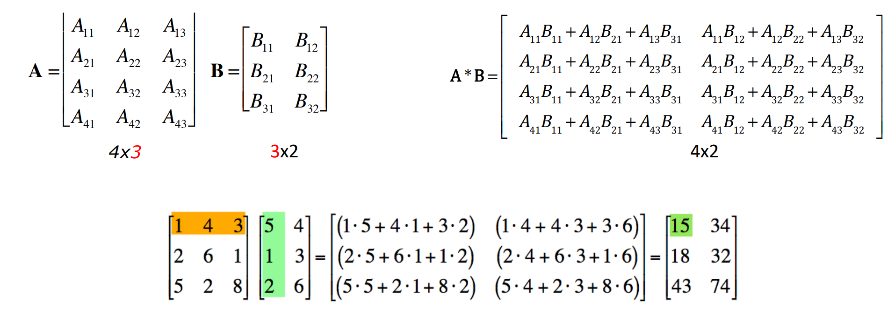

`X = A\B` - $X = A^{-1}B$
`X = D/C` - $X = DC^{-1}$
rotate-逆时针

* product: `.prod()`

```matlab

```

------

## 输入输出

```matlab title="input"
in1 = input(‘Enter data: ’); % 拿到数值/数组
in2 = input(‘Enter data: ’, ‘s’);% 拿到字符串
```

```matlab title="output"
disp(variable) 
disp('text to print’) 
fprintf(format,data);% 类似 c 的 printf
```

```matlab title="save"
% 工作区的所有变量存储到 file_name
save('file_name'); 
save file_name;
save file_name var1 var2;
% 上面的指令存储为 .mat 文件，二进制
save -ascii file_name; % 人可以读
```

```matlab title="load"
% 将 .mat 文件中的变量 load 到工作区中
load('file_name');
load file_name;
load file_name var1 var2;
% 其他文件格式：
load file_name.txt;
var = load('file_name.txt’);
% option
mat, -ascii
```

## 画图

最常用的两个画图

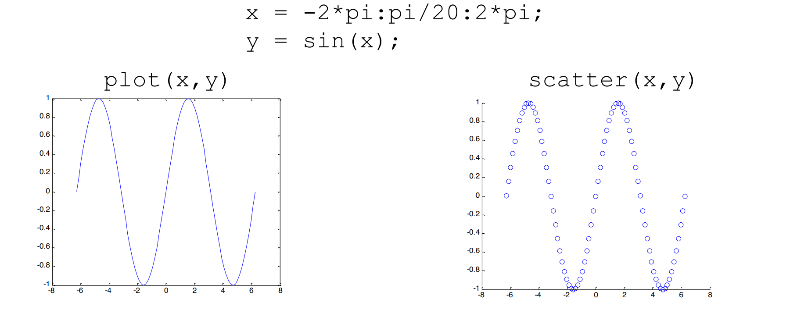


`fplot` - 自适应的画图


设置外观：

`plot(x,y,'LineSpecifiers', ...'PropertyName',PropertyValue)`

Line specifiers

* Line style: solid, dash, dot, dash-dot
* Line color: red, green, blue, cyan, etc.
* Marker: plus, circle, asterisk, etc.

> 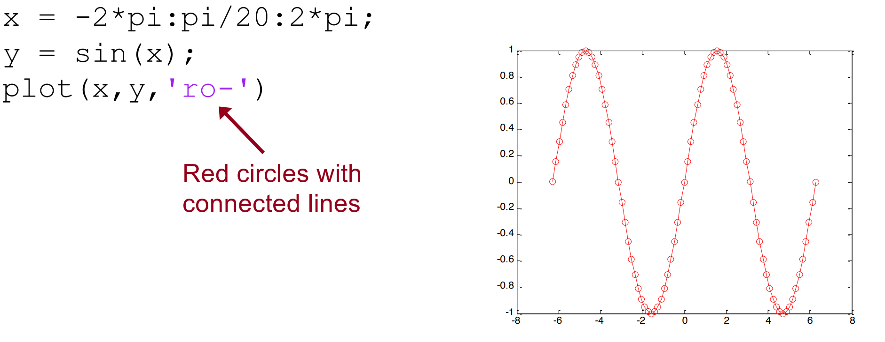

Property names

* LineWidth
* MarkerSize
* MarkerEdgeColor
* MarkerFaceColor

> 

可选颜色：
r = Red
g = Green
b = Blue
c = Cyan
m = Magenta
y = Yellow
k = Black
w = White


多个线的情况：

* 方法一：`plot(x,y1,x,y2,'LineWidth',4)` （自动设定不同颜色）
* 颜色可以分别设定，线宽不能
* 方法二：`hold on` 和 `hold off`

> 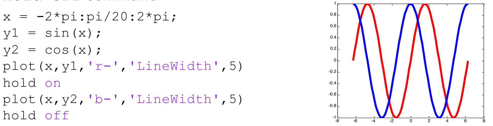


可以用 `set` 在 `plot` 之后设置图的属性

* `gca` - 调整坐标轴（axes）
* `gcf` - 调整整张图（figure）

> 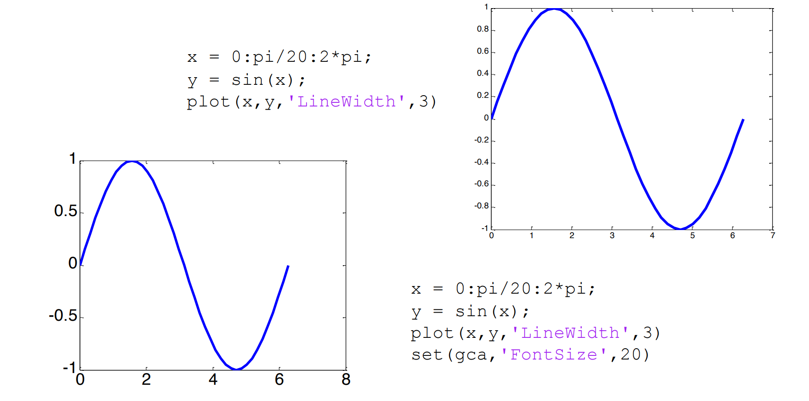
>
> 


画多张图：

```matlab
x = -2*pi:pi/20:2*pi;
y1 = sin(x);
y2 = cos(x);
plot(x,y1,'k-','LineWidth',5)
figure % 创建一张新图
plot(x,y2,'k-','LineWidth',5)
```

* 管理多张图


* 一张图的多个子图


3D 图：


## ODE

* 高阶 ode - 转换成 n（阶数） 个一阶 ode 方程组成的方程组

```matlab
% [0 10]: t 的范围
% [10 1 2]: 初值条件
[t,x] = ode45(@thirdOrderODE,[0 10],[10 1 2]);
```

## Random Numbers
|function| result|
|---|----|
|rand| Single random number between 0 and 1|
|rand(1,n)| Row vector of n random numbers between 0 and 1|
|rand(n)| n x n matrix of random numbers between 0 and 1|
|rand(m,n)| m x n matrix of random numbers between 0 and 1|
|randperm(n)| Row vector with random permutation of integers 1 through n|
|randn(m,n)| m x n matrix of normally distributed random numbers with mean 0 and standard deviation 1|


运用以上函数，我们可以得到：
* Interval (a,b) - `(b-a)*rand + a` 
* Random integers round(rand) for random 0’s and 1’s 
or use 
round, floor, ceil on a multiple of rand 
–Normal distribution mean M and standard deviation S 
S*randn(m,n) + 

Random Number Generator

* 种子相同时生成的东西相同


## Polynomials

* Matlab 里表示成数组


* 计算多项式的某点值

    ```matlab
    % p 是系数数组
    % x 是所求点
    v = polyval(p, x) 
    ```

|target| function|
|---|----|
|Roots of a polynomial| `r = roots(p)`| 
|Polynomial from its roots| `p = poly(r)`| 
|Polynomial multiplication (convolution)| `c = conv(a,b)` |
|Polynomial division (deconvolution) |`[q, r] = deconv(a,b)` |
|Derivatives of polynomials |`pd = polyder(p)`|

## Curve Fitting

* 线性插值 - `yi = interp1(x, y, xi, 'method')`
    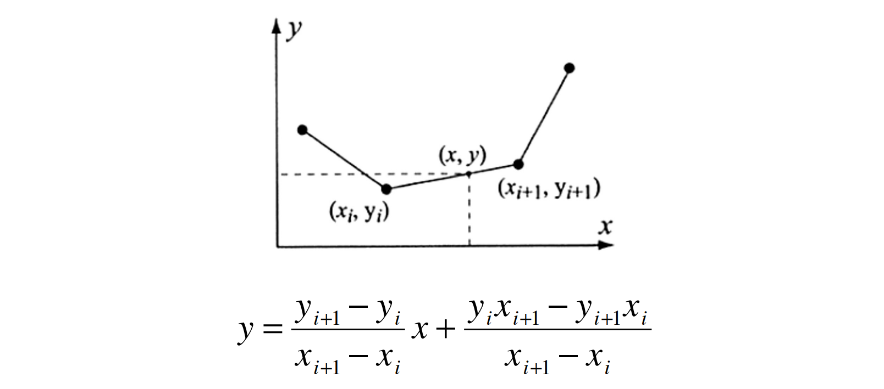


## Probability and Statistics


## Interpolation

------
## tips

### 命令行
* `edit newScript` - 打开或新建名字叫 newScript 的 .m 文件
* `whos` - 列出工作区的所有变量和类型
* `clear` - 清除所有变量（或某个特定变量）
* `clc` - 清除命令行
* `userpath(‘C:\MyMATLABwork’)` - 路径修改
* `path` - 查看所有路径
* `addpath() rmpath()` - 修改路径

### 编辑器
* `...` - 换行符，如果一句代码很长，写在两行里，第一行后面加 `...` 表示是一句代码
* ctrl + R 一键注释；ctrl + T 一键解除注释；（真逆天，上面那条也是）


