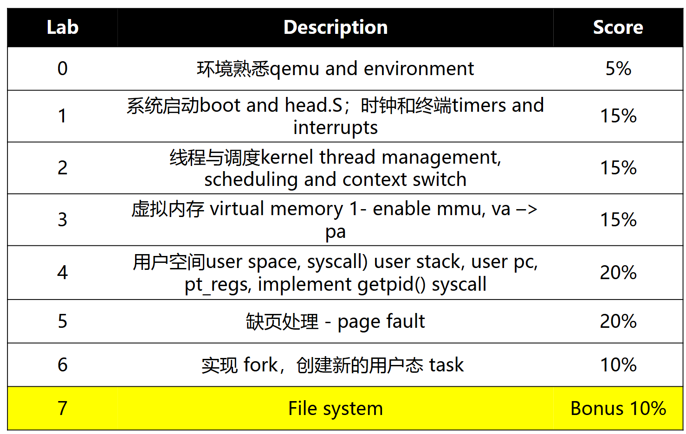

# 操作系统原理与实践

> 核心课程…… 5 学分啊

* 实验 40%
* 出勤、讨论 10%
* 期末 50% - 3 张 A4 纸

## 回顾

* 冯·诺伊曼 - fomulize 了计算机体系结构
    * 三个部分：I/O System、CPU、Memory
* 香农 - Memory 是计算机里所有以二进制形式存储的信息
    * 意思取决于怎么解释
* CPU - 用来改内存（比内存快 400 倍
    * 寄存器
    * 简化成三个阶段 - Fetch-Decode-Execute
    * Direct Memory Access - DMA Controler 从 CPU 得到数据传输的信息，传输完成后再 interupt CPU
* Memory Hierarchy - Cache（一般 3 级，L3 共享
    * 利用 Temporal Locality 和 Spatial Locality
* 摩尔定律、多核

-----------

## OS OverView

主要分为三个部分

* 概念
* Linux 的 demo
* 实验自己实现



> start_kernel() - C 语言执行的第一行
>
> Dennis Ritchies(也是 C 语言之父), Brian Kernighan - Unix 之父
>
> Richard Stallman - 开源之父，Emacs 和 GNU，以及 GCC


什么是操作系统 - 介于硬件和 app 之间的软件层

* resource abstrctor - 内存抽象为文件，CPU 时间抽象为进程……
* resource allocator
  
操作系统启动

* 等待事件
* 从 Single-user mode 到 Batch processing
* Time-Sharing - 交替运行不同程序

--------------

> Ubuntu = Linux core + GNU……
>
> Android = Linux Kernel + 一大堆

想让操作系统与硬件交互，app 和硬件隔离

* CPU 的特权模式 - 能执行特权指令


ARM64 Modes

4 个 modes


<!-- mode 图 -->


System Call

> 需要执行特权指令（如访问硬件等）

<!-- system call 图 -->


Timers - 度量 CPU 的使用

* 硬件 Timer 每隔一段时间 interrupt 一次 CPU，CPU 计数
* 设置 Timer 计数器的操作是需要权限的


-------------

### Main OS Services

* Process Management
    * Process - 进行中的程序
    * OS 创建、停止进程等等
* Memory Management
    * OS 保证访存不越界
* Storage Management
* I/O Management
* Protection and Security
    * OS 管理内存和设备

-------------

### System Calls

> 程序通过 API 发起 System Calls


* kernal 提供给 user 的接口
* 是实现特权操作的命令

```c titile="example"
printf("hello world\n");// 调用 output 设备
// 等价于
write(1,"hello world\n",13);// system call
```

```asm title="汇编层次"
syscall1 # 写操作
# 发生控制流转换
```


* system call number
    * system-call interface 维护一个 table，index 就是 system call number
    * kernal 通过这个 number 决定调用哪个 sys call


`strace` 可以查看调用了哪些 sys call


------------

### Linkers and Loaders

> system service 重要的一部分


ELF binary file

```shell
readelf -h main
```

> windows 通过后缀判断文件类型
>
> linux 通过 magic number 判断


Linking
 
* static linking - 可移植性强（`gcc -static`）
* dynamic linking - 文件小，可移植性差
    * 有 .interp section - loader

二者的内存映射不同

* dynamic linking 会在内存映射中多出很多 library

```shell
pgrep main # 查看进程号
cat /proc/pid/maps # 查看内存映射

r-xp # .text 段
r--p # .rodata 段
rw-p # .data 段
```

<!-- 图像说明内存映射 -->


static

> Who setups ELF file mapping?
>
> loader，sys_exeute()，同时设置堆栈


* elf entry address - user space 从 `_start` 开始执行
* kernal 将 PC 设为 elf entry address 实现跳转

<!-- 有张图 -->


dynamic

* entry point 指向 .interp 的地址

<!-- dynamic 也有张图 -->

> 为什么 app 在不同系统上不能运行？
>
> syscall 的 index 和命令都不同
>
> python 在各个系统上都有解释器，java 有 VM

-------

### OS design

* 重要原则 - policy 和 mechanism 分开
* 各种 structure
    * monolisic - 宏内核
    * layered approach
    * microkernal - 性能差
    * 混合内核

debug

performence tuning
