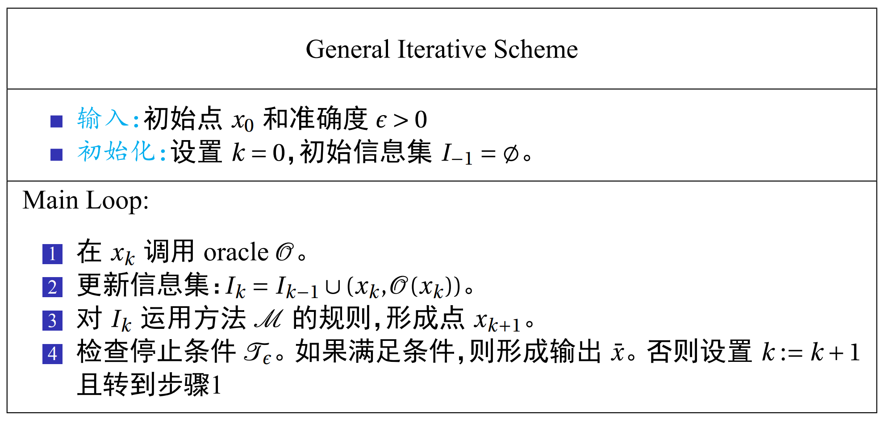

# 优化基本理论与方法

> 核心课程，要好好学

> 怎么不说评分也不布作业呢

## 与机器学习之间的关系

* 机器学习：训练映射，最小化损失函数
* 凸优化：最小化损失函数的优化方法

* 机器学习的任务主要分为分类（离散）和回归（连续）

-------

分类（Classification）- 0，1 损失

* 分到正确的类 - 损失为 0
* 反之损失为 1
* 0，1 情况下，最小化损失函数是 np 问题，不好解决
* 常用 Hinge Loss 替代，更好计算

<!-- Hinge Loss 图 -->

<!-- 复习：np 问题 -->

<!-- 推导 -->

<!-- 这个拉格朗日算子和二范数从哪冒出来的 -->

* 其他的 Loss 函数
    * Squre loss
    * Logistic loss
    * Cross entropy loss（交叉熵）

-------

最大似然估计（Maximum Likelihood Estimation View）

> 对数化把积转化为和

<!-- 待补充 -->

## 一般范式

<!-- 这里是定义 -->

更细的分类

* 有约束问题
* 无约束问题
* 光滑问题：$f_i(x)$ 都可微

* 最优解 - 全局最优解
* 局部解 - 局部最优解

> 一个常用于证明的方法 - 对任何输入，返回 x = 0

<!-- 这里是几个很？的定义 -->
<!-- oracle、计算努力？ -->

不同类型的 oracle

* 零阶
* 一阶
* 二阶

## 迭代法

上述方案有两个最昂贵的步骤

* 解析复杂性
* 算数复杂性

> n 维箱子约束问题

> 用无穷范数测量距离

<!-- 无穷范数 -->

<!-- 什么是 -->

> Lipschitz 连续

## 均匀网格法

构造 $(p+1)^n$ 个点，找出最小的点

* 零阶迭代方法
* 
* 定理 

<!-- 精度 -->

<!-- 后面太困了 -->

### 上下界估计

> 复习：线性代数
>
> 范数

### 一阶方法

> 负梯度方向是最快局部下降

### 二阶方法

> 难以理解

f(x) 在 x 处泰勒展开

Hessian - 对称方阵

正半定

正定

### $C^{1.1}_L(R)^n$ 类

<!-- 这里怎么突然听不懂了，绷 -->

> 引理 1.1 
>
> 引理 1.2（几何解释）

### $C^{2.2}_M(R)^n$ 类

