# 高级数据与算法分析——Part 1
## Preparation Before Class
------
* 教材
  
      数据结构教材

      **introduction to algorithms**

      algorithm design

      数据结构学习与实验指导

* 评分
    
    作业：10%

    Discussion：10%

    Research Topic：10%
    
    期中：10%（可被期末覆盖）

    期末：40%

## AVL Trees
------
* 目标：加速查找

* 方法：查找树
    
    * O(height)
    
    * 递增/递减序列退化成链
    
    * 最好情况（树最矮）：所有子树高度相等——太苛刻

----
### AVL树定义
  * 空树平衡
  

  * 非空树平衡当且仅当
   
    * 左子树与右子树都平衡
    
    * 左右子树高度差小于等于1
  

  * 平衡因子BF（node）=左子树高度-右子树高度
    
    * AVL只能取-1，0，1

> 本课中定义空树高度为-1
<!--  -->

> 几个例子：
> 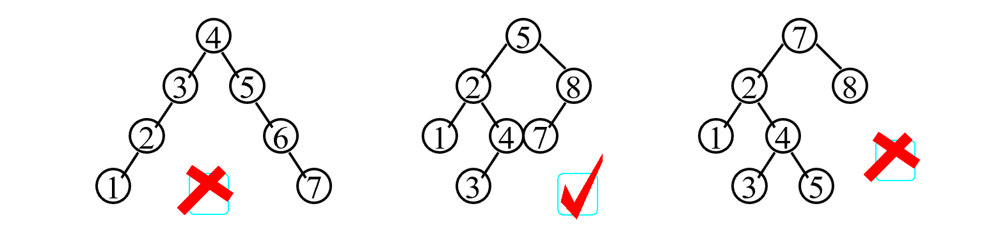
> 


这样就得到了性质较好的树

----
### 如何得到AVL树
* **树的旋转**
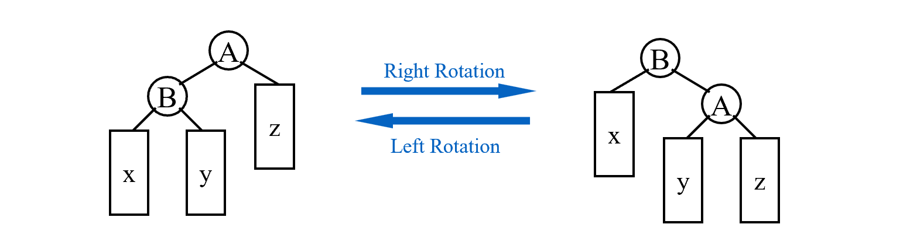
B高度增加1，A高度减少1。复杂度为$O(1)$，代码如下
```c
typedef struct Node *Tree;
struct Node
{
    ElementType Element;
    Tree Left;
    Tree Right;
}

A->Left=B->Right;
B->Right=A;
return B;//新根
```

**AVL树的插入**：
   
   每插入一个新结点，记录（以其为根节点的）高度，从下到上更新父节点高度，计算平衡因子，一但不符合条件
   
* 因子在同一个方向变化
    
    -2：左旋（RR Rotation——指从失衡节点开始向右插两次的情况）
    
    2： 右旋（LL Rotation，与RR对称）
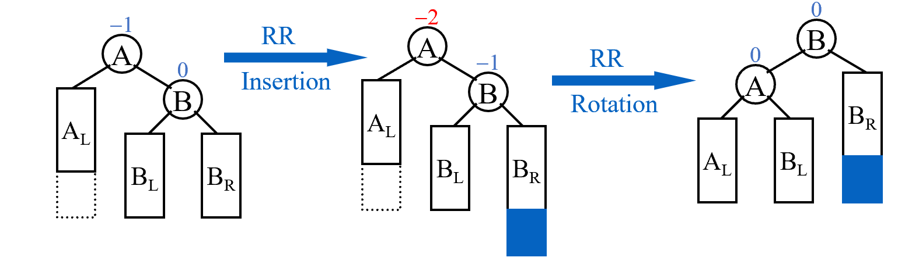

* 不同方向：把树高高方向的孙子转上来，转两次（两种对称情况，LR和RL）
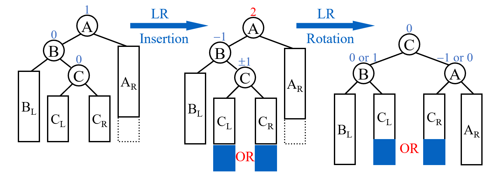

实际上，根据AVL树的良好定义，在每次插入后只需要一次操作（RR/LR...）就能使其再次平衡。

**AVL树的删除**：

用删除节点左子树的最大节点/右子树的最小节点替换他（与BST相同），再删除。

从删除节点的父节点开始（替换后），记录（以其为根节点的）高度，从下到上更新父节点高度，计算平衡因子，一但不符合条件，就用insert中的方法调整。在删除操作中，可能会需要多次调整。


----
### 复杂度分析
  树高的渐进上界

  $n_h$——h高度的树需要的最小结点数

  高度为h的树（所需节点最少）如下
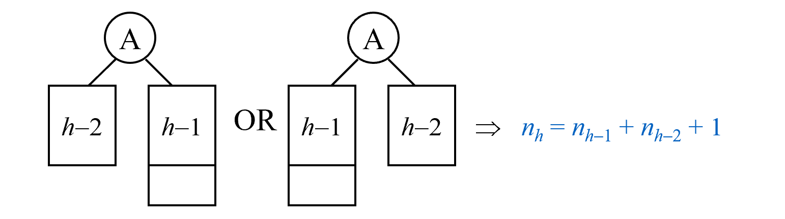

  > 与斐波那契数列类似：
  >
  > $F_0=0,F_1=1,F_n=F_{n-1}+F_{n-2}$
  >
  > 而$F_n\approx\frac{1}{\sqrt{5}}(\frac{1+\sqrt{5}}{2})^i$
  
  所以  $n_h =F_{n+3}-1$
  
  * $h=O(lnn)$
## Splay Trees
------
* 目标：M次操作，总的时间复杂度$O(MlogN)$，即每个操作平均复杂度为$O(logN)$

* 基本思想：每次查询/插入，将该元素提到根节点

### 构造过程
  
  * 如果查询节点的父亲是根——旋转查询节点
 
  * 如果不是，则有父亲节点（P）和祖父节点（G）
    * zig-zag（z字形）：转两次当前节点
    * zig-zig（一个方向）：先转父节点，再转当前节点
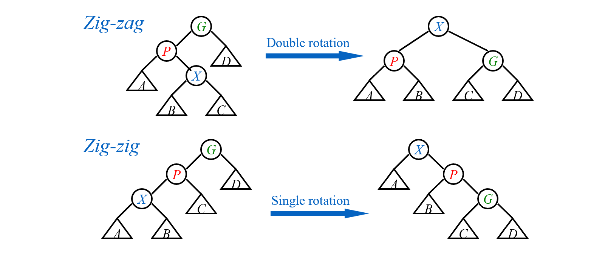

### 删除操作
  1. 找到要删除的元素X（这样让其在根节点）
  
  2. 删掉X，得到左子树和右子树
  
  3. 找到左子树最大的节点，将其推到根节点
  
  4. 这样就能直接将右子树接到左子树的右边

## Amortized Analysis(Three normal methods)
------
> An amortized analysis guarantees the average performance of
each operation in the worst case.

* Splay树的目标：M次操作，总的时间复杂度$O(MlogN)$——均摊时间上界(**Amortized time bound**)

* worst-case bound >= amortized time bound >= average-case bound

* 前两种与数据分布无关

### 栈的例子

#### 聚合分析
  对于所有 n，n 个运算序列总共需要最坏情况时间（determine an upper bound） T（n）。因此，在最坏的情况下，每次操作的平均成本或摊销成本为 T（n）/n。
  
> 以栈为例：

  * push：$O(1)$， pop：$O(1)$， 
  
  * multipop（一次pop出n个）：$min\{k，n\}=O(n)$，其中k是当前栈中元素数
  
  * 所以n次操作上界：$O(n^2)$
  
  
  * 更精确：栈中元素数肯定小于n，push进的元素只能pop一次，所以总的时间复杂度$O(n)$
  $$T_{amortized}= O( n )/n = O(1)
  $$

------
#### 核算法
> 以卖汽水为例：

* a卖一瓶汽水**3元**

* b用**5元**买汽水，存两元（credits）到a那，下次买汽水可以用。此时actual cost：3元

* $amortized\ cost = actual\ cost + credits$

* 买n瓶汽水，bound：
$$
amortized\ cost \geq  actual\ cost(即3n元，因为不赊账)
$$

**注意保证最终信用不小于0**

回到栈操作：

* 实际代价：push=1, pop=1, multipop=min(sizeof(s),k)

* 均摊代价：push = 2(提前把pop的代价付掉，即使不pop该元素), pop = multipop = 0，这样所有代价都是常数

* Credits：push = +1, pop = -1, multipop = -min(sizeof(s),k)

* multipop时的信用为sizeof(s)，因此不会出现信用为负的情况

* n次操作最大的amortized cost为2n，$T_{amortized}= O( n )/n = O(1)$

------
#### 势能法

* $\Phi(D_i)$：势能函数，表示$D_i$状态的势能

* $Credits =\Phi(D_i)-\Phi(D_{i-1})$; 

* 合法的势能函数：保证$\Phi(D_{0})$是最小的，这样总的Credits$=\Phi(D_n)-\Phi(D_{0})$>0，均摊代价是实际代价的上界。下面公式中 $\hat{c_i}$ 是均摊代价， $c_i$ 是实际代价
$$
\sum_{i=1}^n\hat{c_i}=\sum_{i=1}^n(c_i+\Phi(D_i)-\Phi(D_{i-1}))=\sum_{i=1}^nc_i+\Phi(D_n)-\Phi(D_{0})
$$


再次回到栈

* 势能函数$\Phi(D_i)=D_i$时刻栈中的元素数

* 计算均摊代价：

  * push：$\hat{c_i}=c_i+\Phi(D_i)-\Phi(D_{i-1})=1+1=2$

  * multipop：$\hat{c_i}=c_i+\Phi(D_i)-\Phi(D_{i-1})=k'-k'=0$

* 每个操作的代价都是O(1)——均摊代价是O(1)

-----
### Spaly树均摊分析

应用：分析splay tree的均摊代价——Amortized Analysis Using Potential Methods:

> 树的常见势能函数：节点个数、树高···

(因为报告用英文写的所以下面是英文)

In tree's amortized analysis, we often use the height of tree or the amount of nodes as the potential function, which satisfy $\Phi(0)$ is the minimum. To make the potential function increasing slowly, we choose $\Phi(T)=\sum_{i\in T}S(i)$, where S(i) is the number of descendants of i (i included). $\Phi(T)$ is also called rank of T, notion $R(T)$

> Lemma: If $a+b\leq c$ 
>
> then  $loga+logb\leq 2logc-2$

Same as the part of algorithm analysis, there are three situations to discuss according to the picture.
  
* If the "X" to be pushed is one of the childs of root, we only need one rotation. Except X and P, the "S(i)"  didn't change, and the rotation cost $c_i$ is 1. So the amortized cost 
  $$
  \hat{c_i}=1+R_2(X)-R_1(X)+R_2(P)-R_1(P)
  $$
  $$
  \leq 1+R_2(X)-R_1(X)
  $$
    (shown below that $R_2(P)<R_1(P)$)
   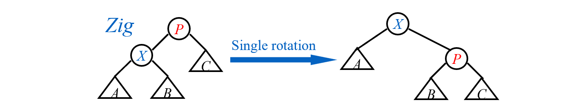
  
* In the zig-zag case, we need two rotation, costing 2. We note that $R_2(X) = R_1(G) = log(the\ number\ of\ nodes\ in\ T)$. So the amortized cost 
  $$
  \hat{c_i}=2+R_2(X)-R_1(X)+R_2(P)-R_1(P)+R_2(G)-R_1(G)
  $$

  $$
  =2-R_1(X)+R_2(P)-R_1(P)+R_2(G)
  $$

  $$
  \leq 2(R_2(X)-R_1(X))
  $$
    (shown below that nodes: $P_2+G_2<X_2,\ so\ according\ to\ lemma,\ R_2(P)+R_2(G)\leq 2R_2(X)+2$)
    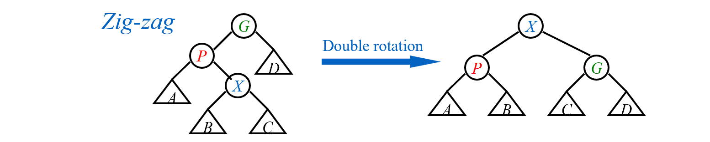
* In the zig-zig case, we need two rotation, too, costing 2. We also note that $R_2(X) = R_1(G)$. So the amortized cost 
  $$
  \hat{c_i}=2+R_2(X)-R_1(X)+R_2(P)-R_1(P)+R_2(G)-R_1(G)
  $$

  $$
  =2-R_1(X)+R_2(P)-R_1(P)+R_2(G)
  $$
   $$
   =2-2R_1(X)+R_2(P)-R_1(P)+R_2(G)+R_1(X)
   $$
  $$
  \leq 3(R_2(X)-R_1(X))
  $$
    (shown below that nodes: $X_1+G_2<X_2,\ so\ according\ to\ lemma,\ R_1(X)+R_2(G)\leq 2R_2(X)+2$)
  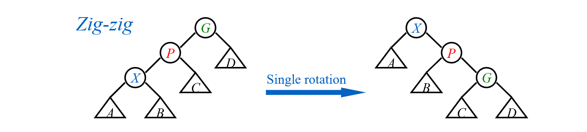

When splay, the former $3R_2(X)$ could be eliminated by the latter item's $-3R_1(X)$. After sum of all the items, we get:
$$
\hat{c_i} \leq 1+3(R_2(X)-R_1(X))=O(logN)
$$

### Incrementing a binary counter
> 算法导论的摊还分析例子

Incrementing a binary counter(k bit in total)

* 每次从低位往高位翻转bit，遇到1继续翻转，遇到0翻转完后停下来

* worst case: 每次最多转k个bits——011...1=>100...0

聚合分析：

* A[0]每次都改变

* A[1]每两次改变一次

* 假设计数n次，则A[0]改变$n$次，A[1]改变$\lfloor\frac{n}{2}\rfloor$次...A[i]改变$\lfloor\frac{n}{2^i}\rfloor$次

* 因此总共的操作（翻转bit）的次数为

$$
\sum^{k-1}_{i=0}\lfloor\frac{n}{2^i}\rfloor<n\sum^{\infty}_{i=0}\frac{1}{2^i}=2n
$$

因此总的时间复杂度上界为O(n)，均摊时间复杂度为O(n)/n=O(1).

核算法：

* 实际代价：1变为0 = 1, 0变为1 = 1

* 均摊代价：0变为1 = 2(提前把1变为0的代价付掉), 1变为0 = 0

* 从0开始计数，肯定先将0变为1才能变回去，因此不会出现信用为负的情况

* 我们知道每次最多只有一个0变成1

* 因此均摊代价为O(1)

势能法：

* 选取势能函数：当前1的数目，记为$b_i$
<!--  怎么看到这就停了-->


## Red-black Tree
------
> tips: 访问空指针会 Sigementation fault，，可以指向一个虚拟节点（哨兵）

* 目标：每次搜索都$(logn)$

### 1. 红黑树定义
1. 红黑树的每个节点要么是红色的，要么是黑色的

2. 根节点是黑色的

3. 每个叶子都是哨兵（NIL），哨兵是黑色的

4. 如果节点是红色的，那么他的孩子都是黑色的

5. 每个节点到（能到达的）所有叶子的简单路径，经过的黑色节点数相同

--------

* black height: 不算自己、不算哨兵，经过的黑色节点数

> 引理：
<!-- 什么引理 -->
证明：

------
### 2. 红黑树构造
 
 构造想法：插入新节点且染成红色——保持性质5，通过迭代变换保持其他性质


**Insert**(不满足性质有三种情况)：
  
  * case 1：红叔叔（所以爷爷肯定黑色）——将爸爸和叔叔染黑，爷爷染红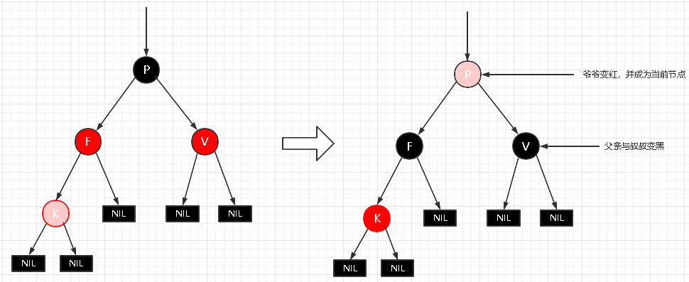
  
  * case 2：近叔叔黑——旋转到case3
  
  * case 3：远叔叔黑——父亲染黑，旋转爷爷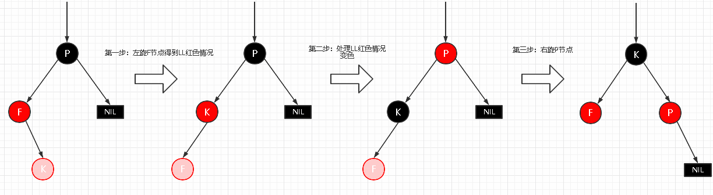
  
这样保持了每次只有一条规则被破坏

* 复杂度：最坏情况——一直case 1
$$
T = O(h) = O(logn)
$$

----
**Delete**

* 被删节点是leaf node: 父亲指向NIL

* 只有一个儿子：用儿子替代他

* 有两个儿子：用左子树最大的/右子树最小的替代他。

此时

<!--删除怎么删  -->

## B+ Tree
------
### 1. 定义

#### A B+ tree of order **M**:

* 根节点要么没有孩子，要么有$[2,M]$个孩子

* 除根之外的非叶子节点，有$[\lceil M/2\rceil,M]$个孩子

<!-- 好像还有一点，yy怎么不发ppt😭 -->

<!-- 为什么根节点不同？ -->

------
### 2. 插入过程

* 插入=>若超限=>分裂

* 保证有序/找到位置：遍历（O(n)）

* 如果推到前面——可能O(n)，因此实际操作不这么做

<!-- 伪代码  -->
```c
Btree Insert(ElementType X,Btree T)
{
  Seach from root to leaf
}
```

<!-- 时间复杂度 -->
> choose M: best 3 or 4

-------
> B+树的好处：相近的元素离得近，磁盘友好

------
### 3. 删除过程
<!-- 删除？ -->

