# 高级数据与算法分析——Part 2
## Inverted File Index
------
> 应用：信息检索，搜索引擎

搜索引擎的搜索方式？

* Solution 1: 遍历寻找搜索的关键字（太耗时）

* Solution 2: 矩阵存储（太耗空间）
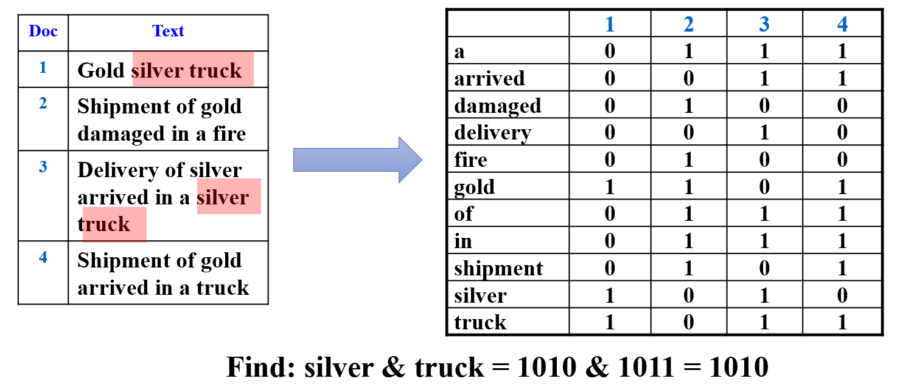

> 磁带假设：词和词没有顺序

* Solution 3: Inverted File Index（参考图论，将矩阵用邻接表表示）
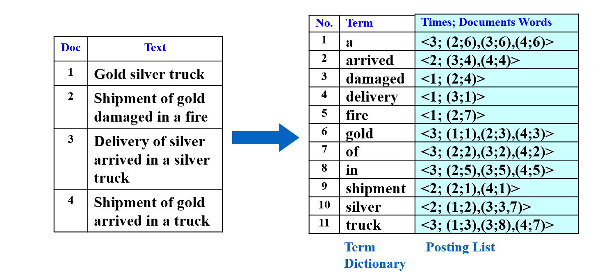
以a为例：出现次数3次，分别出现在第二个网站的第六个，第三个网站的第六个，第四个网站的第六个。

    因此链表里存储的是<3,(2;6),(3;6),(4,6)>

```c
while ( read a document D ) {
    while ( read a term T in D ) {
        if ( Find( Dictionary, T ) == false )
            Insert( Dictionary, T );
        Get T’s posting list;
        Insert a node to T’s posting list;
    }
}
Write the inverted index to disk;
```

### Optimize
1. 对term进行处理
   
      * 只留下词根
      
      * 停用词（stop words）过滤：the、a、what...——成本大，收获低

2. 加速搜索
   
      * 哈希
      
      * 搜索树

    > Discussion: 哈希和搜索树各自的优缺点？
    >
    <!-- > 是什么啊啊啊 -->

3. 内存优化
      * 内存不够时，把写好的词典放入disk
      
      * 释放内存，创建一个新的词典
      
      * 最后归并排序

4. 存储优化
      * disk都不够时（web-scale的数据）

      * Solution 1：将磁盘按字母序放在不同电脑里

      * Solution 2：Document-Partitioned index
        
          每个分区代表一个单独的文档集合，其中包含了该文档集合中的所有关键词以及它们对应的频率信息。这种分区的目的是为了提高查询效率，因为对于给定的查询，系统只需要访问与其相关的文档分区即可。

        * 好处：易于扩展、便于并行、即使一个集合不可用都能返回结果（虽然可能不是最佳的


5. Dynamic indexing
     * 物理删除代价昂贵——做新旧标记
     
     * 分为一个Main list和new list，已存在的词放在Main list里，新词放在new list里


6. Compression(压缩)
    
    将空格和停用词去除，将词汇表线性存储，记录每个单词首字母位置差序列
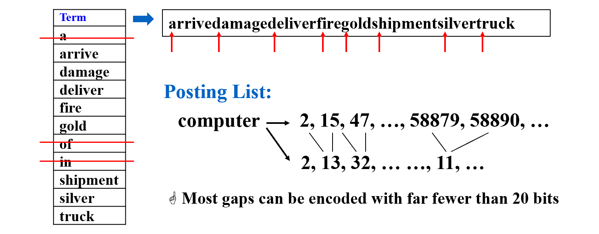

### Measures
几个评价指标：

* 索引的快慢

* 搜索的快慢

* 对复杂语言的处理能力 

|文档|相关|不相关|
|--|--|--|
|检索到|$R_R$|$I_R$|
|未检索|$R_N$|$I_N$|

精确率：检索到的正确样本在检索到的样本上的比例
$$
Precision\ P = R_R / (R_R + I_R)
$$
召回率：检索到的正确样本在所有正确样本上的比例
$$
Recall    \  R = R_R / (R_R + R_N)
$$

> [倒排文件索引的一个题集](https://blog.csdn.net/HGGshiwo/article/details/116351170)


## Leftist Heaps
-------
> review: 堆的操作（以最小堆为例）

* 插入 —— 插到完全二叉树最后的位置，跟父节点比较，比父节点小则交换，直到比父节点大（$O(logn)$）

* 删除（最小值） —— 删除根，将最后位置的元素提到根上，再与两个儿子比较，把最小的儿子换到上面，直到两个儿子都比当前值大（$O(logn)$）

* 建堆 —— 找到最后一个节点的父节点，从这个节点开始依次向前（以数组形式存储），把小儿子提上来（$O(n)$）

* 合并 —— 复杂度相当于重新建堆（$O(n)$，n为两个堆size之和）

堆有很好的顺序性质，合并操作应能简化


左偏堆（Leftist Heaps）—— 一种不平衡的二叉树，也是堆（即根是子树中最大/小的元素）。利用结构的不平衡，**加速堆的合并**

-------
### Definition
* 有两个儿子的节点是内部节点，其余为外部节点

* **null path length, Npl(x)**: 到外部节点的最短路径长度

* 定义Npl(null) = -1
* 从定义可以看出
$$
Npl(X) = min \\{ Npl(LeftChild) + 1 ,Npl(RightChild) + 1 , \\}
$$
* **左偏树** —— 即所有的节点，左儿子的Npl大于等于右儿子的Npl


> Theorem: 右路径长度为 r 的左偏树，至少有 $2^r-1$ 个节点
>
> （右路径是从根节点开始，一直往右儿子遍历经过的所有节点（即右儿子的右儿子的右儿子······构成的路径），路径长等于经过的节点数）
<!-- 分割 -->
> 运用数学归纳法
 
 r = 1 时，只有一个根节点，显然成立

 r = k 时，假设结论成立

 r =  k + 1 时，

 因为左偏堆要求左边节点的 Npl 大于等于右边节点，那么只有一直往右，才能以最短路径到达叶子节点。所以根节点的 Npl 长与右路径相关。
 
 因此 Npl(root) = k，Npl(RightChild) = k - 1，右子树的右路径为 k，由假设，右子树至少有$2^k-1$个节点

 因为左儿子的 Npl 不比右儿子小，我们想求节点数的下界，因此设 Npl(LeftChild) = k - 1
 
 同理（根节点的 Npl 长与右路径相关），左子树的右路径为k，因此左子树至少有$2^k-1$个节点

 总的节点数 = 左子树 + 右子树 + 根 = $2^{k+1}-1$，假设成立

------
### Implementation
> 两个堆的合并


```c
struct TreeNode
{
    ElementType     Element;
    PriorityQueue   Left;
    PriorityQueue   Right;
    int             Npl;// 特别的地方
};
```

方法一：递归

1. Merge( H1->Right, H2 )
   
    先判断哪个堆顶的元素小，再把元素大的堆和小的右儿子 Merge  
    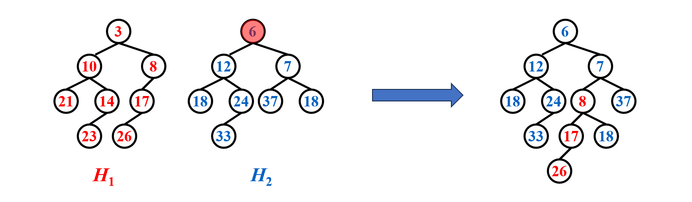


2. Attach( H2, H1->Right )

    将 Merge 好的堆接到原来的右儿子位置上（递归假设 Merge 后的堆已经是左偏堆，因此只有根可能不符合左偏堆的定义）
    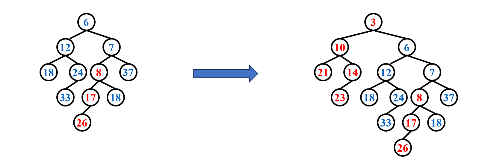

3. Swap(H1->Right, H1->Left ) if necessary

    因此只要查看左儿子和右二子的 Npl，来判断是否需要交换，即可保证结果是左偏堆
    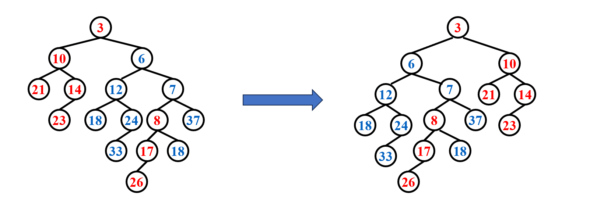

```c
PriorityQueue  Merge ( PriorityQueue H1, PriorityQueue H2 )
{ 
    if ( H1 == NULL )   return H2;	
    if ( H2 == NULL )   return H1;	
    // 找到堆顶元素小的堆
    if ( H1->Element < H2->Element )  return Merge1( H1, H2 );
    else return Merge1( H2, H1 );
}

static PriorityQueue
Merge1( PriorityQueue H1, PriorityQueue H2 )
{ 
    if ( H1->Left == NULL ) 	/* single node */
        H1->Left = H2;	/* H1->Right is already NULL 
                    and H1->Npl is already 0 */
    else {
        H1->Right = Merge( H1->Right, H2 );     /* Step 1 & 2 */
        if ( H1->Left->Npl < H1->Right->Npl )
            SwapChildren( H1 );	/* Step 3 */
        H1->Npl = H1->Right->Npl + 1;/* 更新 Npl */
    } /* end else */
    return H1;
}

```

$$
T_p = O(log{N})
$$

方法二：迭代                              

1. Sort the right paths without changing their left children

    用下面这个例子说明：先看 3 和 6，应该将 6 接到 3 的下面，因此保持 3 的左子树不变，把 6 跟右子树比较。

    右子树中，6 比 8 小，因此保持 6 的左子树不变，把 6 接到 3 上，再比较 6 的右子树和 8，以此类推 ......
    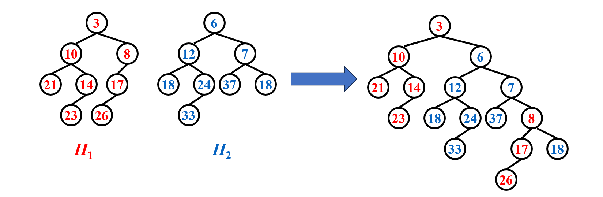

2. Swap children if necessary

    从下到上回溯，发现 7 和 3 不满足，交换他们的孩子。（注意更新 Npl）
    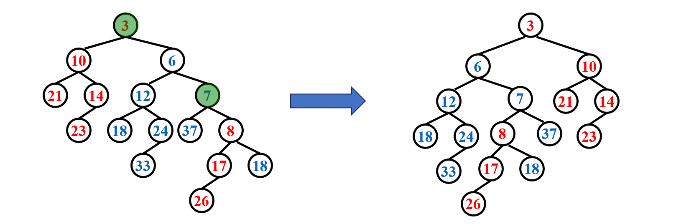

```c
PriorityQueue  Merge ( PriorityQueue H1, PriorityQueue H2 )
{ 
    if ( H1 == NULL )   return H2;	
    if ( H2 == NULL )   return H1;	
    PriorityQueue root;
    // 初始化
    if(H1->Element < H2->Element){
        root = H1;
        push(H1);
        H1 = H1->Right;
    }else{
        root = H2;
        push(H2);
        H2 = H2->Right;
    }

    // 迭代地将小的元素插到当前根的右边，并成为新的根
    While(H1 && H2){
        if(H1->Element < H2->Element){
            root -> Right = H1; 
            root = root -> Right;
            push(H1);
            H1 = H1->Right;
        }else{
            root -> Right = H2; 
            root = root -> Right;
            push(H2);
            H2 = H2->Right;
        }
    }

    if(H1)  root -> Right = H1; 
    if(H2)  root -> Right = H2; 

    PriorityQueue temp;
    // 回溯，判断是否需要交换儿子，更新Npl
    While(temp = pop()){
        root = temp;
        if(root->Left && root->Right){
            if(root->Left->Npl < root->Right->Npl)  Swap(root);
        root->Npl = root->Right->Npl + 1;
        }else if(root->Right){
            root->Left = root->Right;
            root->Right = NULL;
            root->Npl = 0;
        }else   root->Npl = 0;
    }
    return root;
}
```

> delete min
>
> Step 1: Delete the root
>
> Step 2: Merge the two subtrees

$$
T_p = O(log{N})
$$

## Skew Heaps
------
左偏树合并时不判断 Npl，直接交换左右子树，就是斜堆。（除右路径上最大的节点不交换）

可以保证均摊代价

> Example: insert 15

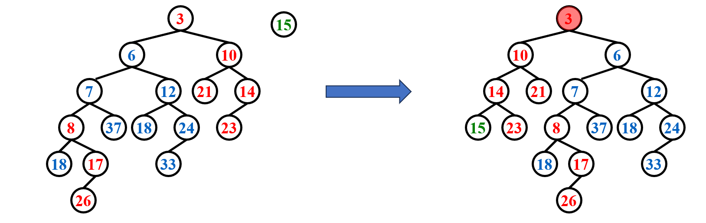


```c
// 这个也可以写代码


```


* 优点：不用存 Npl，不用判断

* 开放性问题：如何保持右路径长度

------
均摊分析（势能法）
<!-- ? -->

* 势能函数$\Phi(D_i)$ = 整个树中重节点的个数

* 重节点：右子树节点个数严格大于左子树的节点

* 只有右路径节点的轻重会改变，因此只下面只计算右路径的势能（其余抵消）

$$
\Phi(D_0) = h1 + h2 + h 
$$

* 操作后，重节点一定变轻，轻节点不一定变重，为求上界，假设轻节点都变重（势能函数就会变大，存储更多势能）

$$
\Phi(D_N) \leq l1 + l2 + h

$$


$$
T_{amortized} = 
$$

* 最坏情况：Merge, Insert, DeleteMin 都是 O(N)
* 均摊情况：都是 O(logN)


## Binomial Queue
------
> 二项优先队列

* 建堆的时间复杂度：$O(n)$，均摊$O(1)$
* 插入的时间复杂度：$O(logn)$
* 因此我们想优化插入

### 定义

A binomial queue is not a heap-ordered tree, but rather a collection of heap-ordered trees, known as a forest.  Each heap-ordered tree is a binomial tree.

* A binomial tree of height 0 is a one-node tree.
* A binomial tree, $B_k$, of height k is formed by attaching a binomial tree, $B_{k – 1}$, to the root of another binomial tree, $B_{k – 1}$.

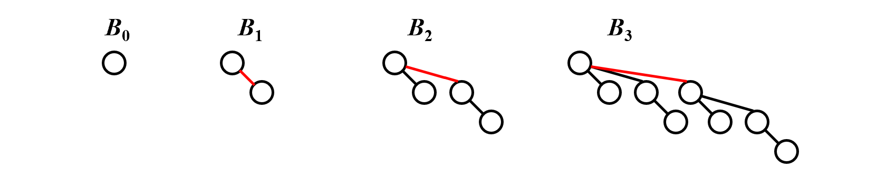

观察得：$B_k$ consists of a root with k children, which are                        .  $B_k$ has exactly       $2^k$     nodes.  The number of nodes at depth d is    $C_k^d$        .

任何大小（节点数）的二项队列可以被二项树唯一表示

> Example

------
### 操作

* FindMin: 比较每个根节点大小，找到最小的。节点数为N，则最多有$\lceil logN\rceil$个树，时间复杂度为$O(logN)$.
    * 可以记录最小的根，并在变更时更新。这时的时间复杂度为$O(1)$。
* Merge: 类似于二进制


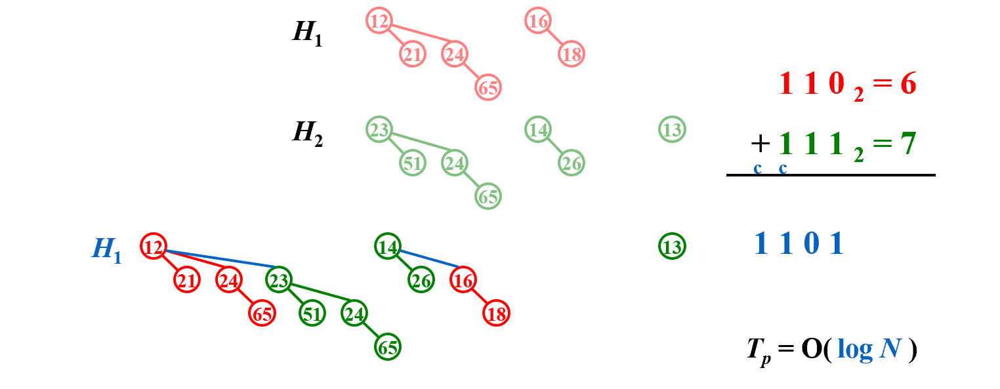

* Insert: Merge的特殊情况——Merge($H, B_0$)
* DeleteMin: 
    * step 1: FindMin—— ($O(logN)$)
    * step 2: 在二项队列中删除$B_k$，得到H' ——($O(1)$)
    * step 3: 在$B_k$中删除根，将其所有子树作为新的队列H''—— ($O(logN)$)
    * step 4: Merge(H', H'') ——($O(logN)$)

------
### 实现

左儿子右兄弟——节省空间，不用考虑随机访问孩子
```c
typedef struct BinNode *Position;
typedef struct Collection *BinQueue;
typedef struct BinNode *BinTree;  /* missing from p.176 */

struct BinNode 
{ 
    ElementType	    Element;
    Position	    LeftChild;
    Position 	    NextSibling;
} ;

struct Collection 
{ 
    int	    	CurrentSize;  /* total number of nodes */
    BinTree	TheTrees[ MaxTrees ];
} ;
```

DeleteMin
```c
DeleteMin(BinQueue H)
{
    int min = FindMin(H);//min的元素在数组中的位置
    BinTree OldRoot = H->TheTrees[min]; 
    H->TheTrees[min] = H->TheTrees[0];//指向哨兵
    BinQueue new_H = Malloc...
    while(NextSibling){
        //创建新队列
    }
    free(OldRoot);
    Merge(H, new_H);
}
```

-----
### 分析
* 1/2：不合并
* 1/4：合并一次
* 1/8：合并两次

势能法：

* $\Phi(i)$ = i次插入后的树的数量


