# 高级数据与算法分析——Part 3

## Backtracking

-----
解决问题的一般思想：生成一个候选解的 list，检查所有的解，去除不符合要求的，来找到最后的解

**回溯法**：不要的分支扔掉（“剪枝”），避免在不需要的分支上浪费检查所需的算力

* 基本思想：suppose we have a partial solution ( x1, ... , xi ), than we add  xi+1 and check if ( x1, ... , xi, xi+1 ) satisfies the constrains.  If the answer is “yes” we continue to add the next x, else we delete xi and backtrack to the previous partial solution ( x1, ... , xi ).


-----
> Eight Queens: 在 8*8 的棋盘放 8 个皇后，没有两个皇后在同一行/列/对角线上（放入一个皇后后，八个方向都被 ban）

> 

* 解的表示方法（xi 表示第 i 行的皇后在第几列）：
$$
Solution = ( x1, x2, ... , x8 ) = ( 4, 6, 8, 2, 7, 1, 3, 5 )
$$


* 解空间大小：$n!$（n皇后）


先考虑四皇后的简单版本，建立一个 game tree（帮助理解，实际并不建树）：


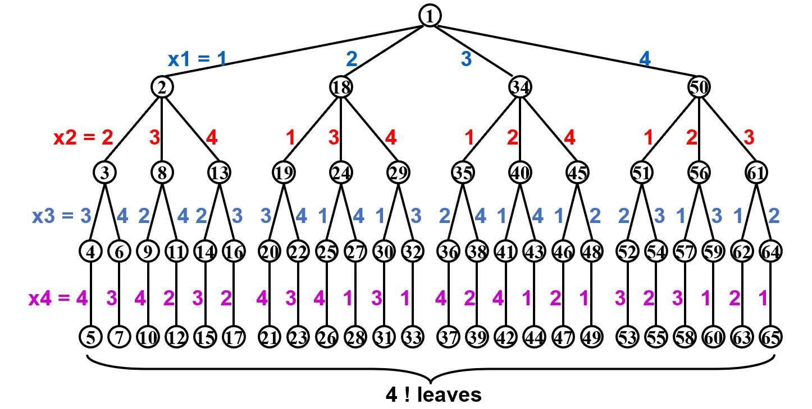

每个根到叶子的路径代表一个解，接下来进行深度优先搜索，黑色是检查后发现不满足条件的节点，绿色是找到的解。

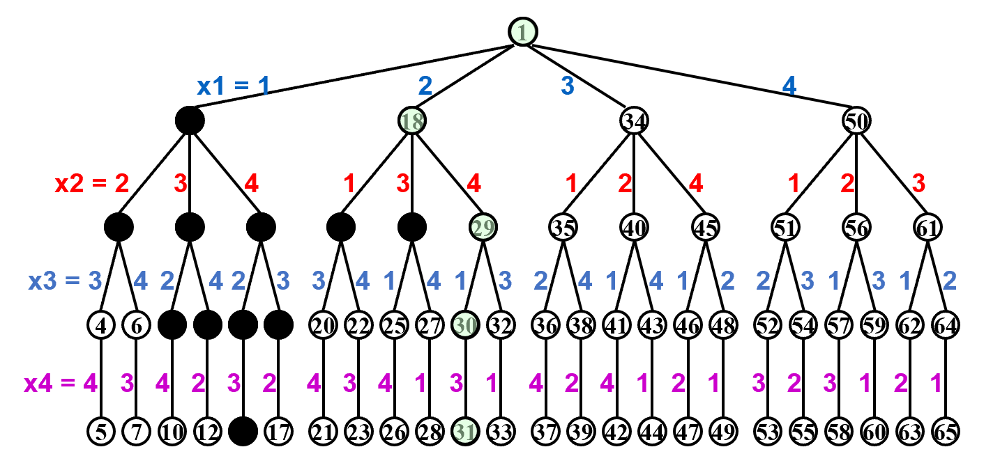

用这个方法，我们找到了第一个解 ( 2, 4, 1, 3 )


* 穷举：一直走到树的最深处

* 回溯：在一半发现不行时回去


-----
> Turnpike Reconstruction
>
> 有 N 个加油站，给定所有加油站两两间的距离（N(N-1)/2 个），求解加油站坐标（最左边的是 0）
>
> Example: Given D = {1,2,2,2,3,3,3,4,5,5,5,6,7,8,10}

Step 1: N(N-1)/2 = 15 implies N = 6

Step 2: 因为第一个加油站坐标为 0，因此离他最远的加油站坐标为 10. 其余加油站都在二者之间

Step 3: 找到第二大的距离 8，假设它与第一个加油站的距离是这么大，并在集合中排除 2（此时它与最后一个加油站的距离就是 2）

Step 4: 找到第三大的距离 7，假设它与第一个加油站的距离是 7，如果可行再去枚举第四大的距离，不可行则认为它与最后一个加油站的距离是 7，都不行的话回溯到 Step 3，假设它与最后加油站的距离是 8

······

搜索树如下：

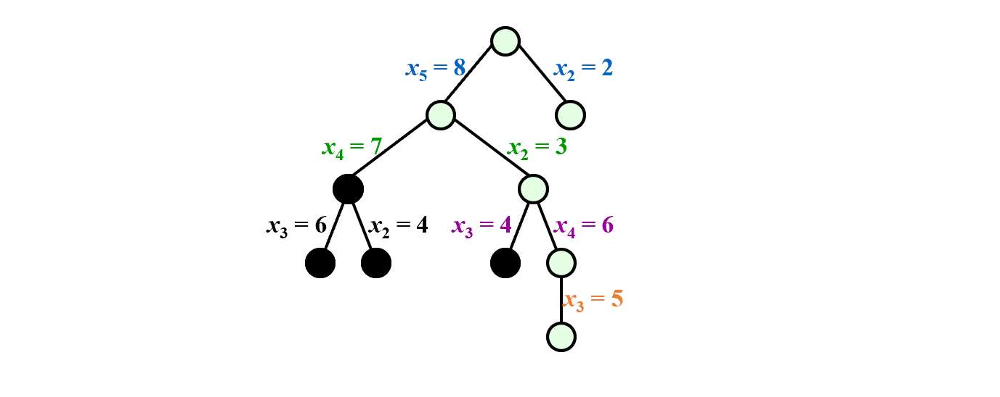

最终的解（相应位置的坐标）：

( 0, 3, 5, 6, 8, 10 )

```c title="加油站问题的代码"
bool Reconstruct ( DistType X[ ], DistSet D, int N, int left, int right )
{ /* X[1]...X[left-1] and X[right+1]...X[N] are solved */
    bool Found = false;
    if ( Is_Empty( D ) )
        return true; /* solved */
    D_max = Find_Max( D );
    /* option 1：X[right] = D_max */
    /* check if |D_max-X[i]|属于D is true for all X[i]’s that have been solved */
    // 相当于把新的加油站放在坐标为 D_max 的位置
    OK = Check( D_max, N, left, right ); /* pruning */
    if ( OK ) { /* add X[right] and update D */
        X[right] = D_max;
        for ( i=1; i<left; i++ )  Delete( |X[right]-X[i]|, D);
        for ( i=right+1; i<=N; i++ )  Delete( |X[right]-X[i]|, D);
        Found = Reconstruct ( X, D, N, left, right-1 );
        if ( !Found ) { /* if does not work, undo */
            for ( i=1; i<left; i++ )  Insert( |X[right]-X[i]|, D);
            for ( i=right+1; i<=N; i++ )  Insert( |X[right]-X[i]|, D);
        }
    }
    /* finish checking option 1 */
    if ( !Found ) { /* if option 1 does not work */
        /* option 2: X[left] = X[N]-D_max */
        OK = Check( X[N]-D_max, N, left, right );
        if ( OK ) {
            X[left] = X[N] – D_max;
            for ( i=1; i<left; i++ )  Delete( |X[left]-X[i]|, D);
            for ( i=right+1; i<=N; i++ )  Delete( |X[left]-X[i]|, D);
            Found = Reconstruct (X, D, N, left+1, right );
            if ( !Found ) {
                for ( i=1; i<left; i++ ) Insert( |X[left]-X[i]|, D);
                for ( i=right+1; i<=N; i++ ) Insert( |X[left]-X[i]|, D);
            }
        }
        /* finish checking option 2 */
    } /* finish checking all the options */
    
    return Found;
}

```

### 回溯法的代码模板

```c title="回溯法的模板"
bool Backtracking ( int i )
{   Found = false;
    if ( i > N )
        return true; /* solved with (x1, …, xN) */
    for ( each xi 属于 Si ) { 
        /* check if satisfies the restriction R */
        OK = Check((x1, …, xi) , R ); /* pruning */
        if ( OK ) {
            Count xi in;
            Found = Backtracking( i+1 );
            if ( !Found )
                Undo( i ); /* recover to (x1, …, xi-1) */
        }
        if ( Found ) break; 
    }
    return Found;
}

```

> 更推荐上面的搜索树，可以剪掉很大规模的子集
>
> 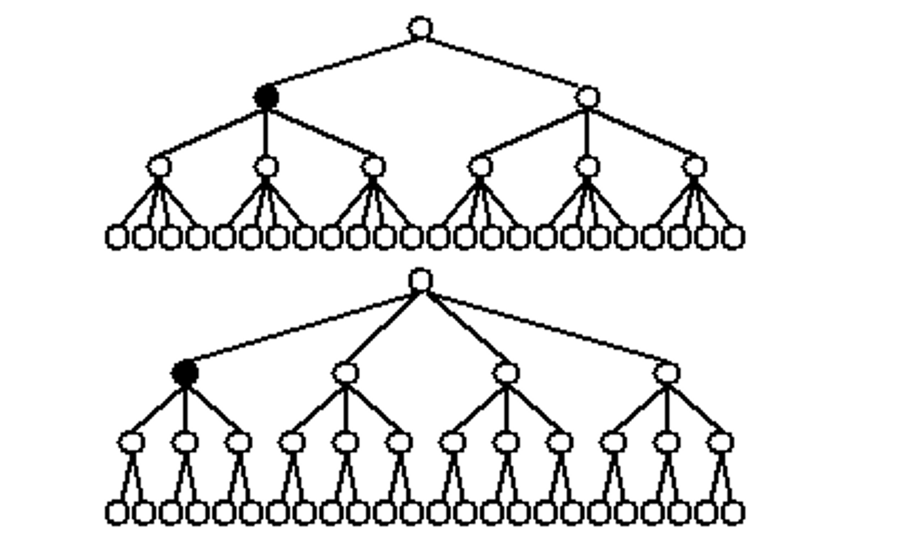

------

> Stick Problem


-----

> AlphaGo
>
> Tic-tac-toe
> 
> 19,683 possible board layouts (39 since each of the nine spaces can be X, O or blank), and 
> 
> 362,880 (i.e., 9!) possible games (different sequences for placing the Xs and Os on the board)

### Minimax Strategy

Use an evaluation function to quantify the "goodness" of a position.  For example:
$$
f(P)=W_{Computer}-W_{Human}
$$

where W is the number of potential wins at position P

以下图为例，红圈是人，有 4 种可能的赢法

1. 上面一横
2. 左边一竖
3. 右边一竖
4. 下边一横

同理，蓝叉是电脑，有 6 种可能的赢法


The human is trying to minimize the value of the position P, while the computer is trying to maximize it. - Minimax Strategy

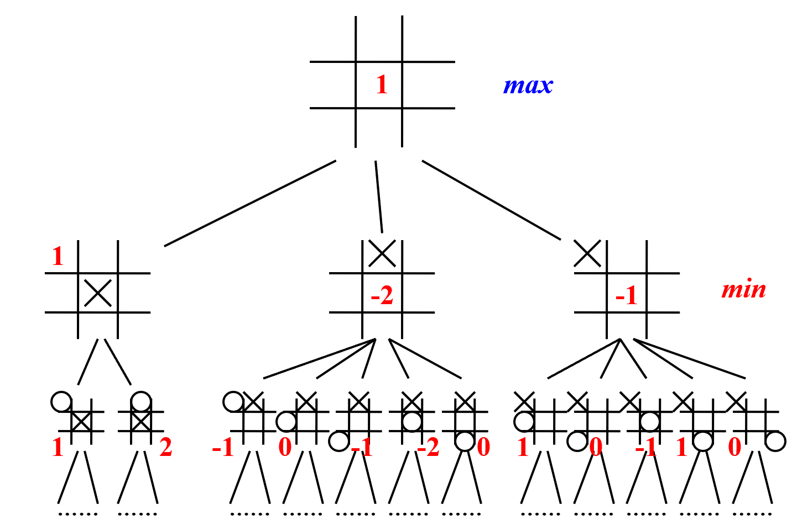

剪枝方法：

*  α pruning
    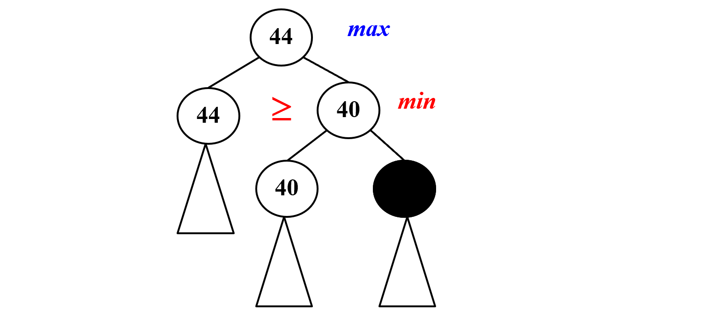
    
*   β pruning

    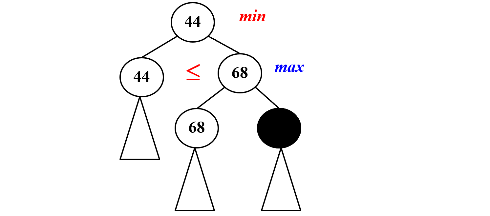

limits the searching to only  $O(\sqrt{N})$ nodes, where N is the size of the full game tree.

> 注：回溯的效率跟S的规模、约束函数的复杂性、满足约束条件的结点数相关。约束函数决定了剪枝的效率，但是如果函数本身太复杂也未必合算。满足约束条件的结点数最难估计，使得复杂度分析很难完成。

----------
## Divide and Conquer

将规模为 N 的大问题分成 a 个规模为 N/b 的子问题，子问题通过再次分割递归解决，Merge 需要消耗 $f(N)$ 的资源，因此
$$
T(N)=aT(N/b)+f(N)
$$


典型问题：

> 最大子序列问题

分为左右两个部分，合并时考虑左右贯通情况，因此 a = 2，b = 2，f(N) = O(N)

* f(N) 的得到：一种有效的方法是从中间点开始，向左右两侧分别找到最大序列和，然后将它们相加。这个过程的复杂度是 O(n)，其中 n 是子数组的长度。

可以推出 $T(N) = O(NlogN)$（推导在后面）

> 树的遍历

> 归并排序 


### Closest Points Problem

> 给出平面上 N 个点的坐标，求两点之间的最短距离

枚举法：检查 $N(N-1)/2$ 个点对，$T=O(N^2)$

分治法：将平面分成左右两块，计算左右两边内部的最小距离，再计算横跨两块的最短距离

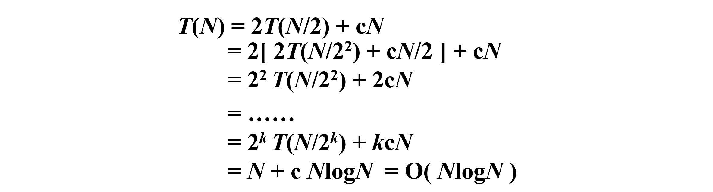
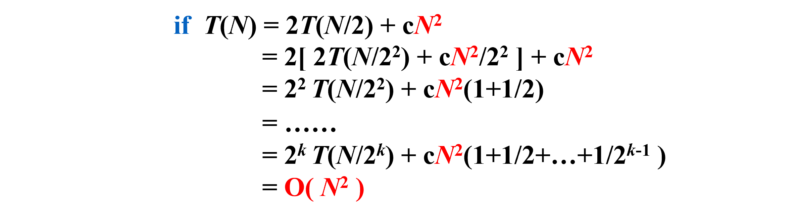

* 由上面的推导知：合并函数的复杂度 matter
* 横跨两块的最短距离如何计算很重要
    
    * 已经知道了左右两边的最小距离 $\delta$，水平方向上，只有两个点在 $[-\delta,\delta]$ 之间，它们之间的距离才能更小
    * 根据左右两边的最小距离，维护横跨左右的小方块，在其中计算最短距离（自上而下遍历）
    * 例如下图，选定最上方的一个点，构造下面这样的区域（接下来选择纵坐标第二大的点，构造小方块


| 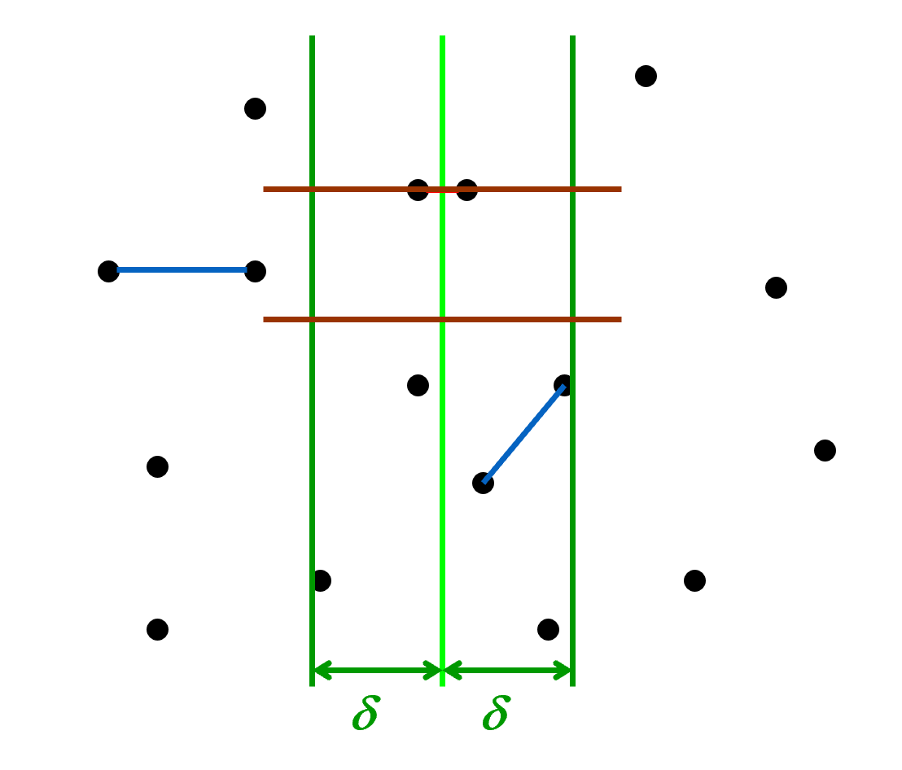 | 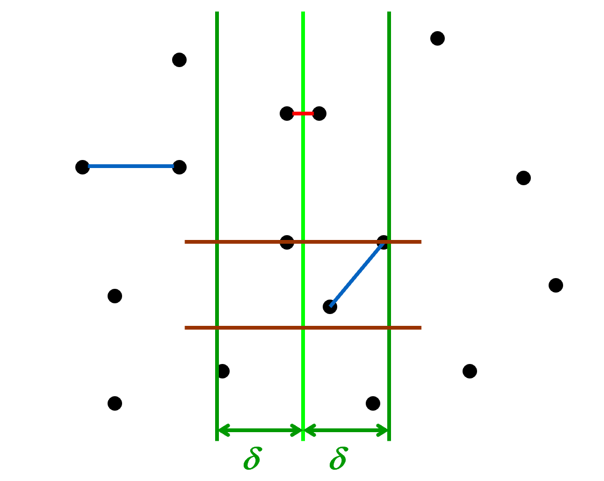 |
| ------------------------- | ------------------------- |


最多点的情况：

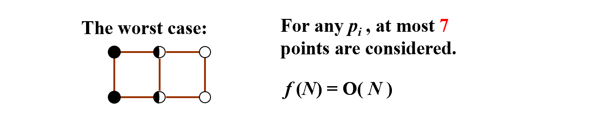

```c
/* points are all in the strip */
/* and sorted by y coordinates */
for ( i = 0; i < NumPointsInStrip; i++ )
    for ( j = i + 1; j < NumPointsInStrip; j++ ) 
        if ( Dist_y( Pi , Pj ) > delta )
    break;
        else  if ( Dist( Pi , Pj ) < delta )
     delta = Dist( Pi , Pj );
```

-------------
### 复杂度分析

1. Substitution method —— guess, then prove by induction
    
    > $T(N) = 2T(\lfloor N/2 \rfloor)+N$

    Proof: 假设对所有 M < N，复杂度是 $O(NlogN)$，特别地，对 M = $\lfloor N/2 \rfloor$，有 $T(\lfloor N/2 \rfloor) \leq c \lfloor N/2 \rfloor log\lfloor N/2 \rfloor$

    $$
    T(N)= 2T(\lfloor N/2 \rfloor)+N\leq c \lfloor N/2 \rfloor log\lfloor N/2 \rfloor+N
    $$

    $$
    \leq c N (log N – log 2) + N \leq c N log N \ \ \ for\ c\geq 1
    $$

    如果假设O(N): 归纳法得到的界不严格，假设不成立，必须严格小于 cN

2. Recursion-tree method
   
    > $T(N) = 3T(N/4)+\Theta(N^2)$

    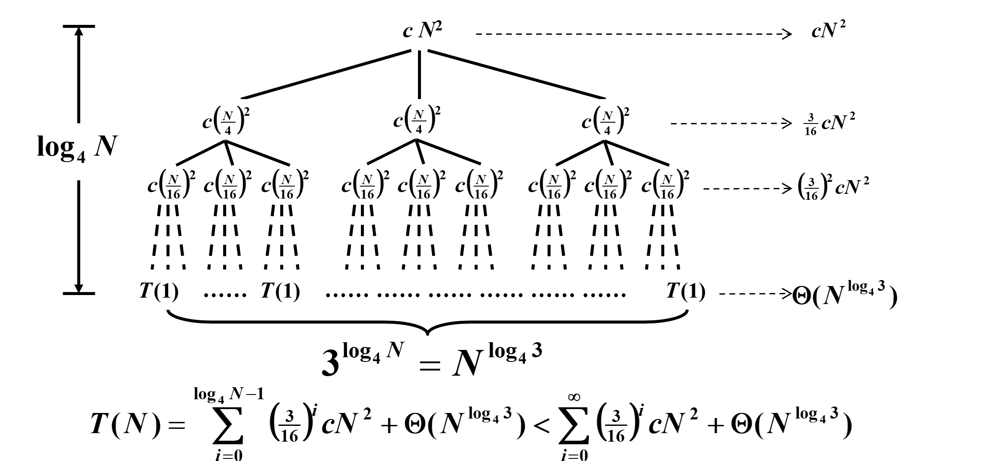
    注：
        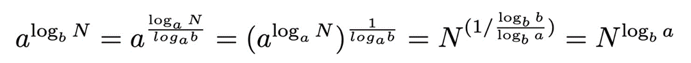

    
    
    > $T(N) = T(N/3)+T(2N/3)+cN$

    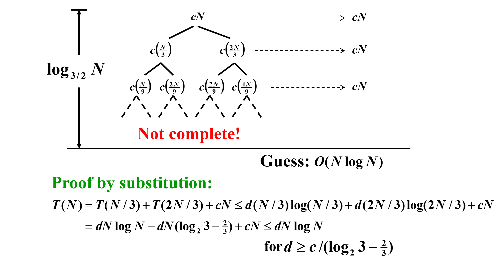

3. Master method

    > 一共有三种形式，依托于叶子重要还是根重要


    第一种：【Master Theorem】

    Let a ?= 1 and b > 1 be constants, let f(N) be a function, and let T(N) be defined on the nonnegative integers by the recurrence  T(N) = aT(N/b) + f(N).  Then:

    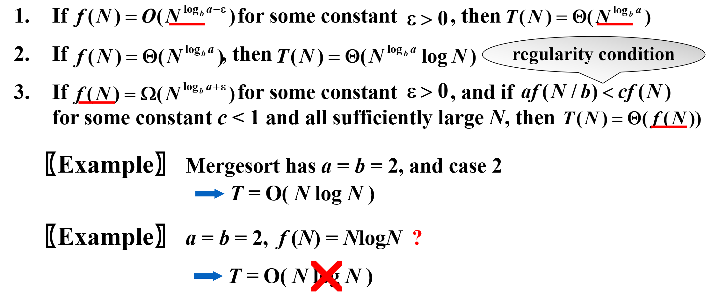


    > 由上面的反例知：主方法仅适用于多项式大于/小于的情况


    主方法的证明：
    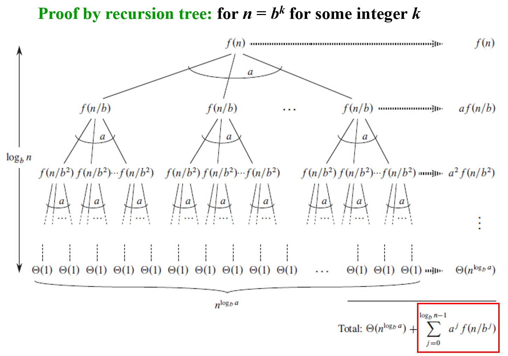
    <!-- 不太懂但应该不会考 -->
    第二种
    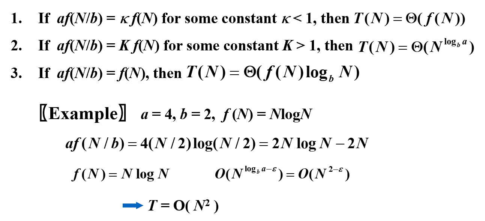
    第三种
    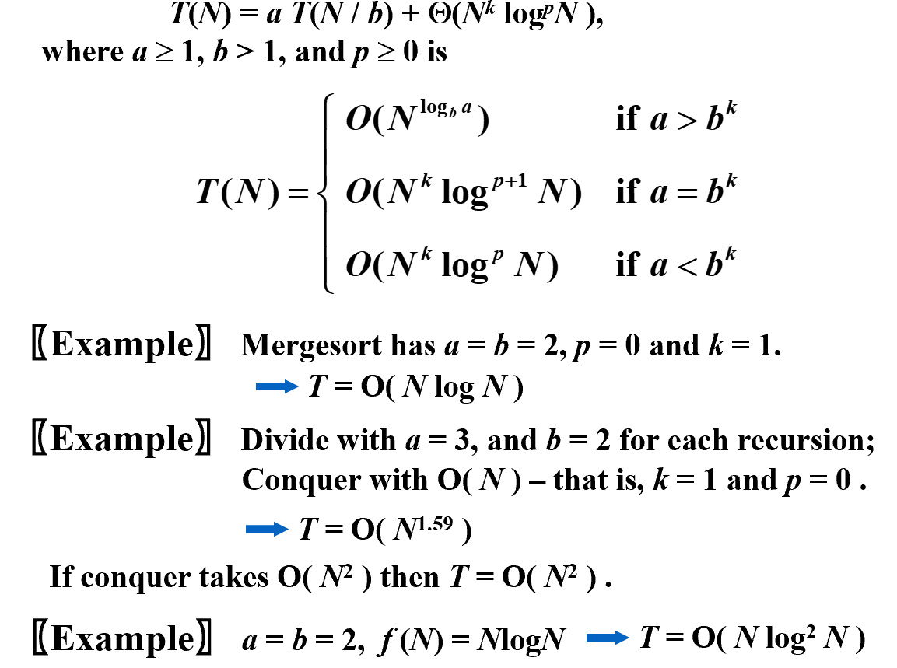


> [分治法题集](https://blog.csdn.net/qq_43733499/article/details/103934690)

------------
## Dynamic Programming

> 斐波那契数列的递归算法：
> $$
> F(N) = F(N – 1) + F(N – 2) 
> $$
> 时间复杂度高（T(N)>=F(N)）

递归树：
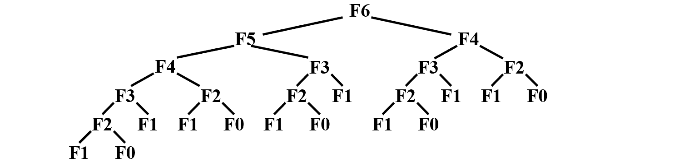

* 问题：依赖太多

* 解决方法：把最近的两个结果记录下来，需要的时候查表

代码：
```c
int  Fibonacci ( int N ) 
{   int  i, Last, NextToLast, Answer; 
    if ( N <= 1 )  return  1; 
    Last = NextToLast = 1;    /* F(0) = F(1) = 1 */
    for ( i = 2; i <= N; i++ ) { 
        Answer = Last + NextToLast;   /* F(i) = F(i-1) + F(i-2) */
        NextToLast = Last; Last = Answer;  /* update F(i-1) and F(i-2) */
    }  /* end-for */
    return  Answer; 
}
```

* O(N) 的时间复杂度


**重要概念：**

* 状态：方程中的参数，现在在解决一个什么问题

* 状态转移方程：现在的状态可以转换成什么样的子问题来解决

状态转移方程的两个性质：

1. 最优子结构：当前问题的最优解依赖子问题的最优解

2. 重叠子问题：子问题的解可能会被重复计算多次

------

> 发现：矩阵乘法的顺序 matter
>
> 问 N 个矩阵相乘，什么时候代价最小
>
> （矩阵相乘的代价 $M_{a\times b} \times M_{b\times c}$ 的代价是 $a\times b\times c$）

代价计算：将问题分解成两个子问题（最后一步的操作）

* 左边的 M 个矩阵相乘的结果乘右边 N - M 个矩阵
* $b_n = \sum_{i=1}^{n-1}b_ib_{n-i}$ ($b_n$ - n 个矩阵相乘有几种组合方式)
* $m_{ij}$ - 第 i 个矩阵乘到第 j 个矩阵的最小代价


本问题中的状态：$m_{ij}$ - 计算从 i 到 j 的代价

因此状态规模为 $O(n^2)$ （i、j 两两组合）

另一种写法（规模从小到大，不易出错）

$$
F[N][i] = min\{F[N-k][i] + F[k][i-k]+...\}
$$
$F[N][i]$ - 计算从以 i 为终点，大小为 N 的问题

```c title="implementation code"
/* r contains number of columns for each of the N matrices */ 
/* r[ 0 ] is the number of rows in matrix 1 */ 
/* Minimum number of multiplications is left in M[ 1 ][ N ] */ 
void OptMatrix( const long r[ ], int N, TwoDimArray M ) 
{   int  i, j, k, L; 
    long  ThisM; 
    for( i = 1; i <= N; i++ )   M[ i ][ i ] = 0; 
    for( k = 1; k < N; k++ ) /* k = j - i */ 
        for( i = 1; i <= N - k; i++ ) { /* For each position */ 
    j = i + k;    M[ i ][ j ] = Infinity; 
    for( L = i; L < j; L++ ) { 
        ThisM = M[ i ][ L ] + M[ L + 1 ][ j ] 
            + r[ i - 1 ] * r[ L ] * r[ j ]; 
        if ( ThisM < M[ i ][ j ] )  /* Update min */ 
        M[ i ][ j ] = ThisM; 
    }  /* end for-L */
        }  /* end for-Left */
}
```


----

> OBST：把搜索概率高的点放在树靠近根部的位置更好，如何找到最优解？
>
> $T(N)=\sum_{i=1}^{N}p_i·(1+d_i)$

本问题的几个定义：

* $T_{ij}$ - 第 i 个元素到第 j 个元素组成的树
* $c_{ij}$ - $T_{ij}$ 的 cost ($c_{ii}=0$)
* $r_{ij}$ - $T_{ij}$ 的根
* $w_{ij}$ - $T_{ij}$ 的权重 = $\sum_{k=i}^{j}p_k$

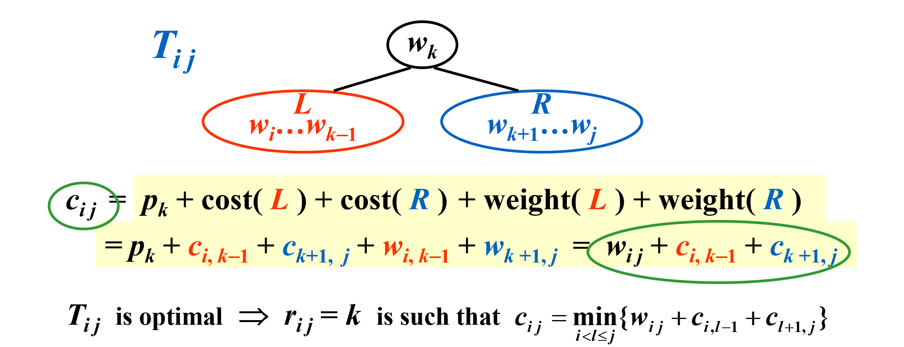


-----


> All-Pairs Shortest Path

方法 1：用 |V| 次最短路径算法 $O(N^3)$

方法 2：

> 弗洛伊德算法

思路：从 A 到 B 有一个最短路径集合，不断添加中间的“跳板”节点，则新的最短路径 = min{原来的最短路径（已经算出），用跳板的最短路径}，并把跳板更新到集合里

定义：

* $D^k[ i ] [ j ] = min{\ length\ of\ path\ i \rightarrow \{ l \leq k \} \rightarrow j }$
* $D^{-1}[ i ] [ j ] = Cost [ i ] [ j ]$.   Then the length of the shortest path from i to j  is $D^{N-1}[ i ] [ j ]$

算法：从 $D^{-1}[ i ] [ j ]$ 生成 $D^0$, $D^1$...

已经生成 $D^{k-1}$ 后
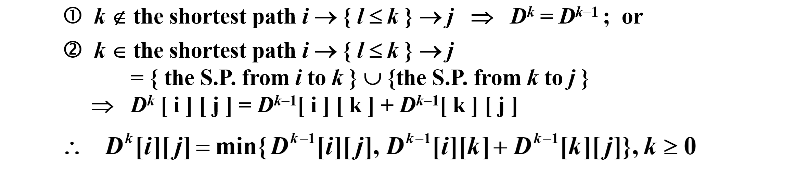

```c title="code"
/* A[ ] contains the adjacency matrix with A[ i ][ i ] = 0 */ 
/* D[ ] contains the values of the shortest path */ 
/* N is the number of vertices */ 
/* A negative cycle exists iff D[ i ][ i ] < 0 */ 
void AllPairs( TwoDimArray A, TwoDimArray D, int N ) 
{   int  i, j, k; 
    for ( i = 0; i < N; i++ )  /* Initialize D */ 
         for( j = 0; j < N; j++ )
     D[ i ][ j ] = A[ i ][ j ]; 
    for( k = 0; k < N; k++ )  /* add one vertex k into the path */
         for( i = 0; i < N; i++ ) 
     for( j = 0; j < N; j++ ) 
        if( D[ i ][ k ] + D[ k ][ j ] < D[ i ][ j ] ) 
        /* Update shortest path */ 
         D[ i ][ j ] = D[ i ][ k ] + D[ k ][ j ]; 
}
```

* 复杂度 - $O(N3)$, but faster in a dense graph.
* 负边有效（没有负的环）
* 顺序无关


> 5. Product Assembly
>
> 车有两条生产线，每个部件生产时间不同
>`
> 可以中途转换生产线（需要时间）
>
> 求最小的总的生产时间

F[N][k] = min{F[N-1][k]+, F(N-1)+}

k = 0 或 1：表示在哪条生产线上


> 附加例题一：Longest-Common-Subsequence Problem
> 
> 求最大共同子序列


F[N][M]=min{}


> 附加例题二：
>


## Greedy Algorithms

> 活动安排问题

动态规划解法：

* $c_{ij}$ - 在第 i 个活动结束后，第 j 个活动开始前，可以选择的活动数

$$
这是一个状态转移方程
$$

* 实际实现时，将 $c_{ij}$ 存起来，并记录是否访问过

贪心策略：选择不重合、结束最早的线段

正确性证明：


* 贪心选出来的第一个元素可以替代最优解的第一个元素
* 最优子结构

一维动态规划

$$
c_{1,j} = 
\begin{cases}
0& \text{x=0}\\
1& \text{x!=0}
\end{cases}
$$

* 最后一个选 - 转移成选前面的

* 最后一个不选 - 转移成选倒数第二个


------

> Huffman Codes - for file compression

如果只有四个字符出现——编码成两个 bit

霍夫曼编码——用短的 01 串表示出现频率高的字符

用树表示

<!-- 这里有个树的图 -->

避免某个字符的编码是另一个字符的前缀，造成混淆，因此编码规则：

## NP-Completeness

> Recall
>
> 欧拉回路 - NPC
> 
> 哈密尔顿回路 - NPH
>
> 最短路径 - NPC
>
> 最长路径 - NPH

NPH - 没有多项式时间的算法

------

Eazy vs. Hard

* 最简单的：O(N) - 至少读一次输入
* 最困难的： 无解
* 介于二者之间：NPC 和 NPH

> 停机问题 - 是否可以检测某个程序会自行停止


```c title="检测自身是否可停机"
Loop( P )
{  
/* 1 */ if ( P(P) loops )	print (YES);// 不可能去判断
/* 2 */ else infinite_loop();
}
```


-----------

图灵机：

* Deterministic Turing Machine: executes one instruction at each point in time.  Then depending on the instruction, it goes to the next unique instruction.
* Nondeterministic Turing Machine: is free to choose its next step from a finite set.  And if one of these steps leads to a solution, it will always choose the correct one.

> 如果本来不知道选什么，不确定图灵机也不能决定


**NP: Nondeterministic polynomial-time** 定义：

* P 问题：确定性图灵机可以在多项式时间内解决的问题
* NP 问题：非确定性图灵机可以在多项式时间内解决的问题


> 典型的 NP 问题：Hamilton cycle problem - Find a single cycle that contains every vertex

* Not all decidable problems are in NP.  For example, consider the problem of determining whether a graph does not have a Hamiltonian cycle.

显然 P 问题一定是 NP 问题，但 P 问题是否完全等于 NP 问题，还没有解决

* NP-Complete Problems (hardest): An NP-complete problem has the property that any problem in NP can be **polynomially reduced** to it.
* polynomially reduced: 


如果我们可以在多项式时间解决任意一个 NPC 问题，那么可以在多项式时间内解决所有 NP 问题（即 P = NP）

> 例题：假设汉密尔顿是 NPC 问题，求证旅行商问题也是 NPC 问题
>
> Hamiltonian cycle problem: Given a graph G=(V, E), is there a simple cycle that visits all vertices?
>
> Traveling salesman problem: Given a complete graph G=(V, E), with edge costs, and an integer K, is there a simple cycle that visits all vertices and has total cost <= K?


------

A Formal-language Framework —— 计算机能看懂的语言

* Abstract Problem: binary relation on a set I of problem instances and a set S of problem solutions.
* Map I  into a binary string { 0, 1 }*   ->   Q is a concrete problem.

complexity class co-NP = the set of languages L such that $\bar L \in NP$


$$
L \in NP \rightarrow \bar L \in NP ?
$$ 

四种可能性：
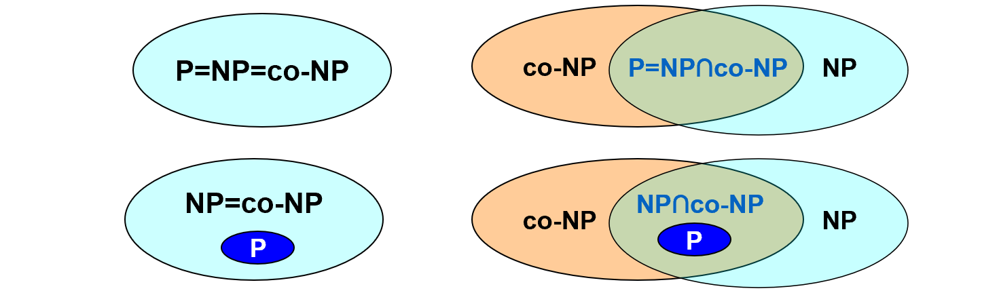


## Approximation

### Approximate Bin Packing

> Next Fit

当前容器有空位——放入当前物品

当前

> First Fit
>
> Best Fit

bad case: 

$$
S_i = 1/7+\varepsilon
$$

* On-line Algorithms: 来一个数据决策一个（适合生产线，无法看到数据全貌）

定理：对任何在线算法，一定可以构造数据，使得在线算法的结果和最优结果的比至少为 5/3

* Off-line Algorithms: 读取全部数据后再进行决策

    * Bin Packing: 将数据从大到小排好序，再使用 First Fit/Best Fit

### The Knapsack Problem

fractional version

0 1 version

* approximate ratio 的计算


### The K-center Problem

定理

--------------

