## Local Search

> 梯度下降


### Framwork

* Local
    
    * 定义一个邻居
    * A **local optimum** is a best solution in a neighborhood

* Search
    * Start with a feasible solution and search a better one within the neighborhood
    * A local optimum is achieved if no improvement is possible


如何得到邻居：

* S~S': S' 是一个邻居，由 S 经过小小改动得到
* N(S): S 的邻居 - S' 组成的集合

**算法：**

```c
SolutionType Gradient_descent()
{   Start from a feasible solution S  FS ;
    MinCost = cost(S);
    while (1) {
        S’ = Search( N(S) ); /* find the best S’ in N(S) */
        CurrentCost = cost(S’);
        if ( CurrentCost < MinCost ) {
            MinCost = CurrentCost;    S = S’;
        }
        else  break;
    }
    return S;
}
```

### Vector Cover Problem

> Given an undirected graph G = (V, E).  Find a **minimum** subset S of V such that for each edge (u, v) in E, either u or v  is in S.


分析：

* 可行解的集合：FS-所有顶点覆盖的方法
* 目标函数：cost(S)，顶点集合的大小
* 邻居：S 增加/减少一个顶点
* Search：Start from S = V; delete a node and check if S' is a vertex cover with a smaller cost.

> 一个点的相邻顶点数 < |V|，因此 N(S) 的大小 O(|V|)

这种方法容易不小心删掉关键的点，得到不好的结果

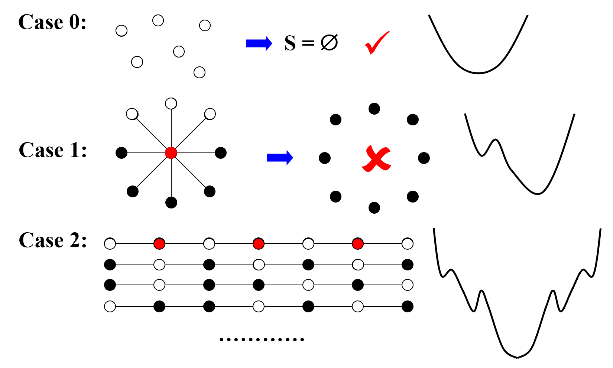

```c title="改进"
SolutionType Metropolis()
{   Define constants k and T;
    Start from a feasible solution S in FS ;
    MinCost = cost(S);
    while (1) {
        S’ = Randomly chosen from N(S); 
        CurrentCost = cost(S’);
        if ( CurrentCost < MinCost ) {
            MinCost = CurrentCost;    S = S’;
        }
        else {
            // 以一定的概率跳出当前解
            With a probability e^{delta(cost)/kT}, let S = S’;
            else  break;
        }
    }
    return S;
}
```


### Hopfield Neural Networks

> Graph G = (V, E) with integer edge weights w (positive or negative).
> 
> If $w_e$ < 0, where e = (u, v), then u and v want to have the same state; if $w_e$ > 0 then u and v want different states.

<!--  -->

> 不一定有解，比如三角形三条正边

定义：

* 好边和坏边: In a configuration S, edge e = (u, v) is good if $w_e s_u s_v < 0 (w_e < 0 iff s_u = s_v )$; otherwise, it is bad.
* 顶点的满足条件：In a configuration S, a node u is satisfied if the weight of incident good edges $\geq$ weight of incident bad edges.

    * 相邻点的权重（ $w_e s_u s_v$）和 <= 0 
* A configuration is stable if all nodes are satisfied.

```c
ConfigType State_flipping()
{
    Start from an arbitrary configuration S;
    while ( ! IsStable(S) ) {
        u = GetUnsatisfied(S);
        su = - su;
    }
    return S;
}
```


定理：一定有稳定解，最多翻 $W = \sum_e|W_e|$

Proof: Measure of proggress:

$$
\Phi(S)=\sum_{e\ is\ good}|W_e|
$$

* 每翻转一个点，原先的好边变成坏边，坏边变成好边
* 又因为未满足的点的边权和>0，所以势能函数必增长
* 而势能函数必小于 W

因此最多翻 W 次


u 个翻转发生后：（此时 S 变成了 S'）

### Maximum Cut Problem
> : Given an undirected graph G = (V, E) with positive integer edge weights we, find a node partition (A, B) such that the total weight of edges crossing the cut is maximized.
>
> 每个顶点染色，希望顶点颜色不同的边的权重和最大

> 是 Hopfield Neural Networks 的 special case
>
> 目标函数转化成好边的边权和
<!--  -->

> 应用


问题分析：

* 目标函数：最大化 w(A, B)
* 可行解：任何染色的方式
* 邻居：把一个点的颜色改变（翻转没有被满足的节点）


不能保证一定得到最优解

> 局部解有多好？

定理：得到的解不会小于最优解的 1/2

证明：算法结束后，对任何一个节点，好边权重和肯定大于坏边权重和，即
$$

$$


不一定在多项式时间内收敛：

* 如果目标函数的改变比 $\frac {2\varepsilon}{|V|}W(A, B)$ 小，则退出
* $(2+\varepsilon)$-approximation

Claim：在用了上面的方法后，最多翻转 $O(n/\epsilo logW)$（多项式时间复杂度）


* 找一个更好的邻居
    
    * 选择范围变大（增大步长），邻居由 {v1, v2, v3} 变为 {(v1),(v1, v2)} - $O(n^2)$;

-------------

## Randomized Algorithms

随机的目的：

* 分析算法时，需要生成随机数据测试（世界随机）

$$
Average-case\ Analysis
$$

* 算法决策时，有时需要随机（对抗 worst-case input）

* 不需要精确解的情况，随机算法能高效地算出可能性很高的解
    * 选择算法起点


A Quick Review

* Pr[A] - 事件 A 发生的可能性
* E[X] - 数学期望

> Example: The Hiring Problem
>
> * Hire an office assistant from headhunter 
> 
> * Interview a different applicant per day for N days
> 
> * Interviewing Cost = $C_i$  <<  Hiring Cost = $C_h$
> 
> * Analyze interview & hiring cost instead of running time


计算雇佣的消耗：雇佣 M 个人，Total cost = $O(NC_i+MC_h)$

需要设计一个算法，能招募到最厉害的人，并且 Total cost 最小

```C title="Naive Solution"
int Hiring ( EventType C[ ], int N )
{   /* candidate 0 is a least-qualified dummy candidate */
    int Best = 0;
    int BestQ = the quality of candidate 0;
    for ( i=1; i<=N; i++ ) {
        Qi = interview( i ); /* Ci */
        if ( Qi > BestQ ) {
            BestQ = Qi;
            Best = i;
            hire( i );  /* Ch */
        }
    }
    return Best;
}
```

* worst case 人按能力递增顺序面试，算法 cost 是 $O(NC_h)$

如果候选人按随机顺序出现，计算期望值：

* 随机性假设：当前面试的 i 个人中，任意一个个人是当前最好的面试者的可能性相同
* X = number of hires
* $X_i$ = 第 i 个人是否被雇佣
* $X=\sum_{i=1}^n{Xi}$
* 由随机性假设，$E(X_i)=1/i$
* $E(X)=\sum_{i=1}^n1/i=lnN+O(1)$

因此，随机情况下，算法 cost 是 $O(C_hlnN+NC_i)$

----------------

```c title="Ramdomized Algorithm"
int RandomizedHiring ( EventType C[ ], int N )
{   /* candidate 0 is a least-qualified dummy candidate */
    int Best = 0;
    int BestQ = the quality of candidate 0;
    // 把面试者随机排序，再用上面的算法
    randomly permute the list of candidates;

    for ( i=1; i<=N; i++ ) {
        Qi = interview( i ); /* Ci */
        if ( Qi > BestQ ) {
            BestQ = Qi;
            Best = i;
            hire( i );  /* Ch */
        }
    }
}
```
* 好处 - 面试顺序一定随机
* 坏处 - 额外时间开销


```c title="随机的代码实现"
void PermuteBySorting ( ElemType A[ ], int N )
{
    for ( i=1; i<=N; i++ )
        A[i].P = 1 + rand()%(N3); 
        /* makes it more likely that all priorities are unique */
    Sort A, using P as the sort keys;
}
```

* Claim: PermuteBySorting produces **a uniform random permutation** of the input, assuming all priorities are distinct.

-----------


如果只能雇佣一个人，策略如下：

```c
int OnlineHiring ( EventType C[ ], int N, int k )
{
    int Best = N;
    int BestQ = - Inf ;
    for ( i=1; i<=k; i++ ) {
        Qi = interview( i );
        if ( Qi > BestQ )   BestQ = Qi;
    }
    for ( i=k+1; i<=N; i++ ) {
        Qi = interview( i );
        if ( Qi > BestQ ) {
            Best = i;
            break;
        }
    }
    return Best;
}
```

即忽略前面的 k 个人，不管表现如何都不雇佣，只记录最好的表现作为后面面试的参考。

* 参数 k 很重要


概率分析：

$$
Pr[S]=\sum_{}
$$

<!-- 这里分析好难 -->

总之，雇佣到最好的人的可能性 $Pr[S]\geq\frac{k}{N}ln\frac{N}{k}$（求导算 k）


-------------

> Example: Quicksort
>
> average: $O(NlogN)$
>
> worst: $O(N)^2$
>
> 为了防止最坏情况发生，要选好 pivot

* 两个概念
    * Central splitter - the pivot that divides the set so that each side contains at least n/4
    * Modified Quicksort - always select a central splitter before recursions
    
    

分析：

<!-- 什么 type 啊这是什么 -->

* Type j: 


## Parallel Algorithms

### Parallel Random Access Machine (PRAM)

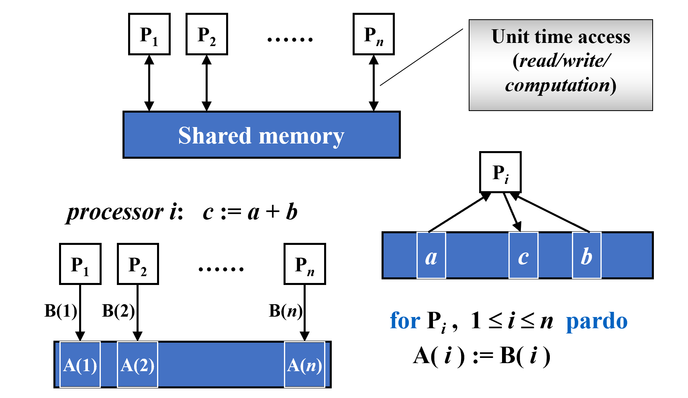

`for Pi, 1<=i<=n pardo` - 每个处理器同时进行操作

* 同时写入一个位置会产生冲突，解决方法：
    * Exclusive-Read Exclusive-Write (EREW) - 不允许同时读写
    * Concurrent-Read Exclusive-Write (CREW) - 允许同时读，不允许同时写
    * Concurrent-Read Concurrent-Write (CRCW) - 当且仅当同时写的数据相同时，允许同时写（还有随机写和最优先写的规则）
    * 第三种方法最常见

---------------


> Example: The summation problem.
> 
> Input:  A(1), A(2), …, A(n)
> 
> Output: A(1) + A(2) + … +A(n)

（一共有八个处理器）

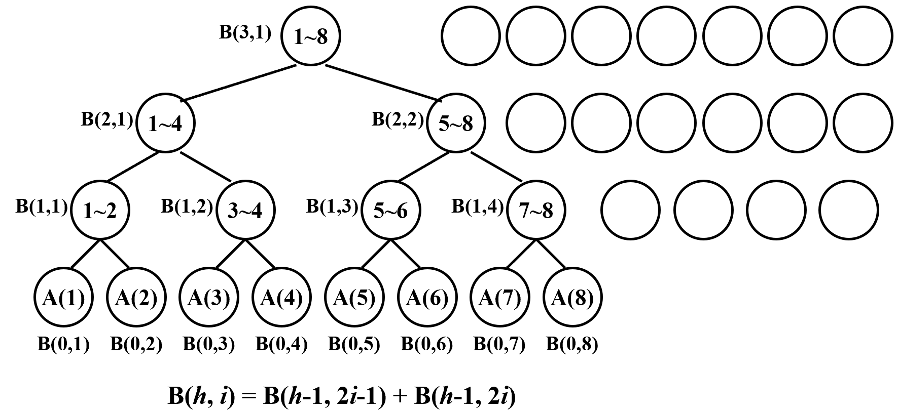

```c
for Pi, 1<=i<=n pardo
    B(0,i): = A(i)

    for j = 1: log n begin
        if i <= n/2^h
            B(j,i): = B(j-1,2*i-1)+B(j-1,2*i)
        else stay idle // PRAM 模型需要告诉处理器是进行操作还是 stay idle
    end

    for i = 1: output B(log n, 1); for i > 1: stay idle

```

可以看到上图中在后面的循环，后面的几个处理器都不进行操作

PRAM 的不足：每说明处理器数量不同时怎么做；必须知名具体操作有时过于复杂

----------

### Work-Depth (WD) Presentation

```c
for Pi,  1 <= i <= n  pardo
   B(0, i) := A( i )
for h = 1 to log n 
    for Pi, 1 <= i <= n/2^h  pardo
        B(h, i) := B(h-1, 2i-1) + B(h-1, 2i)
for i = 1 pardo
   output  B(log n, 1)
```

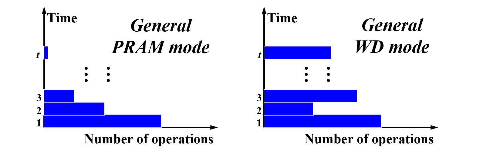

----------

Measuring the performence

* Work load - total number of operation 工作量
* Worst-case running time: T(n) 工时
* 等价描述：
    * W(n) operations and T(n) time
    * P(n) = W(n)/T(n) processors and T(n) time (on a PRAM)
    * W(n)/p time using any number of p ≤ W(n)/T(n) processors (on a PRAM)
    * W(n)/p + T(n) time using any number of p processors (on a PRAM)


只对 PRAM 成立的原因是，PRAM 每个处理器的工作量是相同的（stay idle 也算作工作量），WD 不是。

分析上面提到的 WD 算法：

```c
for Pi,  1 <= i <= n  pardo
   B(0, i) := A( i )
for h = 1 to log n 
    for Pi, 1 <= i <= n/2^h  pardo
        B(h, i) := B(h-1, 2i-1) + B(h-1, 2i)
for i = 1 pardo
   output  B(log n, 1)
```
$$
T(n) = logn + 2
$$
$$
W(n) = n + n/2 + n/2^2 + ... + n/2^k + 1 = 2n(2^k = n)
$$

* WD-presentation Sufficiency Theorem - WD 模式中的算法可以在 O(W(n)/P(n) + T(n)) 时间内由**任何** P(n) 个处理器实现，使用与 WD 表示中相同的并发写入约定。

-----------

> Example: Prefix-Sums.
>
> Input:  A(1), A(2), …, A(n)
>
> Output: $\sum_{i=1}^1A(i),\sum_{i=1}^2A(i),\sum_{i=1}^3A(i)...$

Technique: Balanced Binary Trees


得到 C 的递推公式：


因此需要从下到上算一次 B，再从上到下算 C

```c
for Pi , 1 <= i <= n pardo
  B(0, i) := A(i)
for h = 1 to log n
  for i , 1 <= i <= n/2h pardo
    B(h, i) := B(h - 1, 2i - 1) + B(h - 1, 2i)
for h = log n to 0
  for i even, 1 <= i <= n/2h pardo
    C(h, i) := C(h + 1, i/2)
  for i = 1 pardo
    C(h, 1) := B(h, 1)
  for i odd, 3 <= i <= n/2h pardo
    C(h, i) := C(h + 1, (i - 1)/2) + B(h, i)
```


> Example: Merging – merge two non-decreasing arrays A(1), A(2), …, A(n) and B(1), B(2), …, B(m) into another non-decreasing array C(1), C(2), …, C(n+m) 

* RANK( j, A) = Bj 在 A 数组中比多少个元素大
* RANK( j, A) = i,   if A(i) < B(j) < A(i + 1), for 0 < i < n
* RANK( j, A) = 0,  if B(j) < A(1) 
* RANK( j, A) = n,  if B(j) > A(n)

算出 RANK 值后，可以用下面的算法并行得到数组 C，O(1) time and O(n+m) work.
```c
for Pi , 1 <= i <= n  pardo
    C(i + RANK(i, B)) := A(i)
for Pi , 1 <= i <= n  pardo
    C(i + RANK(i, A)) := B(i)
```


怎么算 RANK 值

* 二分搜索树 $T(n) = O(logn), W(n) = O(nlogn)$
    ```c
    for Pi , 1 <= i <= n  pardo
        RANK(i, B) := BS(A(i), B)
        RANK(i, A) := BS(B(i), A)
    ```
* Serial Ranking $T(n) = W(n) = O(n+m)$
    * 维护两个指针，计算 rank
    * 指向的 A 比 B 小，则确定了 A 在 B 中的位置，后移 A 的指针
    ```c
    i = j = 0; 
    while ( i <= n || j <= m ) {
        if ( A(i+1) < B(j+1) )
            RANK(++i, B) = j;
        else RANK(++j, A) = i;
    }
    ```

-------

Parallel Ranking

* 先选取 **p = n/logn** 个中间点，串行算 rank - $T = O(logn), W = O(plogn) = O(n)$
    * A_Select( i ) = A( 1+(i-1)logn )   for 1 <= i <= p
    * B_Select( i ) = B( 1+(i-1)logn )   for 1 <= i <= p
    

* 再分解成下面的这些子问题，最多 2p 个，sized O(logn) - $T = O(logn), W = O(plogn) = O(n)$

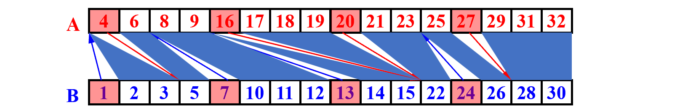

* 总的来说：$T = O(logn)，W = O(plogn) = O(n)$

-------------

> Example: Maximum Finding.


```c title="compare all pairs"
for Pi , 1 <= i <= n  pardo
    B(i) := 0
for i and j, 1 <= i, j <= n  pardo
    if ( (A(i) < A(j)) || ((A(i) = A(j)) && (i < j)) )
            B(i) = 1
    else B(j) = 1
for Pi , 1 <= i <= n  pardo
    if B(i) == 0
       A(i) is a maximum in A
```

上面的算法 - $T(n) = O(1),W(n) = O(n^2)$（B(i) 是并行写入的，只要有一个为 1 就写入 1）

A Doubly-logarithmic Paradigm

方法一：Partition by $\sqrt{n}$

* 切割成 $\sqrt{n}$ 个子问题
* 递归求解
* 最后计算两两打架（T(1) = O(1), W(1) = O(1)）

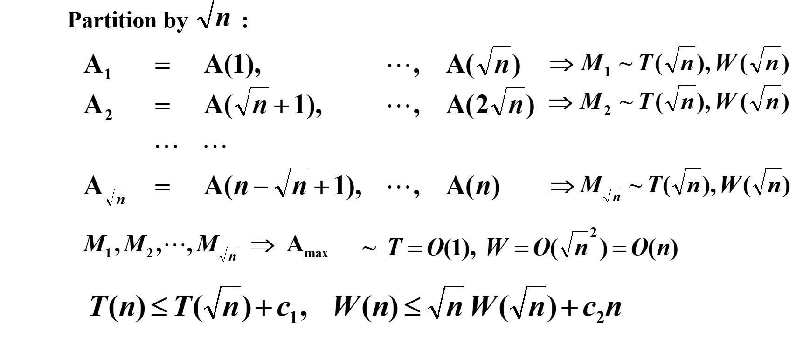

估计递归式 $T(n) \leq T(\sqrt{n}) + c$ 的上界函数:


1. 初始情况下： $T(n) \leq T(\sqrt{n}) + c$
2. 对 $T(\sqrt{n})$ 继续递归： $T(\sqrt{n}) \leq T(n^{1/4}) + c$
3. 对 $T(n^{1/4})$ 继续递归： $T(n^{1/4}) \leq T(n^{1/8}) + c$
4. 如此继续下去：

设 $k$ 是递归的深度（由 $n$ 减少到 1 需要多少步），使得 $n^{(1/2)^k} = 1$。

求解 $k$：

$$
n^{(1/2)^k} = 1$$
$$(1/2)^k \log n = \log 1$$
$$k = \log_2 \log n$$

即，递归的深度是 $\log_2 \log n$。


$$T(n) \leq c \cdot (\log_2 \log n)$$

* 因此，$T(n) = O(\log \log n)$

同理，$W(n)$ 递归的深度也是 $\log_2 \log n$。

$W(n)\leq nW(1) + c_2n\log_2 \log n$

* $W(n) = O(n\log \log n)$

--------------

方法二：Partition by h = log log n


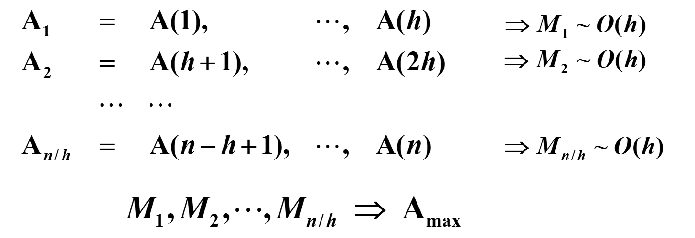

<!-- wsm -->

$$
T(n)=O(h+loglog(n/h))=O(loglogn)
$$
$$
W(n)=O(h\times(n/h)+(n/h)loglog(n/h))=O(n)
$$


------------------


<!-- wsm -->
方法三：Random Sampling

* 从 A 中采样 $n^{\frac{7}{8}}$ 个元素
* 检查外面有没有更大的元素
* 如果有则采样一个包括这个更大的元素的 B
    ```c
    while (there is an element larger than M) {
         for (each element larger than M)
             Throw it into a random place in a new B^(n(7/8));
         Compute a new M;
    }
    ```

有非常大的可能算法在 $T(n) =O(1), W(n)=O(n)$ 内结束，超过这个值的可能性大小 = $O(1/n^c)$ 

----------

## External Sorting ✔️


Disk 拿到数据时间长，数据量大时需要一个内存外部排序的算法


> quick sort 每次拿取时间很长（需要移动磁头、等待旋转等等），效率低

简化问题的假设

* Store data on tapes (can only be accessed sequentially)
* Can use at least 3 tape drives

> Example: Suppose that the internal memory can handle M = 3 records at a time.
>
> run - 在排序过程中的一个连续的有序子序列
>
> pass - 将多个有序的 runs 进行合并的过程
> 
> 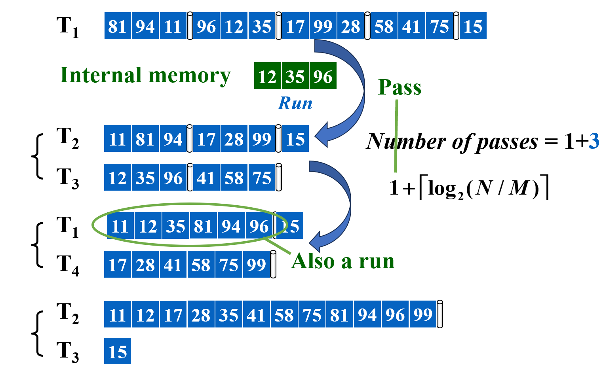
>
> N - 总元素数，M - 内部存储大小

时间消耗：

* Seek time — O( number of passes )
* Time to read or write one block of records
* Time to internally sort M records
* Time to merge N records from input buffers to the output buffer


> Computer can carry out I\O and CPU processing in parallel


------------

为减少耗时，reduce pass:

* 多路归并 - 需要 k 个 input tape，k 个 output tape，交换着用
* 减少要用的 tape 数：k 个 input，1 个 output，转换时将 output 的一部分 copy 到之前的 input tape 里
    * 前两次 pass：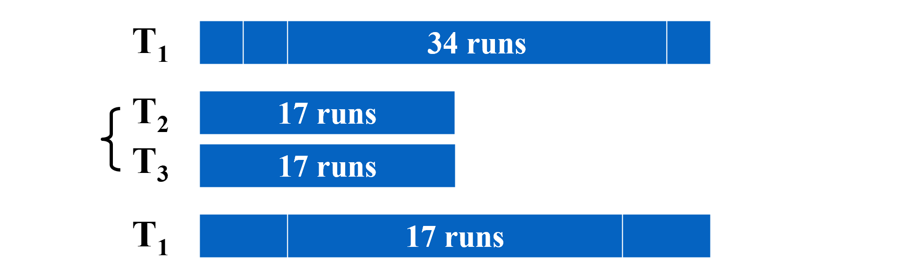
    * copy 操作（消耗大）：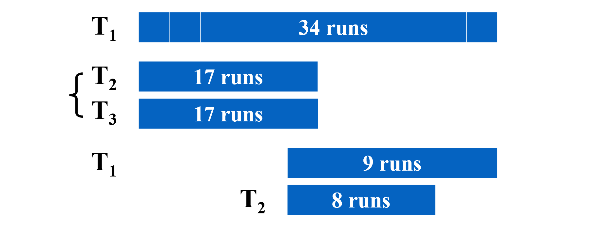
    * 全部执行下来 - 1 + 6 passes + 5 copies
* 或者不均分，则不需要 copy，如果是斐波那契数，需要的合并很少
    * 将 T1 的 34 个 run 分成下面两个：
    * 将 T2 和 T3 的前 13 个 run 合并到 T1，T2 还剩 8 个 run：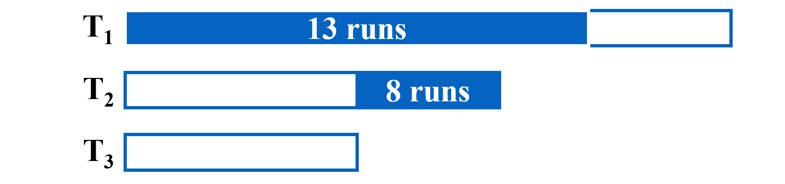
    * 以此类推，将 T1 和 T2 的前 8 个 run 合并到 T3：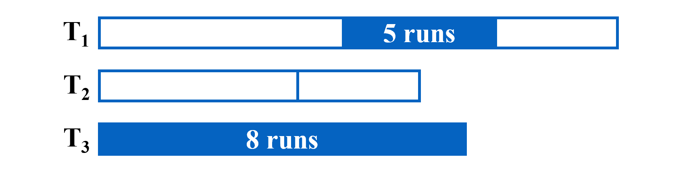
    * 图中情况仅需 1 + 7 passes，只需要 k + 1 个 tapes

结论：

* 两路合并的情况，如果是 N/M 是斐波那契数 $F_N$，则分成 $F_{N-1}$ 和 $F_{N-2}$ 是最佳选择
* k 路合并，定义 k 路斐波那契数 $F_N^k = F_{N-1}^k + F_{N-2}^k + ... + F_{N-k}^k$, ($F_N^k = 0,\ 0\leq N\leq k-2$, $F_{k-1}^k = 1$)

------------
handle buffer

* 如果只有一个 output buffer，在它输出磁盘时，排序会停止
* 用两个 output buffer，其中一个接受 input buffer 的数据，另一个往 disk 写数据
* 因此 k-way 的排序，需要 2k 个 input buffer，2 个 output buffer

在内存固定的情况下，路越多，buffer 越小，即 M 越小，在 pass 数的计算公式中，与 log 的底数相制衡。因此不是路数越多越好。


加大每个 run 的大小 - Replacement selection


* 直接顺序拿取 k 个，按大小排序，选取最小的放在新 tape 里，在空出来的位置拿取新的。
* 拿取新的时可能不能放在新 tape run 的后面 -> 成为死空间
* 当 k 个位置都是死空间 -> 放在下一个 tape，这样平均情况下，每个 run 是之前的两倍

> Powerful when input is often nearly sorted for external sorting.

最小 merge 操作：霍夫曼树

用下面的例子说明

> Suppose we have 4 runs of length 2, 4, 5, and 15, respectively. How can we arrange the merging to obtain minimum merge times?
>
> 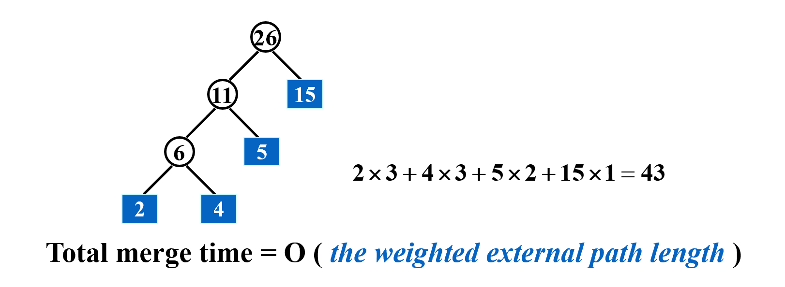

