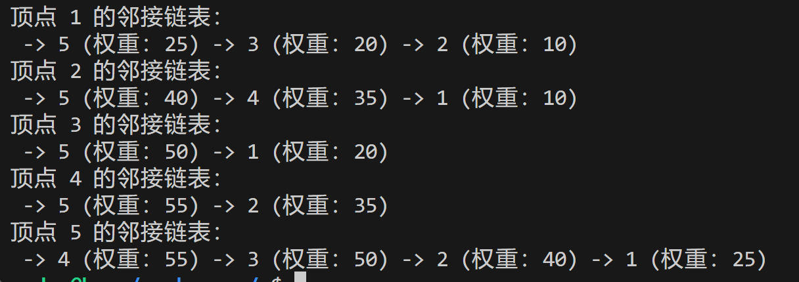
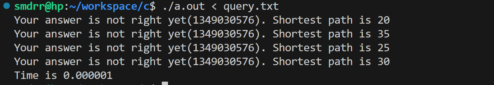

# Project 2 - Test Interface

## 我们项目中的输入数据

> 在实际文件中没有注释

```c title='query.txt'
5 7//图有5个顶点，7条边
//接下来是7行，每行描述一条边
1 2 10//从顶点1到顶点2的边，权重为10
1 3 20
1 5 25
2 4 35
2 5 40
3 5 50
4 5 55

//查询语句的输入
4//一共有4条查询语句
1 3//查询顶点1到3的最短路径
2 4
5 1
3 2

```

在程序中，读取数据的部分已经写好，图被保存为一张邻接链表，结构声明如下。

```c
// 定义图中的节点结构
typedef struct Node {
    int vertex;            // 节点的值
    int weight;            // 到该节点的边的权重
    struct Node* next;     // 指向下一个相邻节点的指针
} Node;

// 定义邻接链表结构
typedef struct Graph {
    int numVertices;       // 图中节点的数量
    Node** adjLists;       // 存储邻接链表的数组
} Graph;
```

下面用例子说明
.JPG)

注意事项：

* 数组标号从0 - n-1，而顶点标号从1 - n
* 数组中的元素类型是node，第一个元素不是哨兵，直接是一条边
* 图是无向图
* 权重都是正整数
* 没有平行边和self loop
* printGraph函数可以查看图的结构


你需要完成的：

* 在line 146补充函数`int dijkstra_heap(Graph* graph, int src, int dest)`，用堆实现dijkstra算法
* 参数意义：在图graph中找到标号为src到标号为dest的顶点的最短距离，返回这个最短距离的大小
* 最终的数据集是现实中的道路，不保证一定有解。如果没有解，返回-1
* dijkstra()函数是暴力搜索法，可以认为是正确的，用来检验你的算法的正确性
* test程序执行完毕会有以下输出：（括号里是函数dijkstra_heap()的返回值，此时函数为空，返回了随机值1349030576）
  
* 你可以更改query.txt中的数据来检验程序的正确性

-----
## 下面是数据集的格式（我来处理，其他人可忽略）
* A graph contains n nodes and m arcs
* Nodes are identified by integers 1...n
* Graphs is undirected in this project
* Graphs can have parallel arcs and self-loops
* Arc weights are signed integers

输入文件的格式：

> 图的数据（.gr文件） 

|每一行开头的首字母|对应意义|示例代码|
|-----|----|----|
|c|comment，注释，应被忽略|`c This is a comment`|
|p|problem，只出现一次，必定在不是注释的第一行，给出图的节点数和边数（n个节点，m条边）|`p sp n m`|
|a|arc，描述图的一条边（U、V是两端的节点，W是边的权重），一共m行|`a U V W`|

例子如下
```
c 9th DIMACS Implementation Challenge: Shortest Paths
c http://www.dis.uniroma1.it/~challenge9
c Sample graph file
c
p sp 6 8
c graph contains 6 nodes and 8 arcs
c node ids are numbers in 1..6
c
a 1 2 17
c arc from node 1 to node 2 of weight 17
c
a 1 3 10
a 2 4 2
a 3 5 0
a 4 3 0
a 4 6 3
a 5 2 0
a 5 6 20
```

> 查询的输入方式（.p2p文件）
>
> (p2p意思是Point-to-point，找点对点的最短路径)

|每一行开头的首字母|对应意义|示例代码|
|-----|----|----|
|c|comment，注释，应被忽略|`c This is a comment`|
|p|problem，只出现一次，必定在不是注释的第一行，给出查询指令的条数n|`p aux sp p2p n`|
|q|query，查询，让你求解S到T的最短路径|`q S T`|

示例代码
```
c 9th DIMACS Implementation Challenge: Shortest Paths
c http://www.dis.uniroma1.it/~challenge9
c Sample point-to-point problem specification file
c
p aux sp p2p 3
c contains 3 query pairs
c
q 1 5
q 5 1
q 1 2
```