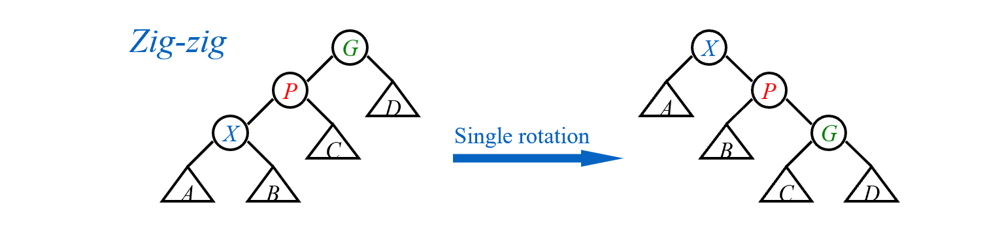

### Splays Tree

#### Insertion

Insert an element x into a given tree t and push it to the root using an iterative method. 

Except for the empty case, there is three basecases. After insert x to the corresponding subtree, we should judge:
* The first case is that the node to be inserted is root's child, just rotate once to put the node at the root.
* The second case is the zig-zag case. Maybe it's better using picture to explain. The "X" is the node to be inserted. In the zig-zag case as shown in the picture, we should rotate X twice.

* The final case is the zig-zig case. Similarly, the "X" is the node to be inserted. In the zig-zag case as shown in the picture, we should rotate X's parent fisrst, then rotate X.


<font size = 3>

```c
begin Insert( Tree t, ElementType x )
    if t is NULL
        return Node(x)
    if t's value is larger than x
        t's left child = Insert( t's left child, x )
        
        if t is root and x is t's child
            return RightRotation(t)
        if zig-zag
            t's left child = LeftRotation(t's left child)
            return RightRotation(t)
        if zig-zig
            t = RightRotation(t)
            t = RightRotation(t)

    else 
        t's right child = Insert( t's right child, x )
        //Symmetrical with the left insert,
        //while the rotation direction is reversed
end
```

</font>

#### Deletion

Delete an element x into a given tree t using. ( In this project, the case where x can not be found doesn't exist .) 
* First find the element x in the tree t. and push x to the root using the same method as inserting.
* Delete x, Then we acquire a left subtree and a right subtree of x.
* Then find the max element in the left subtree and push it to the root. Obviously, now its right subtree is empty.
* So we can connect the x's right subtree to the right of the left subtree directly. 

<font size = 3>

```c
begin Delete( Tree t, ElementType x )
    Define Tree Temp as NULL
    if t is NULL
        ERROR
    Find( Tree t, ElementType x )//then x is at the root
    
    FindMax( Tree t's left subtree )//Also push the max element to the root
    
    Temp = t
    if t's left subtree is NULL
        t = right subtree
    else
        t = left subtree
        left subtree -> right = right subtree       
    
    free(temp)
    return t
end
```

</font>

#### Time Complexity

Amortized Analysis Using Potential Methods:

In tree's amortized analysis, we often use the height of tree or the amount of nodes as the potential function, which satisfy $\Phi(0)$ is the minimum. To make the potential function increasing slowly, we choose $\Phi(T)=\sum_{i\in T}S(i)$, where S(i) is the number of descendants of i (i included). $\Phi(T)$ is also called rank of T, notion $R(T)$

> Lemma: If $a+b\leq c$ 
> then  $loga+logb\leq 2logc-2$

Same as the part of algorithm analysis, there are three situations to discuss according to the picture.
  
* If the "X" to be pushed is one of the childs of root, we only need one rotation. Except X and P, the "S(i)"  didn't change, and the rotation cost $c_i$ is 1. So the amortized cost 
  $\^c_i=1+R_2(X)-R_1(X)+R_2(P)-R_1(P)$
  $\leq 1+R_2(X)-R_1(X)$
    (shown below that $ R_2(P)<R_1(P) $)
   
  
* In the zig-zag case, we need two rotation, costing 2. We note that $R_2(X) = R_1(G) = log(the\ number\ of\ nodes\ in\ T)$. So the amortized cost 
  $\^c_i=2+R_2(X)-R_1(X)+R_2(P)-R_1(P)+R_2(G)-R_1(G)$

  $=2-R_1(X)+R_2(P)-R_1(P)+R_2(G)$

  $\leq 2(R_2(X)-R_1(X))$
    (shown below that nodes: $P_2+G_2<X_2,\ so\ according\ to\ lemma,\ R_2(P)+R_2(G)\leq 2R_2(X)+2$)
    
* In the zig-zig case, we need two rotation, too, costing 2. We also note that $R_2(X) = R_1(G)$. So the amortized cost 
  $\^c_i=2+R_2(X)-R_1(X)+R_2(P)-R_1(P)+R_2(G)-R_1(G)$

  $=2-R_1(X)+R_2(P)-R_1(P)+R_2(G)$
    $=2-2R_1(X)+R_2(P)-R_1(P)+R_2(G)+R_1(X)$
  $\leq 3(R_2(X)-R_1(X))$
    (shown below that nodes: $X_1+G_2<X_2,\ so\ according\ to\ lemma,\ R_1(X)+R_2(G)\leq 2R_2(X)+2$)
  

When splay, the former $3R_2(X)$ could be eliminated by the latter item's $-3R_1(X)$. After sum of all the items, we get the **amortized time complexity** 
$$
\^c_i \leq 1+3(R_2(X)-R_1(X))=O(logN)
$$
Similarly **average time complexity** is also $O(logN)
$.

Concerning the worst case: X is at the bottom, which depth is N(the number of nodes). Push it to root needs  to rotate N times. So the **worst time complexity** is $O(N)$.