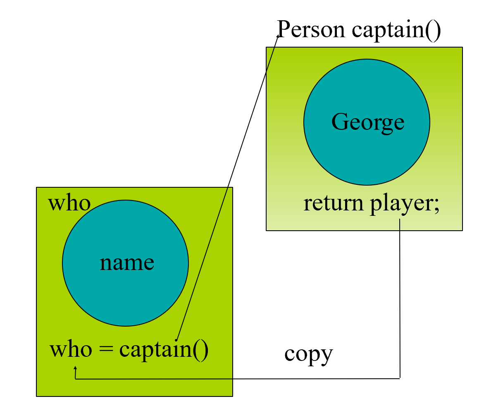

# Implementation

## 待定标题
----

class 的定义

* Class declaration and prototypes in that class	are in  the header file (.h).
* All the bodies of these functions are in the source  file (.cpp).

编译过程

* The	 compiler sees only one .cpp file, and  generates .obj file
* The	 linker links all .obj into one executable  file
* To	provide information about functions  in  other .cpp files, use .h


因此：

* 函数在头文件中声明：需要在任何需要使用/定义的地方include头文件
* 类同理（一般一个头文件放一个类）
* 头文件（header）=接口（interface）：别人看你的头文件才知道怎么用


include 写法的区别：

* `#include “xx.h”`:first search in the current  directory, then the	directories declared  somewhere
* `#include <xx.h>`:search in the specified  directories
* `#include <xx>`:same as #include <xx.h>

Tips

* One class declaration per header file
* Associated with one source file in the same  prefix of file name.
* The	contents of a header file is	surrounded with #ifndef  #define…   #endif
* #pragma once equivalent to #ifndef…#endif


------

## The Makefile utility

> 用来管理很大的程序（多文件
>
> 目标：分成多个部分，方便人和机器管理；发生改动后，最小化编译过程；Easy maintenance of project structure,  dependencies and creation


根据时序判断是否需要重新编译，减少开销（根比儿子时间早，则根要更新）


A	makefile is a file (script) containing	:（不止于 C 语言）

- Project structure (files, dependencies)
- Instructions for files creation

The make		command reads a makefile,  understands the	project	structure	and  makes up	the	executable


将树用makefile表示出来：
```makefile
sum: main.o	sum.o#冒号表示依赖
gcc –o	sum main.o sum.o

main.o: main.c sum.h  # main.c 可省略
gcc –c main.c

sum.o: sum.c sum.h  
gcc –c sum.c
```

宏替换（便于更改）

* `$@`: 上一行的第一个
* `$*`: 上一行的所有不包含扩展名的部分

```makefile
sum: main.o	sum.o
gcc –o	$@	main.o	sum.o

main.o	sum.o: sum.h  
gcc –c $*.c
# 将会展开为 gcc –c main.c 或 gcc –c sum.c
```

Tips

- If something is changed, linking	is usually  necessary
- 在一个 Makefile 中，可以定义多个目标，每个目标有不同的用途和操作。
- 目标 clean 是一个特殊的目标，没有依赖项。它通常用于删除编译过程中生成的中间文件（例如，目标文件 .o、可执行文件等），以清理工作目录。
- 运行 make clean 命令将触发 clean 目标的规则
- make 时可以传入参数，覆盖 makefile 内部参数 `make	PAR1=1	PAR2=soft1`
- 使用变量：`$(VAR_NAME)`
- 简单的条件语句可以放在 makefile 中

```makefile
OBJS = main.o	another_qsort.o  compare.o	quicksort.o
# Clean intermediate files  clean:
rm *~ $(OBJS)

ifeq (value1, value2)
body of if
else
body of else
endif
```

-----

## Initialize


构造函数与类同名，当对象被创建时，编译器自动调用构造函数

* 可以写多个构造函数，接受不同的参数，采用不同的构造方式
* 缺省构造函数：不接受任何参数的构造函数，对每个成员变量进行初始化
* 如果没有任何构造函数，编译器会创建缺省构造函数

```cpp title="构造函数"
class X{
    int i;
public:
    X()
};
//调用
void f(){
    X a;// a.X()
}
```


如果定义的构造函数有参数，调用时没给参数，会调用缺省构造函数

但是，一旦你定义了一个构造函数函数，系统就不会自动生成缺省构造函数

此时如果不加参数会报错

```cpp title="缺省构造函数的产生"
class TEST
{
    int num;

public:
    TEST(int num);
    void increment();
    ~TEST();
};

TEST array[2];// illegal，没有调用构造函数

------------------------

class TEST
{
    int num;

public:
    TEST(int num=0);
    void increment();
    ~TEST();
};

TEST array[2];// legal，此时 num 初始化为 0
```


```cpp
Course(string id, float score) : course_id(id), score(score) {}
```
`course_id(id), score(score)`：这是构造函数初始化列表。它在构造函数的主体之前，使用逗号分隔的方式对类的成员变量进行初始化。在这里，course_id(id) 表示将 course_id 成员变量初始化为传入构造函数的 id 参数的值；score(score) 表示将 score 成员变量初始化为传入构造函数的 score 参数的值。

通过使用构造函数初始化列表，可以直接初始化成员变量，而不需要在构造函数的主体中进行赋值操作。这样做的优点是可以提高代码的效率和可读性。

* Order of initialization is order of declaration
* Not the order in the list!
* Destroyed in the reverse order.

```cpp title="Initialization vs. assignment"
Student::Student(string s):name(s) {} 
// initialization 
// before constructor

Student::Student(string s):name(s) {} 
// assignment
// inside constructor
// string must have a default constructor
```

* jump可以跳过
* 但编译不允许跳过初始化

-------

## Destructor

> 析构函数：类名前加一个 ~ 的函数


当出了对象作用域时，自动调用析构函数（ `}` 处调用

```cpp
{
    // 内存已经分配，但构造函数尚未调用
    int a = 10; // 此时内存分配并赋值
    MyClass obj; // 在这里调用 MyClass 的构造函数
}
```

```cpp title="Aggregate initialization"
int a[5] = {1,2,3,4,5};
int b[6] = {5};
int c[] = {1,2,3,4};
    - sizeof c / sizeof *c
struct x { int i; float f; char c; };
    - X x1 = {1, 2.2, 'c'};
X x2[3] = { {1, 1.1, 'a'}, {2, 2.2, 'b'} }
struct Y { float f; int i; Y(int a); };
Y y1[] = { Y(1), Y(2), Y(3) };
```

## Overloading

> Same functions with different arguments list.

多个同名函数 —— 编译器决定调用哪个

```cpp
void print(char * str, int width); // #1
void print(double d, int width); // #2
void print(long l, int width); // #3
void print(int i, int width); // #4
void print(char *str); // #5

print("Pancakes", 15);
print("Syrup");
print(1999.0, 10);
print(1999, 12);
print(1999L, 15);
```


函数的缺省值

* A default argument is a value given in the declaration that the compiler automatically inserts if you don’t provide a value in the function call.
* To define a function with an argument list, defaults must be added from right to left.（奇怪的规则


```cpp
Stash(int	size, int	initQuantity = 0);

int harpo(int n, int m = 4, int j = 5);
int chico(int n, int m = 6, int j);//illeagle
int groucho(int k = 1, int m = 2, int n = 3);
beeps = harpo(2);
beeps = harpo(1,8);
beeps = harpo(8,7,6);
```

----------

## Constant objects

const 对象的成员变量不能被修改（直接或间接）

* 只能调用 const 类型的成员函数
* const 成员函数在声明时会带有 const 关键字，并且保证在函数内部不会修改对象的成员变量。

```cpp title="const 成员函数"
int Date::get_day() const {
    day++; //ERROR modifies data member
    set_day(12); // ERROR calls non-const member
    return day; // ok
}
```

Class 里面的 const 成员变量 has to be initialized in initializer list of the  constructor


如果是编译器需要用到的常量

```cpp
class HasArray {
    const int size;
    int array[size]; // ERROR!
    ...
};

// 解决方法
// Make the const value static:
static const  int size = 100;
// static indicates only one per class (not one per object)

// Or use “anonymous enum” hack:
Class HasArray{
    enum { size = 100 };
    int array[size];  // OK!
    …
}
```

参数调用

```cpp
void f(Student i);// a new object is to be created in f
void f(Student *p);// better with const if no intend to modify the object
void f(Student& i);// better with const if no intend to modify the object

Student f();// a new object is to be created at returning
// 其他取决于具体实现
```

tips

* Pass out pointer or reference of the passed in only
* Never new something and return the pointer


------------


## Copy Constructor


``` title="problem"
void f() {
    Stash students();
    …
}
```

Stash students(); 是一个函数声明，声明了一个名为 students 的函数，该函数返回一个 Stash 类型的对象，并且不接受任何参数。（不是对象定义和函数调用）


* 拷贝构造：`T::T(const T&)`
* 没有定义拷贝构造时编译器自动生成
* 自动生成的拷贝变量：每个成员变量自动调用拷贝函数
* 拷贝指针的两种选择：
  * 只是拷贝了指针的值，指向的内存还是相同的（原来的内存可能被 free）- 自动生成的
  * 把指向的内存也拷贝


```cpp title="Person 的拷贝构造函数"
#include <cstring>     // #include <string.h> 
using namespace std; 

Person::Person( const char *s ) { // 接受 string 的构造函数
 name = new char[::strlen(s) + 1]; 
  ::strcpy(name, s);  
} 

Person::Person( const Person& w ) { // 拷贝构造函数
    name = new char[::strlen(w.name) + 1]; 
    ::strcpy(name, w.name); 
    // No value returned
}

Person::~Person() { 
  delete [] name;     // array delete 
}
```

调用拷贝构造（注意分辨 constructions 和 assignment）

```cpp title="什么时候调用拷贝构造"
void roster( Person );      // declare function 
Person child( "Ruby" );     // create object 
roster( child );   // call function

Person baby_a("Fred"); 
// these use the copy ctor 
Person baby_b = baby_a;   // not an assignment 
Person baby_c( baby_a );  // not an assignment


 Person captain()	{
    Person player("George");
    return player; 
    }
Person who=captain()
```



* 拷贝构造最好自己写，不同编译器不同
* 如果不想要拷贝构造，写一个 private，这样调用时会 generates a compiler error if try to pass-by-value
* 编译器对拷贝的优化


```cpp
Person copy_func( char *who ) { 
    Person local( who ); 
    local.print(); 
    return local; // copy ctor called! 
} 

Person nocopy_func( char *who ) { 
    return Person( who ); 
}  // no copy needed!
```

### Delegating Ctor

* 在函数内调用其他构造函数
* 不能有 initialization list
* a private ctor can be used to  provide initialization to other members.
* It is possible to create a chain of delegating  ctors.


## Static

两个含义

* 静态存储：地址固定
* 静态变量：全局可见（越少越好）

最好在函数声明时使用，全局变量不推荐使用


Static Objects

* Construction	occurs	when	definition	is  encountered
* Constructor called at-most once
* The constructor arguments must be satisfied
* Destruction takes place on exit from program
* Compiler assures LIFO order of destructors


**Golbal Objects**

* 在 main 函数开始前构造
* 在 main 函数结束后调用析构


Static Initialization	Dependency

* Order of construction within a file is known
* Order between files is unspecified!
* Problem when non-local static objects in different
* A non-local static object is:
    – defined at global or namespace scope
    – declared static in a class
    – defined static at file scope


在类中 static 变量：所有实例共有，不额外在实例化时分配内存

（不能在静态成员函数访问 static 变量）

visit：

```cpp
<class name>::<static member>
<object variable>.<static member>
```

## Namespace

很多函数同名时会出问题，因此使用命名空间方便管理，减少冲突

* 命名空间就像类一样是一个作用域
* 仅需要名称封装时首选
* 大括号末尾没有分号

先在头文件里声明

```cpp title="Mylib.h"
namespace MyLib {
    void foo();
    class Cat {
    public:
        void Meow();
    };
}
```

cpp 文件里实现

```cpp title="MyLib.cpp"
#include ”MyLib.h”

void MyLib::foo() {	cout << "foo\n"; }
void MyLib::Cat::Meow() {	
        cout << "meow\n"; 
}
```

使用：

```cpp title="main.cpp"
#include ”MyLib.h”
void main()
{
        MyLib::foo();  
        MyLib::Cat c;  
        c.Meow();
}

// using 了相应命名空间后
void main() { 
   using namespace std; 
   using namespace MyLib; 
   foo(); 
   Cat c; 
   c.Meow(); 
   cout << “hello” << endl; 
}

// 可以给命名空间改名（太短容易重复
namespace short = supercalifragilistic; 

// 也可以只用一点
namespace mine { 
    using orig::Cat; // use Cat class from orig 
    void x(); 
    void y(); 
}

// 可以重复声明
//header1.h 
namespace X { 
    void f(); 
} 

// header2.h 
namespace X { 
    void g(); // X how has f() and g(); 
}
```

如果使用了多个命名空间，用同名函数会报错

多文件时会自动合并