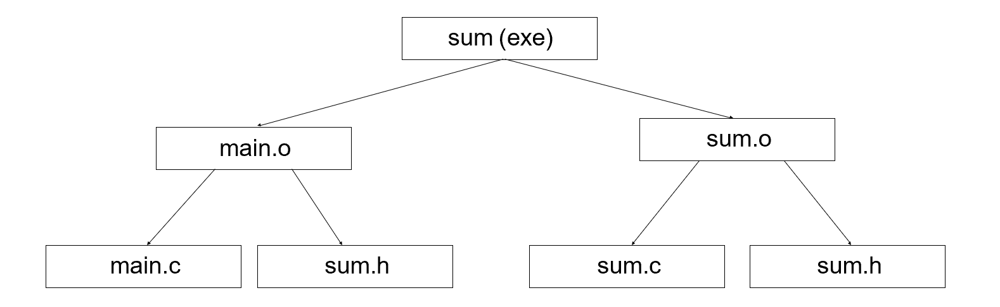

# Implementation

## 待定标题
----

.h头文件（声明）

* 函数在头文件中声明：需要在任何需要使用/定义的地方include头文件
* 类同理（一般一个头文件放一个类）
* 头文件（header）=接口（interface）：别人看你的头文件才知道怎么用


include 写法的区别：

* `#include “xx.h”`:first search in the current  directory, then the	directories declared  somewhere
* `#include <xx.h>`:search in the specified  directories
* `#include <xx>`:same as #include <xx.h>

## The Makefile utility
------
根据时序判断是否需要重新编译，减少开销（根比儿子时间早，则根要更新）


将树用makefile表示出来：
```makefile
sum: main.o	sum.o#冒号表示依赖
gcc –o	sum main.o sum.o

main.o: main.c sum.h  
gcc –c main.c

sum.o: sum.c sum.h  
gcc –c sum.c
```
宏替换（便于更改）
* `$@`: 上一行的第一个
* `$*`: 
```makefile
sum: main.o	sum.o
gcc –o	$@	main.o	sum.o

main.o	sum.o: sum.h  
gcc –c $*.c
```

## Initialize

`init()`：缺省函数，如果未定义，系统自动生成

为了确保初始化，在对象定义的时刻会用**构造函数**强制初始化

构造函数：与类名相同的函数
```cpp
class X{
    int i;
public:
    X()
};
//掉用
···

```
构造函数可带参数
```
Tree
```
-------


如果定义的构造函数有参数，调用时没给参数，会调用缺省构造函数

但是，一旦你定义了一个构造函数函数，系统就不会自动生成缺省构造函数

数组的初始化调用
```

```
* jump可以跳过
* 但编译不允许跳过初始化

## Destructor
-------
> 析构函数