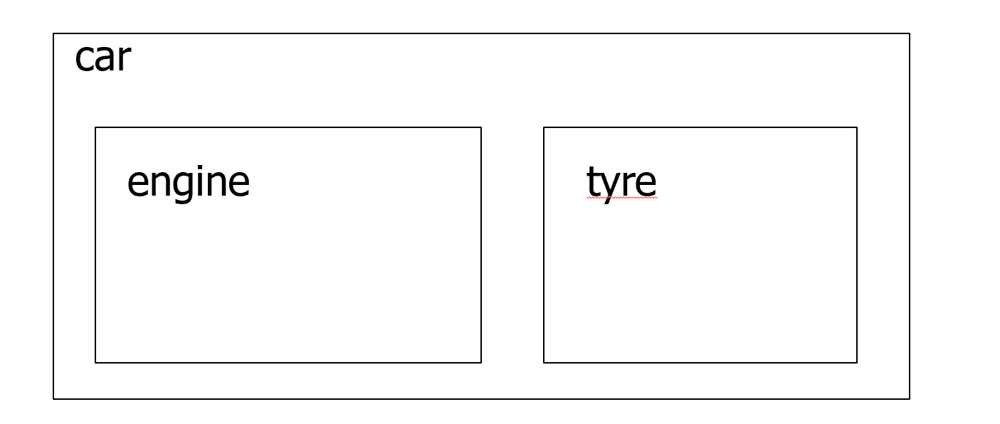

# Inheritance

> 继承
<!--  -->

> 函数调用有代价（栈等）

## Inline Function

将 function 在调用处展开，不用调用和返回，没有函数调用的开销了（坏处是代码变大）

用 `inline` 关键字：

```cpp
// 需要调用的版本
int f(int i){
    return i*2;
}
main(){
    int a=4;
    int b=f(a);
}

// 原地转换的版本
inline int f(int i){
    return i*2;
}
main(){
    int a=4;
    int b=f(a);
}
```

* 类似于宏，但是宏是简单的字符串替换，inline 具备语法检查的功能
* `inline` 函数的定义要放在头文件里，否则编译器无法对齐展开
* 可能不会在 .obj 文件中产生任何代码
* `inline` 会有类型转换和返回值(比宏好)


```cpp title="宏和 inline"
#define f(a) (a)+(a)

main(){
  double a = 4;

  printf(“%d”, f(a));
}


// inline
inline int f(int i){
  return i*2;
}

main(){
  double a = 4;

  printf(“%d”, f(a));
}
```

* 如果函数过大/递归，即使写了 inline，编译器也会让其变为正常函数
* 函数写在 class 声明里，认为是 `inline`
* 如果想这么干，可以在类外面这么写，便于看清类的接口


## Composition

> Objects can be used  to build up other  objects

Ways of inclusion

* Fully
* By reference（allows sharing）

类的组合关系可以用“Has-A”描述：



可以将参数传给嵌入对象的构造函数： `MyClass(int x, int y) : e(x), a(y) { /*...*/ }`

---------

## 继承

> 继承的目的：将子类的共性提取为父类，使得父类的代码可以重用
> 
> Allows reusing and sharing of design for Member data、Member functions、Interfaces
<!--  -->

> 接口重用，使用的代码易合并

子类具有父类的所有接口（创建时会复制一份），then make additions and modifications to the  clone.

类间的继承与派生关系可以用“Is-A”描述


子类是父类的超集


```cpp title="继承的代码示例"
class Item
{

}

class CD: public Item// 继承标识
{

}
```


* public 和 protect
    * protect：子类可见，客户不可见


* 父类需要先构造（不加参则调用缺省构造函数）
* 父类的构造用类名访问，相当于嵌入对象
* 析构先调用子类（与构造相反的顺序）

* 输入输出流可以作为方法的参数

```cpp title="输入输出流作为参数"
inline void Manager::print( std::ostream& out ) const 
{
    Employee::print( out ); //call the base class print
    out << m_title << endl;
}
// 调用
bill.print(cout);
```

子类的同名函数会覆盖父类的函数（overwrite），父类的同名函数不可访问了

哪些函数不会继承？

* 构造函数
    * 在派生类的显式拷贝构造函数中，需要显式调用基类的拷贝构造函数，否则将调用基类默认构造函数
* 析构函数
* 赋值运算符
    * 如果编译器为类自动生成赋值操作符（operator=），它会按成员变量的顺序逐一进行赋值操作
    * 如果你定义了自己的赋值操作符，你需要确保显式调用基类的赋值操作符
* 私有变量被隐藏，但在内存中存在

继承的不同类型：


* Upcasting

```cpp title="Upcast example"
Manager pete("Pete","444-55-6666","Bakery");
Employee* ep=&pete;// 类型丢失
```


pure virtual  functions - 纯虚函数没有具体的实现，只定义了函数的接口，要求派生类必须提供该函数的具体实现

通过指针和引用访问虚函数时，会发生动态绑定，调用的是实际对象类型（Dog）的函数实现

```cpp
#include <iostream>
#include <string>
using namespace std;

class Pet
{
public:
    virtual string speak() const { return "pet!"; }
};
class Dog : public Pet
{
public:
    string speak() const { return "dog!"; }
};
int main()
{
    Dog ralph;
    Pet *p1 = &ralph;
    Pet &p2 = ralph;
    Pet p3;
    cout << p1->speak() << endl;
    cout << p2.speak() << endl;
    cout << p3.speak() << endl;
    return 0;
}
```


```cpp
Ellipse  elly(20F, 40F);
Circle  circ(60F);
elly =	circ; // Only the part of circ that fits in elly gets copied
// Vtable	from circ is ignored; the	vtable	in elly is  the	Ellipse	vtable
elly.render(); // Ellipse::render()

Ellipse  *elly(20F, 40F);
Circle  *circ(60F);
elly =	circ;// Well, the	original	Ellipse	for elly is lost....
// elly and circ point to	the	same	Circle	object!
elly->render();// Circle::render()


void func(Ellipse& elly) {  
    elly.render();
}

Circle	circ(60F);  func(circ);
// References act like	pointers
// Circle::render()	is called
```


```cpp
class Expr{
public:
    virtual Expr* newExpr();
    virtual Expr& clone();
    virtual Expr self();
};

class BinaryExpr: public Expr{
public:
    virtual BinaryExpr* newExpr();	// ok
    virtual BinaryExpr& clone();	// ok
    virtual BinaryExpr self();  	// Error!
};
```

* 当你在派生类中重载基类中的函数时，如果该函数有多个重载版本，你必须在派生类中覆盖所有这些重载版本。

* 否则，基类中未覆盖的重载版本将被隐藏

-----------

多继承(别用)

```cpp
class B1 { int m_i; }; 
class D1 : public B1 {}; 
class D2 : public B1 {}; 
class M : public D1, public D2 {};

void main() {
    M m;  // OK
    B1* p = new M; // ERROR: which B1
    B1* p2 = dynamic_cast<D1*>(new M); // OK 
} 
```


## C++ Standard Library

### Vector Class

```cpp title="vector 类的使用例子"
#include <iostream>
#include <vector>

int main() {
    std::vector<int> numbers; // 需要 std 命名空间
    // 不需要担心 size

    // Add elements to the vector
    numbers.push_back(10);
    numbers.push_back(20);
    numbers.push_back(30);

    // 可以用标号访问
    std::cout << "First element: " << numbers[0] << std::endl;

    // 迭代器访问（与操作符重载有关）
    vector<int>::iterator p;
    for(p=numbers.begin();p<=numbers.end();p++){
        // 访问每个元素
    }
    return 0;
}
```

* Constructors: `vector<Elem> c;` `vector<Elem> c1(c2);`
* Add/Remove/Find: `V.find(...)` - 返回迭代器类型


### List Class

### Map

相当于 python 的字典，由 key 和 value 组成


### 迭代器

* Declaring: `list<int>::iterator li`
* 可以自增 `i++` - 指向下一个元素
* *li：取出指向的值，可修改


Algorithms 接受迭代器而不是不同的类——可扩展性

```cpp
list<int> L;
vector<int> V;
// 将 list 拷贝到 vector 中
copy(L.begin(),L.end(),V.begin);
```

简化方式：typedef 将模板类型缩写


## Overloading Operators

> 另外一种函数形式


* 大部分操作符可重载

* 不可被重载：


Restriction

* 只有现存的操作符能重载
* 操作数的数量和优先级不变

如何重载：

* 关键字 `operator`

* 为什么用 const

```cpp title="重载加号"
// 类内
const String String::operator +(const String& that){
    // 隐式的第一个操作数：调用 "+" 的当前类的对象
}

// 函数（必须显式的两个操作数）
const String operator+(const String& str1,const String& str2){

}
```

```cpp
Integer x(1),y(5),z;
x + y; // x.operator+(y)
z = x + y;// 合法
z = x + 3;// 3 会调用构造函数转化成 Integer，合法
z = 3 + y;// 不合法
```

```

```

“必须”用成员函数重载的运算符：

*  =
* []
* ->
* ->*
*  ()