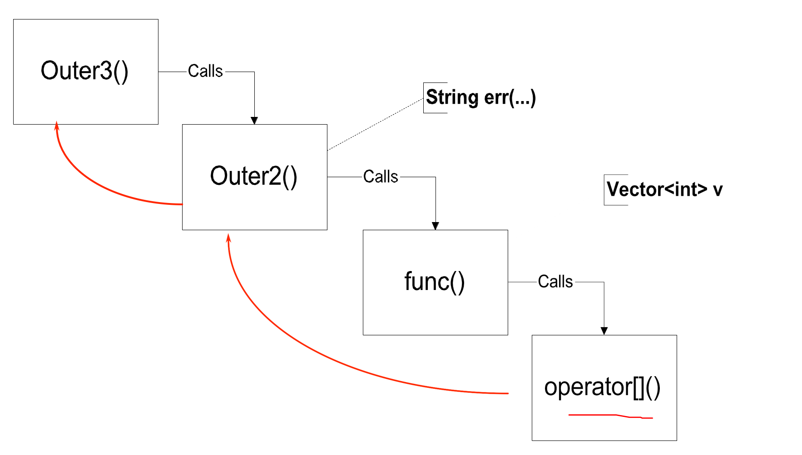

## templates

> 如果我们需要列表 X 和 Y
>
> 类型不同

<!--  -->

> 此时父类、克隆不方便

* 重用 —— 以类型为参数，重用代码


### Function Template

```cpp
// 简单的交换函数
void swap (int& x, int& y){
    int temp = x;
    x = y;
    y = temp;
}

// 如果需要交换其他类型
template < class T >// T 是类型参数
void swap (T& x, T& y){
    T temp = x;
    x = y;
    y = temp;
}

// 调用方法（实例化）
swap<int>(i,j);// 显式写
swap(i,j);// 也可以，编译器会推导
// 但是 i、j 类型不同会报错
```

T 的三个用法

* 临时变量定义
* 函数返回值类型


重载顺序

1. unique function match
2. unique function template match
3. overloading


```cpp
// 传递的参数没有类型 T
template < class T >
void function (){
    /*...*/
}

// 此时必须指定 T 类型
funtion<int>();
```


### Class Template

```cpp
template <class T>
class Vector{
public:
    Vector(int);
    ~Vector();
    Vector(const Vector&);
}


// Usage
Vector<int> v1(100);
Vector<Complex> v2(256);

// int - > complex:
// 先调用 complex 接受 int 的构造函数
// 再把 int 赋给 complex 对象
```

* 在模板类的每一个成员函数实现，都需要在上面加上 `template <class T>`


多个模板和嵌套

```cpp
// 两个例子
```

模板的非类型参数

```cpp 例子
// 在编译前给出，所以可以分配静态数组
```

带模板参数的子类
```cpp
template <class A>
class Derived : public Base(...)

// 如果父类也带模板参数
template <class A>
class Derived : public Base<A>(...)// 需要确定父类的模板参数
class Derived : public Base<int>(...)// 模板参数不需要相同
```


### Iterator

* 简单的包装方式


* stl 的实现方式：trick


```cpp
template <class T>
struct myIter{
    typedef T value_type;
    T* ptr;
    myIter(T *p = 0):ptr(p){}
    T& operator*(){return *ptr;}
}
```


模板特化

```cpp
template

```

* 源程序调用函数模板，才会生成对应参数类型的模板函数的代码。
* 类模板实例化为模板类是要产生相应的代码的，只能在编译阶段进行


## Exceptions

> C++ 处理异常的机制是由检查、抛出和捕获 3 部分组成

throw: 中断当前函数，回到调用者


Define a class to represent the error

```cpp
class VectorIndexError {
public:
    VectorIndexError(int v) : m_badValue(v) { }
    ~VectorIndexError() { }
    void diagnostic() {
        cerr << "index " << m_ badValue
        << "out of range!"; }
private:
    int m_badValue;
};
```


raise an exception

```cpp
template <class T>
T& Vector<T>::operator[](int indx){  
  if (indx <	0 || indx >= m_size) {
    // VectorIndexError e(indx);
    // throw e;
    throw VectorIndexError(indx);
  }
  return m_elements[indx];
}
```


handle the exception

* Cares deeply
    ```cpp
    void outer() {
        try {
            func(); func2();
        } catch (VectorIndexError& e) {
            e.diagnostic();
            // This exception does not propagate
        }
        cout << "Control is here after exception";
    }
    ```

* Mildly interested

    ```cpp
    void outer2() {
        String err("exception caught")
        try {
            func();
        } catch (VectorIndexError) {
            cout << err;
            throw;// propagate the exception
        }
        cout << "Control is here after exception";
    }
    ```

* Doesn’t care	about the	particulars
    ```cpp
    void outer3() {
        try	{
        outer2();
        }	catch (...) {
            // ... catches ALL	exceptions!
            cout << "The exception stops here!";
        }
    }
    ```





Try block - 可以配很多（或 0 个） catch 语句

```cpp
try { ... }
catch ...
catch ...
```

Exception	handlers

* 选择 catch 块，看 catch() 里面的类型
* catch 后面 () 的作用：传递信息和选择
* 只能接受一个参数


```cpp
catch (SomeType v) { // handler code
}
catch (...) { // handler code
}
```

* catch 块的选择顺序
    * Check for exact match
    * Apply base class conversions (Reference and pointer types, only)
    > 如果抛出的异常是基类的派生类，而 catch 块的参数是基类类型的引用或指针，那么该 catch 块也能捕获到这个异常 
    
    * Ellipses (...) match all
    